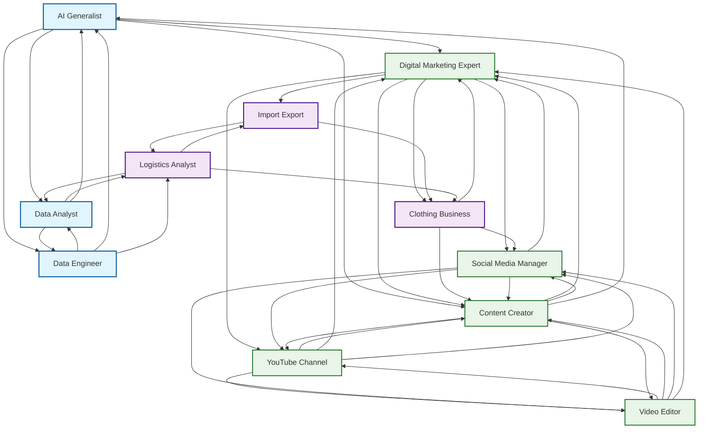

Now let me create the complete answer with all the detailed information:

# Complete Multi-Skill Professional Development GuideBased on current market research and industry trends, here's a comprehensive guide covering all the skills, businesses, and career paths you've mentioned. The interconnected nature of these domains creates powerful synergies that can maximize your earning potential and career flexibility.## Skill Interconnection NetworkThe skills you've identified are highly interconnected, creating multiple pathways for cross-domain expertise:



## Detailed Career Analysis### **AI Generalist****Core Skills Required:**[1][2][3]
- Machine Learning (Python, TensorFlow, PyTorch)
- Deep Learning & Neural Networks  
- Natural Language Processing (NLP)
- Computer Vision & Generative AI
- Data Science & Statistical Analysis
- Cloud Platforms (AWS, Azure, GCP)
- MLOps & AI Pipeline Management

**Industry Expectations & Salary:**[4][2][1]
- **India:** ₹6-50 lakhs per annum (entry to senior level)
- **US:** $100,000-$200,000+ annually
- **Startup Investment:** ₹50,000-2,00,000 (courses, certifications, equipment)
- **Expected ROI:** 150-300% within 2-3 years
- **Revenue Streams:** AI consulting, model development, freelance projects, course creation

### **Digital Marketing Expert****Core Skills Required:**[5][6][7][8]
- SEO & SEM (Google Ads, Analytics)
- Social Media Marketing & Management
- Content Marketing & Copywriting
- Email Marketing & Automation
- PPC Advertising & Data Analytics
- Marketing Automation Tools
- CRM Management & Customer Journey Mapping

**Industry Expectations & Salary:**[6][7][5]
- **India:** ₹3-12 lakhs per annum
- **US:** $50,000-$100,000 annually
- **Startup Investment:** ₹30,000-1,00,000 (tools, courses, ad spend)
- **Expected ROI:** 100-200% within 1-2 years
- **Revenue Streams:** Client services, affiliate marketing, course creation, consulting

### **Data Analyst****Core Skills Required:**[9][10][11]
- SQL & Advanced Database Management
- Python/R Programming for Analysis
- Statistical Analysis & Hypothesis Testing
- Data Visualization (Tableau, Power BI, Excel)
- Business Intelligence & KPI Development
- Machine Learning Fundamentals
- Communication & Presentation Skills

**Industry Expectations & Salary:**[10][11]
- **India:** ₹4-15 lakhs per annum
- **US:** $60,000-$120,000 annually
- **Startup Investment:** ₹25,000-75,000 (software, courses, certification)
- **Expected ROI:** 120-250% within 1-2 years
- **Revenue Streams:** Freelance projects, consulting, dashboard creation, training

### **Data Engineer****Core Skills Required:**[9][12][13][14]
- SQL & Advanced Database Systems
- Python/Scala for Data Processing
- Big Data Technologies (Hadoop, Spark, Kafka)
- Cloud Platforms & Data Warehousing
- ETL/ELT Pipeline Development
- Docker & Containerization
- DataOps & Apache Airflow

**Industry Expectations & Salary:**[12][9]
- **India:** ₹8-25 lakhs per annum
- **US:** $90,000-$160,000 annually
- **Startup Investment:** ₹40,000-1,50,000 (cloud credits, tools, courses)
- **Expected ROI:** 150-300% within 2-3 years
- **Revenue Streams:** Freelance projects, consulting, pipeline development, training

### **Video Editor****Core Skills Required:**[15][16][17][18]
- Adobe Premiere Pro/Final Cut Pro
- After Effects for Motion Graphics
- DaVinci Resolve for Color Grading
- Sound Design & Audio Editing
- Creative Storytelling & Visual Composition
- Project Management & Client Communication
- File Management & Export Optimization

**Industry Expectations & Salary:**[17][18][15]
- **India:** ₹2.5-15 lakhs per annum
- **US:** $35,000-$80,000 annually
- **Freelance Rates:** $20-150 per hour[15]
- **Startup Investment:** ₹1,00,000-3,00,000 (software, hardware, storage)
- **Expected ROI:** 80-150% within 1-2 years
- **Revenue Streams:** Freelance editing, YouTube channel partnerships, course creation

### **Import Export Business****Core Skills Required:**[19][20][21][22]
- International Trade Laws & Regulations
- Documentation & Compliance Management
- Supply Chain & Logistics Coordination
- Market Research & Product Sourcing
- Negotiation & Cross-Cultural Communication
- Financial Management & Risk Assessment
- Quality Control & Vendor Management

**Industry Expectations & Revenue:**[20][21][19]
- **Monthly Profit:** ₹20,000-5,00,000+ (highly variable by volume)
- **Profit Margins:** 20-40% on products
- **Startup Investment:** ₹50,000-15,00,000 (depends on scale and products)
- **Break-even Period:** 1-3 years
- **Revenue Streams:** Product margins, commission-based trading, merchant export

### **Clothing Business****Core Skills Required:**[23][24][25][26]
- Fashion Design & Trend Analysis
- Supply Chain Management & Sourcing
- Inventory Management & Quality Control
- E-commerce & Digital Marketing
- Brand Development & Customer Service
- Retail Operations & Financial Planning

**Industry Expectations & Revenue:**[24][26][23]
- **Monthly Revenue:** ₹50,000-10,00,000+ (business dependent)
- **Gross Margins:** 30-60%
- **Startup Investment:** ₹2,00,000-50,00,000 (online vs physical store)
- **Break-even Period:** 1-2 years
- **Revenue Streams:** Direct sales, custom orders, wholesale, subscription models

### **Freelance Logistics Analyst****Core Skills Required:**[27][28][29][30]
- Supply Chain Analysis & Optimization
- Data Analytics & Statistical Modeling
- Logistics Software Proficiency (SAP, Oracle)
- Process Improvement & Cost Reduction
- Transportation Management Systems
- Excel & Advanced Data Visualization
- Communication & Project Management

**Industry Expectations & Salary:**[28][29][27]
- **India:** ₹40,000-2,00,000 per month (project-based)
- **US:** $63,000-$99,000 annually
- **Startup Investment:** ₹20,000-50,000 (software, certification, marketing)
- **Expected ROI:** 100-200% within 1-2 years
- **Revenue Streams:** Consulting projects, process optimization, training, auditing

### **YouTube Channel****Core Skills Required:**[31][32][33][34]
- Content Creation & Script Writing
- Video Production & Advanced Editing
- YouTube SEO & Algorithm Understanding
- Thumbnail Design & Visual Branding
- Audience Engagement & Community Building
- Analytics & Performance Optimization
- Monetization Strategy Development

**Industry Expectations & Revenue:**[32][33][31]
- **Monthly Income:** ₹10,000-50,00,000+ (highly variable)
- **Monetization Requirements:** 500+ subscribers, 3,000+ watch hours[31][32]
- **Ad Revenue:** $3-5 per 1,000 views[35]
- **Startup Investment:** ₹50,000-2,00,000 (equipment, software)
- **Revenue Streams:** Ad revenue, sponsorships, merchandise, memberships, affiliate marketing

### **Social Media Marketing Manager****Core Skills Required:**[36][37][38][39][40]
- Platform Expertise (Instagram, LinkedIn, TikTok, Twitter)
- Content Strategy & Campaign Planning
- Community Management & Engagement
- Paid Social Media Advertising
- Analytics & Performance Reporting
- Graphic Design & Video Creation
- Influencer Marketing & Brand Partnerships

**Industry Expectations & Salary:**[37][38][39][36]
- **India:** ₹3-12 lakhs per annum
- **US:** $45,000-$80,000 annually
- **Startup Investment:** ₹15,000-75,000 (tools, courses, advertising spend)
- **Expected ROI:** 100-180% within 1-2 years
- **Revenue Streams:** Client retainers, project work, consulting, course creation

### **Content Creator****Core Skills Required:**[41][42][43][44][45]
- Content Strategy & Planning
- Multi-format Writing & Copywriting
- Visual Content Creation & Photography
- Video Production & Post-processing
- SEO & Content Optimization
- Social Media Management & Growth
- Brand Collaboration & Negotiation

**Industry Expectations & Revenue:**[35][43][46][41]
- **India:** ₹20,000-5,00,000+ per month
- **US:** $50,000-$80,000 annually
- **Beginner Income:** $500-1,000/month, Experienced: $1,500-5,000+/month[43]
- **Startup Investment:** ₹30,000-1,50,000 (equipment, software, marketing)
- **Revenue Streams:** Sponsored content, affiliate marketing, courses, digital products, consulting

## Individual Learning Roadmaps### **AI Generalist Learning Path**```mermaid
graph TD
    A[Start] --> B[Foundation Phase<br/>0-3 months]```  B --> C[Skill Development<br/>3-6 months]
    C --> D[Practical Experience<br/>6-9 months]
    D -->```Specialization<br/>9-12 months]
    ```-> F[Professional Level<br/>12+ months]
    ```  B --> B1[Learn Python Programming]
    B --> B2[Statistics & Mathematics]
    B --> B3[Data Structures & Algorithms]```  
    C --> C1[Machine Learning Basics]
    C --> C2```nsorFlow/PyTorch]```  C --> C3[Data Preprocessing]
    
    D```> D1[Build ML Projects]
    D --> D2[Kaggle Competitions]
    D --> D3```en Source Contributions]
    
    ```-> E1[Deep Learning]
    E --> E2[NLP/Computer Vision]
    E --> E3[MLOps & Deployment]
    
    F --> F1[Lead AI Projects]
    F --> F2[Consulting & Training]
    F --> F3[Research & Innovation]
    
    %%```yling
    classDef phase fill:#f9f,stroke:#```,stroke-width:2px
    classDef skill fill:#```,stroke:#333,stroke-width:1px
    ```  class B,C,D,E,F```ase
    class B1,B2,B3,C1,```C3,D1,D2,D3,E1,E2,E3,F1,F2,F3```ill
```

### **Digital Marketing Expert Learning Path**```mermaid
graph TD
    A[Start] --> B[Foundation Phase<br/>0-3 months]
    B --> C```ill Development<br/>3-6 months]
    C```> D[Practical Experience<br/>6-9 months]```  D --> E[Specialization<br/>9-12 months]
    E --> F[Professional Level<br/>12+ months]```  
    B --> B1```gital Marketing Fundamentals]
    B```> B2[Google Analytics Setup]
    B --> B3[Basic SEO Techniques]
    
    C -->```[Advanced SEO/SEM]
    C --> C```ocial Media Marketing]
    C --> C3[Content Creation & Strategy]
    
    D --> D```anage Client Campaigns]
    D --> D2[A/B Testing & Optimization]
    D --> D```ortfolio Building]
    
    E --> E```arketing Automation]
    E --> E```dvanced Analytics & Attribution]
    E --> E3[Paid Advertising Mastery]
    
    F -->```[Strategy Consulting]
    F --> F2```am Leadership & Training]
    F --> F3[Agency Management]
    
    %%```yling
    classDef phase```ll:#f9f,stroke:#```,stroke-width:2px
    classDef skill fill:#```,stroke:#333,stroke-width:1px
    ```  class B,C,D,``` phase
    class B```2,B3,C1,C2,C3,D1,D2,D3,E1,E2,E3,F1,F2``` skill
```

### **Complete Skill Mastery Checklist**```mermaid
mindmap
  root((Multi-Skill Professional))```  Technical Skills
      Programming
        Python```stery
        SQL Expertise
        R/Scala Knowledge```      Version Control (Git)
      ```& Machine Learning
        TensorFlow/Py```ch
        Neural Networks
        N```& Computer Vision
        MLOps```ployment
      Data & Analytics
        Statistical```alysis
        Data Visualization
        Business Intelligence
        ``` Data Tools
      Cloud & Infrastructure
        AWS/Azure/```
        Docker```ntainers
        CI/CD Pipelines
        Database```nagement
        
    Creative & Content
      Video```oduction
        Adobe Premiere Pro
        After```fects
        DaVinci Resolve
        Audio```iting
      Content Creation
        ```ywriting
        SEO Optimization
        Social Media Strategy```      Brand Development
      Design```Visual
        Graphic Design
        UI``` Principles
        Photography
        Visual```orytelling
        
    Business & Operations```    Digital Marketing
        SEO/``` Expertise
        PPC Management
        Email```rketing
        Analytics & Reporting
      ```ommerce & Sales
        Online Store```tup
        Supply Chain Management
        Customer Service```      Sales Fun``` Optimization
      Financial```nagement
        Business Planning```      Cost Analysis
        ROI Calculation
        ```k Assessment
      ```ject Management
        Agile/```um
        Team Leadership
        Client```mmunication
        Quality Assurance
```

## Strategic Implementation Recommendations### **Phase 1: Foundation Building (0-6 months)**1. **Choose 2-3 interconnected skills** from different domains (e.g., Data Analysis + Digital Marketing + Content Creation)
2. **Invest in essential tools and courses** (budget: ₹50,000-1,50,000)
3. **Build basic competency** in chosen areas through online learning and practice projects

### **Phase 2: Practical Application (6-12 months)**1. **Start freelance projects** in your chosen domains
2. **Create a portfolio** showcasing cross-domain expertise
3. **Network within communities** and establish your personal brand

### **Phase 3: Specialization & Scale (12-24 months)**1. **Develop deep expertise** in 1-2 high-value areas
2. **Launch your own services/products** combining multiple skills
3. **Mentor others** and create educational content for passive income

### **Phase 4: Business Development (24+ months)**1. **Scale your operations** with teams and systems
2. **Diversify revenue streams** across all domains
3. **Establish thought leadership** through speaking and consulting

**Expected Timeline to Profitability:**
- **Technical Skills:** 6-12 months to first paid project
- **Creative Skills:** 3-9 months to monetization  
- **Business Ventures:** 12-36 months to sustainable profit
- **Content Creation:** 6-18 months to consistent income

This integrated approach leverages the synergies between different domains, allowing you to command higher rates and create multiple income streams while building a recession-proof skill portfolio that adapts to future market changes.

[1](https://generativeaimasters.in/generative-ai-salary-in-india/)
[2](https://www.nexford.edu/insights/highest-paying-ai-jobs)
[3](https://www.netcomlearning.com/blog/how-to-become-an-ai-engineer)
[4](https://www.coursera.org/articles/artificial-intelligence-salary)
[5](https://digiligo.com/blog/essential-skills-every-digital-marketer-should-know-by-2025/)
[6](https://www.indeed.com/hire/job-description/digital-marketing-specialist)
[7](https://huntr.co/resume-skills/digital-marketing)
[8](https://www.guvi.in/blog/skills-required-to-become-a-digital-marketer/)
[9](https://www.prophecy.io/blog/12-essential-data-engineering-skills)
[10](https://www.coursera.org/in/articles/in-demand-data-analyst-skills-to-get-hired)
[11](https://roadmap.sh/data-analyst)
[12](https://learn.microsoft.com/en-us/training/career-paths/data-engineer)
[13](https://www.pitchnhire.com/blog/skills-needed-for-data-engineer)
[14](https://www.reddit.com/r/dataengineering/comments/1hw8uqm/what_skills_are_most_in_demand_in_2025/)
[15](https://www.miracamp.com/learn/video-editing/freelance-how-to-succeed-freelance-and-find-high-paying-jobs)
[16](https://www.indeed.com/career-advice/finding-a-job/how-to-become-freelance-video-editor)
[17](https://www.shiksha.com/arts-fine-visual-performing/editing-career-chp)
[18](https://www.coursera.org/articles/video-editing-career-path)
[19](https://www.registerkaro.in/guides/how-to-start-import-export-business)
[20](https://www.gfebusiness.org/blog/average-income-import-export-business-in-india/)
[21](https://www.linkedin.com/pulse/what-minimum-capital-start-import-export-business-vaibhav-sharma)
[22](https://digitalexim.com/how-much-money-is-needed-to-start-a-import-export-business-in-india/)
[23](https://truehost.co.in/how-much-capital-do-you-need-to-start-a-clothing-business-in-india/)
[24](https://www.registerkaro.in/guides/how-to-start-a-clothing-business)
[25](https://brandsgateway.com/blog/start-up-costs/)
[26](https://fabriclore.com/blogs/fashion-business-lifestyle-trends/cost-to-start-fashion-business-india)
[27](https://ca.indeed.com/career-advice/finding-a-job/how-to-become-logistics-analyst)
[28](https://sg.indeed.com/career-advice/finding-a-job/how-to-become-a-logistics-analyst)
[29](https://www.coursera.org/articles/logistics-analyst-salary)
[30](https://www.coursera.org/articles/logistics-analyst)
[31](https://www.epidemicsound.com/blog/youtube-monetization/)
[32](https://fliki.ai/blog/new-youtube-monetization-requirements)
[33](https://www.tubebuddy.com/blog/youtube-monetization-requirements/)
[34](https://www.youtube.com/watch?v=Rts_vQuaMbk&vl=en)
[35](https://www.captions.ai/blog-post/how-much-do-content-creators-make)
[36](https://www.coursera.org/articles/social-media-marketing-salary)
[37](https://digitalscholar.in/social-media-marketing-salary-in-india/)
[38](https://in.indeed.com/career-advice/finding-a-job/how-to-become-social-media-specialist)
[39](https://in.indeed.com/career-advice/finding-a-job/what-is-social-media-manager)
[40](https://digitalmarketinginstitute.com/blog/what-skills-do-i-need-to-be-a-social-media-manager)
[41](https://www.coursera.org/articles/content-creator-salary)
[42](https://in.indeed.com/career-advice/finding-a-job/how-to-become-a-freelance-content-writer)
[43](https://bloggerspassion.com/how-to-become-a-content-creator/)
[44](https://skima.ai/resources/job-descriptions/content-creator-job-description)
[45](https://www.coursera.org/articles/digital-content-creator)
[46](https://alitu.com/creator/monetization/realistic-guide-to-creator-earnings/)
[47](https://www.jetking.com/blog/top-10-ai-jobs-and-salary-in-india-2025-guide)
[48](https://onlinedegrees.sandiego.edu/artificial-intelligence-jobs/)
[49](https://digitalmarketinginstitute.com/blog/7-essential-skills-every-digital-marketer-should-know)
[50](https://online.hbs.edu/blog/post/digital-marketing-skills)
[51](https://www.youtube.com/watch?v=SCE3iKbXXTQ)
[52](https://aaft.edu.in/blog/10-essential-digital-marketing-skills)
[53](https://upmetrics.co/startup-costs/clothing-line)
[54](https://www.youtube.com/watch?v=pr0P692HAaE)
[55](https://www.youtube.com/watch?v=RHbPD_gUXk4)
[56](https://www.youtube.com/watch?v=k3A4XPtcON0)
[57](https://nimbuspost.com/blog/how-to-start-an-import-and-export-business-in-india)
[58](https://qikink.com/blog/clothing-business-ideas/)
[59](https://www.nobledesktop.com/careers/video-editor/become-a-freelance-video-editor)
[60](https://e-startupindia.com/learn/how-to-start-an-export-business-with-zero-investment/)
[61](https://www.em-normandie.in/em-normandie-experience/immerse-yourself-professional-world/professions-after-business-school/logistics-analyst)
[62](https://support.google.com/youtube/answer/1311392?hl=en)
[63](https://www.youtube.com/watch?v=Ec5RFkpN7Co)
[64](https://resumeworded.com/skills-and-keywords/logistics-analyst-skills)
[65](https://www.youtube.com/shorts/lKVIz8mi1jA)
[66](https://setmycareer.com/resources/logistics-analyst.php)
[67](https://isthischannelmonetized.com/tools/youtube-monetization-checker/)
[68](https://www.siegemedia.com/creation/content-creator)
[69](https://in.indeed.com/career-advice/career-development/freelance-skills)
[70](https://later.com/blog/how-content-creators-make-money/)
[71](https://lionize.ai/how-to-become-a-freelance-content-creator/)
[72](https://www.kofluence.com/how-much-money-indian-creators-really-make/)
[73](https://www.learningrevolution.net/content-creator-skills/)
[74](https://www.kraftshala.com/blog/how-to-become-a-freelance-digital-marketer/)
[75](https://www.youtube.com/watch?v=R3seYlEzA9s)
[76](https://www.cbs.de/en/blog/content-creator)
[77](https://www.instagram.com/reel/DC6sURTsHaN/?hl=en)
[78](https://in.indeed.com/career-advice/career-development/how-to-become-content-creator)
[79](https://creators.instagram.com/earn-money?locale=en_GB)

[80](https://podcastle.ai/blog/how-to-become-a-content-creator/)

