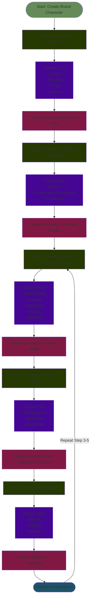

```mermaid
flowchart TD
    Start([Start: Create Brand Character]) --> Step1["Step 1: Create Base Character"]
    
    Step1 --> Tools1["Choose Tool:<br/>• Canva<br/>• Recraft.ai<br/>• Fotor<br/>• Pixelcut"]
    Tools1 --> Output1["Output: High-res Brand Girl PNG"]
    
    Output1 --> Step2["Step 2: Establish Character Consistency"]
    
    Step2 --> Tools2["Choose Tool:<br/>• Bylo.ai<br/>• ConsistentCharacter.ai<br/>• CGDream"]
    Tools2 --> Output2["Output: Multiple Consistent Poses"]
    
    Output2 --> Step3["Step 3: Change Costumes<br/>(For Each Brand)"]
    
    Step3 --> Tools3["Choose Tool:<br/>• DRESSXME<br/>• Krea.ai<br/>• EaseMate<br/>• Vidnoz<br/>• OpenArt"]
    Tools3 --> Output3["Output: Character in Brand Outfit"]
    
    Output3 --> Step4["Step 4: Create Instagram Posts"]
    
    Step4 --> Tools4["Choose Tool:<br/>• Phygital.plus<br/>• Predis.ai<br/>• Piktochart"]
    Tools4 --> Output4["Output: Ready-to-Post Instagram Content"]
    
    Output4 --> Step5["Step 5: Generate Captions"]
    
    Step5 --> Tools5["Choose Tool:<br/>• Ahrefs<br/>• Copy.ai<br/>• Narrato"]
    Tools5 --> Output5["Output: Captions + Hashtags"]
    
    Output5 --> End([Publish to Instagram])
    
    End -->|Repeat Step 3-5| Step3
    
    style Start fill:#658C58
    style End fill:#1D546C
    style Step1 fill:#253900
    style Step2 fill:#253900
    style Step3 fill:#253900
    style Step4 fill:#253900
    style Step5 fill:#253900
    style Tools1 fill:#450693
    style Tools2 fill:#450693
    style Tools3 fill:#450693
    style Tools4 fill:#450693
    style Tools5 fill:#450693
    style Output1 fill:#811844
    style Output2 fill:#811844
    style Output3 fill:#811844
    style Output4 fill:#811844
    style Output5 fill:#811844
```