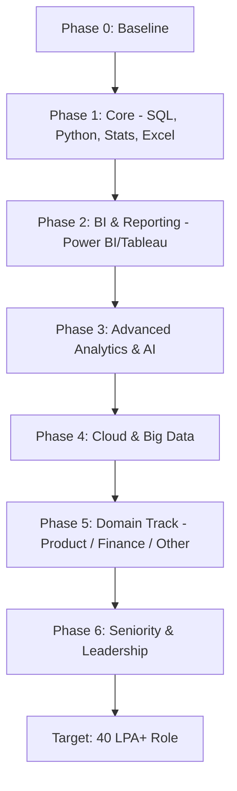
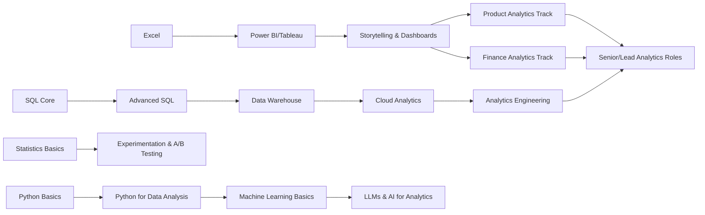
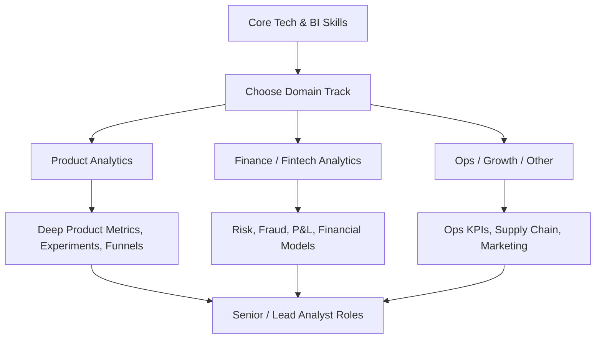

# Roadmap to a 40 Lakh Data / Analytics Role (India / Remote)

what skills and qualifications or knowledge either theoritical or practical should a person have to earn a salary of 40 lakh rupees, Prepare a proper roadmap document of this information that helps an aspirant to learn and achieve their goals, cover all the details from scratch, keep the information as much detailed as it can, you don't need to provide any definitions or theoritical explanation just keep it as a clean, clear, detailed roadmap, use mermaid diagrams wherever needs to explain content in the form of flowcharts or graphs, add table of contents at the beginning of the document and other things that are needed to give a birds eye view of the idea/intent.  cover topics like SQL, Product analyst, Finance analyst and other things that are needed to get the best possible data analyst job

***

## Table of Contents

1. **Overview & Target Profiles**
2. **Phase 0 – Mindset, Baseline & Planning**
3. **Phase 1 – Core Foundations (0–6 Months)**
   - 1.1 SQL
   - 1.2 Programming (Python)
   - 1.3 Statistics & Probability
   - 1.4 Spreadsheets (Excel / Google Sheets)
4. **Phase 2 – BI & Reporting Excellence (3–9 Months Overlap)**
   - 2.1 Power BI / Tableau
   - 2.2 Data Modeling for Analytics
   - 2.3 Dashboard Design & Storytelling
5. **Phase 3 – Advanced Analytics & AI (6–18 Months)**
   - 3.1 Advanced SQL & Data Engineering Lite
   - 3.2 Python for Analytics & ML
   - 3.3 Machine Learning for Analysts
   - 3.4 Generative AI & LLMs for Analytics
6. **Phase 4 – Cloud & Big Data (9–24 Months)**
   - 4.1 Cloud Fundamentals (AWS / Azure / GCP)
   - 4.2 Data Warehousing & Lakehouse
   - 4.3 Analytics Engineering Tooling
7. **Phase 5 – Domain Tracks (Product, Finance, Others) (12–36 Months)**
   - 5.1 Product Analytics Track
   - 5.2 Finance / Fintech Analytics Track
   - 5.3 Operations / Growth / Other High-Value Tracks
8. **Phase 6 – Seniority, Leadership & 40 LPA Positioning (24–60 Months)**
   - 6.1 Role Evolution & Titles
   - 6.2 Leadership & Business Impact
   - 6.3 Personal Brand & Network
9. **Project & Portfolio Roadmap**
   - 9.1 Project Ladder (Beginner → Senior)
   - 9.2 Portfolio Structure
10. **Interview & Offer Roadmap**
    - 10.1 Skill Checklists by Level
    - 10.2 Interview Prep Roadmap
    - 10.3 Compensation Strategy
11. **Mermaid Diagrams Summary**

***

## 1. Overview & Target Profiles

**Ultimate Target Profiles (India / Remote, ~40 LPA band)**  
- Senior / Lead Data Analyst (Product / Finance / Growth)  
- Analytics Engineer / Senior BI Engineer  
- Senior Product Analyst / Senior Revenue Analyst  
- Senior Data Scientist (strong analytics + ML + domain)  
- Analytics Manager / BI Manager (early management band)  

**Core Pillars Required**

- Strong **SQL + Python + BI**  
- Solid **statistics + experimentation**  
- **Cloud + data warehousing** proficiency  
- **Domain depth** (Product or Finance at minimum)  
- Proven **project portfolio & business impact**  
- Emerging **AI / LLM usage** for leverage and speed  
- Demonstrated **ownership & leadership**

***

## 2. Phase 0 – Mindset, Baseline & Planning

### 0.1 Time Horizon & Effort

- Target horizon: **3–5 years** from zero to 40 LPA profile.  
- Weekly time: **15–20 focused hours** alongside job.  

### 0.2 Baseline Self-Assessment (Checkpoints)

- SQL: None / Basic / Intermediate / Advanced  
- Python: None / Basic scripting / Data analysis / ML  
- Stats: School-level only / Inferential / Experimental design  
- BI: None / Built simple dashboards / Managing org dashboards  
- Domain: None / Generic / Product / Finance / Other  
- Soft skills: Low / Medium / High (presentations, leadership)

***

## 3. Phase 1 – Core Foundations (0–6 Months)

> Focus: Become **dangerous** with SQL, Python basics, statistics, and spreadsheets.

### 1.1 SQL – Relational Data Core

**Concepts & Skills to Cover (Sequence)**  
- Basic:
  - SELECT, FROM, WHERE  
  - ORDER BY, LIMIT / TOP  
  - Simple WHERE filters (>, <, =, LIKE, IN, BETWEEN)  
- Joins:
  - INNER JOIN  
  - LEFT / RIGHT / FULL OUTER JOIN  
  - Self-join  
- Aggregations:
  - GROUP BY, HAVING  
  - COUNT, SUM, AVG, MIN, MAX  
- Intermediate:
  - Subqueries (correlated & non-correlated)  
  - CASE WHEN expressions  
  - UNION vs UNION ALL  
  - DISTINCT usage  
- Advanced:
  - Window functions:
    - ROW_NUMBER, RANK, DENSE_RANK  
    - LAG, LEAD  
    - SUM() OVER (PARTITION BY …)  
  - CTEs (WITH clause)  
  - Pivoting / unpivoting  
- Performance & Design:
  - Index basics  
  - Primary / foreign keys  
  - Normalization (1NF, 2NF, 3NF)  
  - Basic query optimization tactics  

**Databases to Practice**  
- PostgreSQL or MySQL (local)  
- At least one cloud-hosted (e.g., PostgreSQL on any cloud)  

***

### 1.2 Programming (Python) – From Zero

**Core Python Fundamentals**  
- Syntax, variables, data types  
- Lists, tuples, dicts, sets  
- Conditions, loops, functions  
- Modules and packages  
- File I/O (CSV, JSON)  

**Python for Data Work**  
- `pandas`:
  - Series, DataFrame  
  - read_csv, read_sql, write_csv  
  - filtering, sorting, indexing, slicing  
  - groupby, aggregations  
  - merge, join, concat  
  - handling missing values, duplicates  
- `numpy`: arrays, vectorized ops, basic stats  
- `matplotlib` / `seaborn`: basic visualizations  

***

### 1.3 Statistics & Probability – Analyst Level

**Core Topics (No Definitions, Just Mastery List)**  
- Descriptive stats:
  - Mean, median, mode, variance, standard deviation  
  - Percentiles, quartiles, IQR  
- Probability:
  - Basic rules, conditional probability  
  - Discrete vs continuous distributions  
- Distributions:
  - Normal, binomial, Poisson, uniform  
- Inferential stats:
  - Sampling, sampling bias  
  - Central Limit Theorem (application)  
  - Estimation and confidence intervals  
- Hypothesis testing:
  - Null vs alternative  
  - One-sample and two-sample t-test  
  - Chi-square tests (independence, goodness-of-fit)  
  - ANOVA (high level)  
- Correlation & regression:
  - Pearson/Spearman correlation  
  - Simple linear regression concepts  

***

### 1.4 Spreadsheets (Excel / Sheets)

**Must-Have Excel Skills**  
- Data cleanup:
  - TRIM, CLEAN, SUBSTITUTE  
  - Text-to-columns, Find & Replace  
- Formulas:
  - IF, nested IF, IFS  
  - VLOOKUP, HLOOKUP, XLOOKUP  
  - INDEX + MATCH  
  - SUMIF, COUNTIF, SUMIFS, COUNTIFS  
- Pivot Tables & Charts  
- Data validation & conditional formatting  
- Basic macros / recording simple automation  

***

## 4. Phase 2 – BI & Reporting Excellence (3–9 Months Overlap)

> Goal: Become **top 10%** in dashboarding & storytelling (Power BI / Tableau).

### 2.1 Power BI (or Tableau) – Depth

**Power BI Core Topics**  
- Data sources & connectors  
- Power Query (M language basics):
  - Data type handling  
  - Transformations (unpivot, merge queries, append)  
- Data modeling:
  - Star schema for analytics  
  - One-to-many, many-to-many relationships  
  - Fact vs dimension tables  
- DAX:
  - Calculated columns vs measures  
  - Row context vs filter context  
  - Basic measures: SUM, COUNTROWS, DISTINCTCOUNT  
  - CALCULATE, FILTER  
  - Time intelligence (YTD, MTD, QoQ, YoY)  
- Visuals:
  - Bar, line, combo, scatter, maps  
  - Matrix, cards, KPI visuals  
  - Tooltips, bookmarks, drill-through  
  - Slicers and filters (page, report-level)  
- Security & Governance:
  - Row-level security (RLS)  
  - Workspace management  
  - Data refresh schedules  

***

### 2.2 Data Modeling for Analytics

**Modeling Concepts**  
- OLTP vs OLAP  
- Star schema vs snowflake  
- Fact table design:
  - Grain, surrogate keys  
  - Measures & numeric fields  
- Dimension table design:
  - Slowly Changing Dimensions (basic understanding)  
  - Conformed dimensions  

***

### 2.3 Dashboard Design & Storytelling

**Design Checklist**  
- KPI identification:
  - Business KPIs vs vanity metrics  
- Layout & UX:
  - Logical grouping of visuals  
  - Navigation (buttons, bookmarks)  
- Color & typography:
  - Consistent palette  
  - Minimal non-data ink  
- Storytelling:
  - Executive summary tiles  
  - Clear narrative flow:
    - Overview → Drill-down → Detail  
- Performance tuning:
  - Reducing visual count  
  - Pre-aggregated tables  
  - Optimized DAX  

***

## 5. Phase 3 – Advanced Analytics & AI (6–18 Months)

> Elevate from “report builder” to **insight generator + light data scientist**.

### 3.1 Advanced SQL & Data Engineering Lite

**Advanced SQL Topics**  
- Complex window functions:
  - Moving averages, running totals  
  - Percentiles, windowed ranking  
- CTEs for complex pipelines  
- Stored procedures & functions (basic)  
- Materialized views (concept & use)  
- Query plans (high-level understanding)  

**Data Engineering Lite**  
- ETL vs ELT  
- Batch vs streaming (concept-level)  
- Scheduling (cron / basic orchestrators)  

***

### 3.2 Python for Analytics & ML

**Analytics Level Python**  
- `pandas` advanced:
  - MultiIndex  
  - Time-series handling (resample, rolling)  
- `scipy.stats` basics  
- Modular project structure:
  - `src`, `notebooks`, `data` pattern  
- Basic unit testing for data functions  

***

### 3.3 Machine Learning for Analysts

**ML Topics (Analyst-Tier)**  
- Problem framing:
  - Regression vs classification vs clustering  
- Supervised:
  - Linear regression, logistic regression  
  - Decision trees, random forest, gradient boosting (XGBoost/LightGBM overview)  
- Unsupervised:
  - K-means clustering  
  - Hierarchical clustering (high-level)  
- Evaluation:
  - Train/test split, cross-validation  
  - Metrics:
    - RMSE, MAE, R²  
    - Accuracy, precision, recall, F1, ROC AUC  
- Feature engineering basics  
- Model interpretability:
  - Feature importance  
  - Simple SHAP / permutation importance (concept-level)  

***

### 3.4 Generative AI & LLMs for Analytics

**LLM/AI Skills**  
- Prompt engineering patterns:
  - Role + context + task + examples + constraints  
- Use cases:
  - SQL generation assistance from natural language  
  - Exploratory data analysis summary from tables  
  - Report draft generation from metrics  
  - Documentation automation  
- Tools:
  - Use at least **one LLM API** workflow (OpenAI / equivalent)  
  - Build one **internal helper tool**:
    - “Ask-your-data” style chat over metadata or exports  
- Awareness:
  - Data privacy, PII handling with LLMs  
  - Guardrails: manual review for outputs  

***

## 6. Phase 4 – Cloud & Big Data (9–24 Months)

> Position yourself towards **Analytics Engineer / Senior Analyst** with cloud.

### 4.1 Cloud Fundamentals (Pick One Provider First)

**Common Ground Concepts**  
- IAM (Identity & Access Management) basics  
- Storage:
  - S3 / Blob Storage / GCS  
- Compute:
  - Serverless (Lambda / Functions / Cloud Functions)  
  - Basic container idea (ECS / AKS / GKE awareness)  

***

### 4.2 Data Warehousing & Lakehouse

**Warehouse Concepts**  
- Columnar storage  
- Partitioning & clustering  
- Cost-based vs rule-based optimization (high level)  
- Star schema implementation on warehouse  

**Platform-Specific**  
- AWS: Redshift + Glue + Athena  
- Azure: Synapse + Data Factory  
- GCP: BigQuery + Dataflow  

***

### 4.3 Analytics Engineering Tooling

**Analytics Engineering Stack**  
- dbt (core concepts):
  - Models, sources, tests, snapshots  
  - Jinja-templated SQL  
  - Documentation & lineage graphs  
- Orchestration (basics):
  - Airflow / Prefect overview  
- Version control:
  - Git branching strategy (feature branches, PRs)  
- CI/CD for analytics:
  - Automated tests on PR  
  - Deployment to staging & prod  

***

## 7. Phase 5 – Domain Tracks (12–36 Months)

> Here is where **40 LPA** becomes realistic: **domain + technical depth + ownership**.

### 5.1 Product Analytics Track

**Core Concepts**  
- Metrics:
  - Acquisition: signups, activation, CAC  
  - Engagement: DAU/MAU, stickiness, session length  
  - Monetization: ARPU, LTV, conversion rates  
  - Retention & churn  
- Analysis Techniques:
  - Funnel analysis  
  - Cohort analysis  
  - Segmentation (behavioral, demographic, RFM)  
  - A/B testing:
    - Hypothesis, control vs treatment, sample size  
- Tools:
  - Product analytics tools (Mixpanel / Amplitude / GA4 – concept-level)  

**Deliverables (Must-Have Experience)**  
- Built funnels & retention dashboards  
- Designed and analyzed **A/B experiments**  
- Owned KPI definitions for a feature or product line  

***

### 5.2 Finance / Fintech Analytics Track

**Finance Core Knowledge**  
- Financial statements:
  - P&L, balance sheet, cash flow  
- Ratios:
  - Liquidity, profitability, leverage  
- Risk:
  - Credit risk basics  
  - Default probabilities (PD), loss given default (LGD) concept  
- Products:
  - Loans, credit cards, BNPL, trading basics  

**Analytics Topics**  
- Credit scoring models (logistic regression)  
- Fraud detection (anomaly detection patterns)  
- Portfolio analytics:
  - Risk/return dashboards  
- Revenue & margin analysis  

**Deliverables**  
- At least one **credit-risk-like project**  
- One **fraud / anomaly detection** mini-project  
- One **P&L / financial KPI** dashboard  

***

### 5.3 Operations / Growth / Other Tracks

**Operations Analytics**  
- Capacity planning, forecasting  
- Inventory & supply chain metrics  
- SLA adherence dashboards  

**Growth / Marketing Analytics**  
- Attribution models (last-click, multi-touch concepts)  
- Campaign performance analysis  
- ROAS, ROI, CAC, LTV relationships  

***

## 8. Phase 6 – Seniority, Leadership & 40 LPA Positioning (24–60 Months)

> Move from **“good individual contributor”** to **“strategic owner with leverage”**.

### 6.1 Role Evolution & Titles

**Target Title Progression**  
- Year 0–2: Data Analyst / BI Analyst / Junior Product Analyst  
- Year 2–4: Senior Data Analyst / Analytics Engineer / Product Analyst  
- Year 4–6: Lead Analyst / Analytics Manager / Senior Analytics Engineer / Senior Product Analyst  

***

### 6.2 Leadership & Business Impact

**Responsibilities to Accumulate**  
- Own critical dashboards for leadership (C-level if possible)  
- Lead analytics projects end-to-end  
- Mentor junior analysts / interns  
- Run requirements workshops with stakeholders  
- Link analysis to:
  - Revenue growth  
  - Cost savings  
  - Risk reduction  

**Evidence on CV**  
- “Increased XYZ revenue by X% / ₹Y via…”  
- “Reduced cost by X% / saved ₹Y by…”  
- “Managed X analysts / interns / cross-functional squad.”  

***

### 6.3 Personal Brand & Network

**Actions**  
- Write case studies and technical breakdowns on:
  - Medium / LinkedIn posts  
  - GitHub READMEs  
- Speak at:
  - Local meetups  
  - Internal company forums  
- Contribute to:
  - Open-source analytics projects  
  - Public dashboards / templates  

***

## 9. Project & Portfolio Roadmap

### 9.1 Project Ladder

**Beginner Projects (Phase 1–2)**  
- Sales dashboard (Excel + Power BI)  
- Basic SQL reporting: top customers, monthly revenue  
- Simple Python EDA on a public dataset  

**Intermediate Projects (Phase 2–3)**  
- Power BI / Tableau multi-page dashboard with:
  - Star schema model  
  - DAX time intelligence  
- SQL + Python project:
  - ETL to cleaned tables  
  - Exploratory analysis + basic regression  

**Advanced Projects (Phase 3–4)**  
- Product analytics case:
  - Funnel + cohorts + A/B test simulation  
- Finance analytics:
  - Credit scoring (logistic regression)  
  - Risk & ROI dashboard  
- Cloud warehouse project:
  - Ingest → warehouse → dbt models → BI  

**Senior-Level Projects (Phase 4–6)**  
- End-to-end analytics platform:
  - Cloud ingestion → warehouse → dbt → BI → documentation  
- LLM-powered internal tool:
  - Query natural language → generate SQL or summary  
- Cross-domain initiative:
  - Combining product + finance + ops analytics to optimize a business unit  

***

### 9.2 Portfolio Structure

**Sections**  
- About (role, target domains)  
- Skills (stack with levels)  
- Projects:
  - Short problem statement  
  - Tech stack  
  - Approach steps  
  - Key insights & business impact  
- Code links (GitHub)  
- Live dashboards (where possible)  

***

## 10. Interview & Offer Roadmap

### 10.1 Skill Checklists by Level

**For 8–15 LPA (Entry / Junior)**  
- SQL: Joins, group by, basic window functions  
- Python: pandas + simple scripts  
- BI: 1–2 solid dashboards  
- Stats: basic descriptive + simple tests  

**For 15–25 LPA (Mid / Senior IC)**  
- SQL: complex queries, window functions  
- Python: analysis + basic ML  
- BI: multiple production dashboards, modeling  
- Stats: A/B tests, regression, time series basics  
- Domain: basic depth in chosen track  

**For 25–40 LPA (Senior / Lead)**  
- Above +  
- Cloud warehouse experience  
- Domain: strong depth & ownership stories  
- Leadership: mentoring, owning roadmap  
- AI/LLM: productivity & innovation stories  

***

### 10.2 Interview Prep Roadmap

**Technical Rounds**  
- SQL problem sets (increasing difficulty)  
- Python data tasks:
  - Cleaning, joins, aggregations, small models  
- Case studies:
  - Product metrics questions  
  - Finance/growth “what would you do?” questions  

**Behavioral Rounds**  
- STAR-structured stories:
  - Conflict resolution  
  - Impact stories with metrics  
  - Ownership and failures  

***

### 10.3 Compensation Strategy

**Key Levers**  
- Company type:
  - Product / fintech / big tech / top consulting have higher bands  
- City / remote:
  - Bangalore / Gurgaon / remote-global often higher  
- Role title:
  - “Senior / Lead / Manager” usually necessary for 40L+  
- Negotiation:
  - Competing offers  
  - Clear value proof: portfolio + metric-driven impact  

***

## 11. Mermaid Diagrams Summary

### 11.1 High-Level Career Roadmap

### 11.2 Skills Dependency Map

### 11.3 Domain Specialization Flow

***

Use this roadmap as a **checklist and timeline**, not just reading material. For every section above, you should be able to answer:

- “Can I do this in a real job scenario without help?”  
- “Do I have at least one project proving this?”  

When the answer is “yes” across **core tech + domain + cloud + leadership**, and your projects show **rupee-impact**, you are in realistic territory for **40 LPA+**.