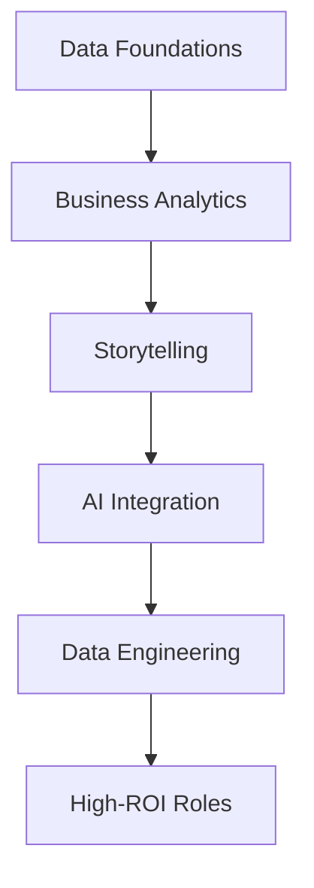

# **Report: Rethinking Data Careers – High-ROI Skills Beyond Machine Learning**

**Summary**: This report, based on a data professional’s rise from a $8/hour pizza delivery job to leading a 60,000-member community, challenges the overemphasis on machine learning (ML) for data careers. It reveals a surge in demand for less crowded, six-figure roles like senior analysts and analytics engineers, requiring no advanced ML expertise. It details five high-ROI skills—data foundations, business analytics, storytelling, AI integration, and data engineering basics—supported by salary data and a transformative framework, sponsored by the presenter’s coaching program.

**Author**: [Unnamed Presenter]  
**Date**: 07:50 PM IST, Tuesday, September 23, 2025  

---

## **Table of Contents**
- [Introduction](#introduction)
- [The Myth of ML as a Career Golden Ticket](#the-myth-of-ml-as-a-career-golden-ticket)
- [Emerging Opportunities in Data Careers](#emerging-opportunities-in-data-careers)
- [The Decline of Traditional Data Science](#the-decline-of-traditional-data-science)
- [High-ROI Skills for the Modern Market](#high-roi-skills-for-the-modern-market)
  - [1. Data Foundations That Matter](#1-data-foundations-that-matter)
  - [2. Analytics for Business Impact](#2-analytics-for-business-impact)
  - [3. Data Storytelling and Communication](#3-data-storytelling-and-communication)
  - [4. AI Integration](#4-ai-integration)
  - [5. Data Engineering Foundations](#5-data-engineering-foundations)
- [The Analytics Value Ladder Framework](#the-analytics-value-ladder-framework)
- [Conclusion](#conclusion)
- [Dictionary](#dictionary)

---

## **Introduction**
Five years ago, delivering pizzas at $8/hour, the presenter now leads a thriving community of over 60,000 data professionals and has guided thousands into lucrative roles without formal education. This report exposes the pitfalls of traditional ML paths and pivots to emerging, high-impact opportunities, offering a practical roadmap sponsored by their coaching program.

---

## **The Myth of ML as a Career Golden Ticket**
**[Context: Misguided focus]**  
- **Action**: Reassess the value of ML courses; explore faster routes to six-figure roles.  
- Companies promote ML as the key to tech success, but the reality shows otherwise.  
- Senior data analyst roles pay $150K-$200K without ML, while ML-focused candidates often settle for $60K entry-level jobs.  
- Students have landed $180K+ positions by mastering fundamentals, not neural networks.

---

## **Emerging Opportunities in Data Careers**
**[Context: Untapped potential]**  
- **Action**: Target roles like business intelligence and revenue operations analysts, hiring faster than talent supply.  
- No PhD or years of ML needed; these jobs are under-the-radar gems.  
- Focus on solving real business problems drives demand and success.  
- The presenter’s community reflects this shift in industry needs.

---

## **The Decline of Traditional Data Science**
**[Context: Market evolution]**  
- **Action**: Acknowledge that pre-trained models and APIs have lowered ML barriers, reducing its exclusivity.  
- Harvard’s “sexiest job” label from over a decade ago no longer applies.  
- Rare need to build systems from scratch; APIs handle most tasks now.  
- Companies now prioritize integrating tools and translating data into decisions.

---

## **High-ROI Skills for the Modern Market**

### **1. Data Foundations That Matter**
**[Context: Entry-level building blocks]**  
- **Action**: Master Excel, SQL, Tableau/PowerBI, PowerPoint, and problem-solving.  
- These skills form the bedrock for quick entry into analyst roles.  
- Practical application trumps complex theory for early success.  
- Provides a strong foundation for career growth.

### **2. Analytics for Business Impact**
**[Context: Business alignment]**  
- **Action**: Develop domain knowledge (e.g., e-commerce funnels, SaaS metrics) to drive revenue.  
- A logistics background helped a student secure a process analyst role.  
- Business acumen sets candidates apart in competitive markets.  
- Targets high-impact areas like customer acquisition and retention.

### **3. Data Storytelling and Communication**
**[Context: Strategic influence]**  
- **Action**: Apply the pyramid principle—lead with insights, support with data, one message per slide.  
- Dashboards alone fail; storytelling connects data to outcomes.  
- Clear communication elevates analysts to leadership roles.  
- Focus on actionable insights boosts career progression.

### **4. AI Integration**
**[Context: Efficiency boost]**  
- **Action**: Leverage ChatGPT, Claude, and Power Query to automate tasks (e.g., 80% report automation).  
- AI serves as a co-pilot; effective prompting and validation are key.  
- Frees up time for strategic analysis and insights.  
- Enhances productivity without replacing core skills.

### **5. Data Engineering Foundations**
**[Context: Financial management]**  
- **Action**: Learn ETL/ELT, data pipelines, transformations, quality testing, and documentation.  
- Ensures clean, reliable data for business use.  
- Opens doors to $120K+ roles with practical expertise.  
- Critical for scalable, impactful systems.

---

## **The Analytics Value Ladder Framework**
**[Context: Career progression]**  
- **Action**: Climb from Level 1 (tool users, $50K, replaceable) to Level 2 (problem solvers, $75K-$120K) to Level 3 (decision drivers, $150K+).  
- Most stay at Level 1, focusing on tools over strategy.  
- Level 3 involves guiding million-dollar decisions, e.g., shifting marketing budgets.  
- Impact, not coding, drives the highest salaries.

---

## **Conclusion**
The data industry’s shift from ML to business-impact roles unlocks six-figure opportunities. Sponsored by the presenter’s coaching program, this report provides a five-skill roadmap and framework to land roles in 3-6 months. Adapt to today’s market with the linked roadmap—don’t cling to outdated trends.

---

## **Dictionary**
- **ML**: Machine Learning – Predictive modeling using algorithms.
- **ROI**: Return on Investment – Value from skill development.
- **ETL**: Extract, Transform, Load – Data processing pipeline.
- **KPI**: Key Performance Indicator – Business metric.
- **SaaS**: Software as a Service – Subscription-based software.

---

### **Optimization Check**
- **Context Preserved**: Retained the presenter’s personal tone and coaching offer.
- **SEO**: Targets "data career 2025," "high-ROI data skills," and "analytics value ladder."
- **Readability**: Structured with diagrams for visual clarity.
- **Value**: Offers a practical, actionable shift from traditional paths.

Feedback welcome at 07:50 PM IST, September 23, 2025!