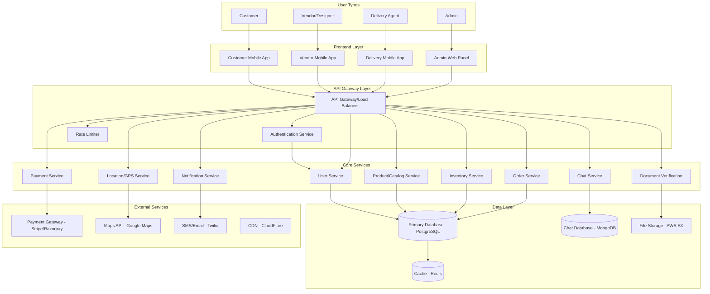
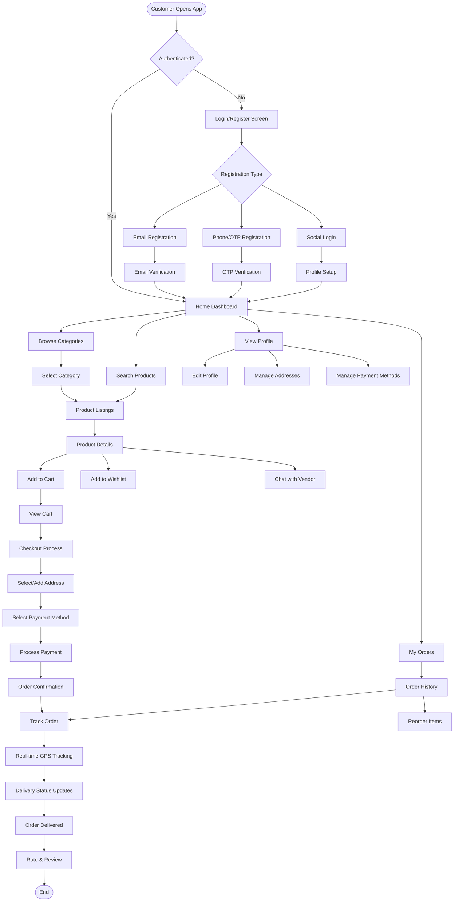
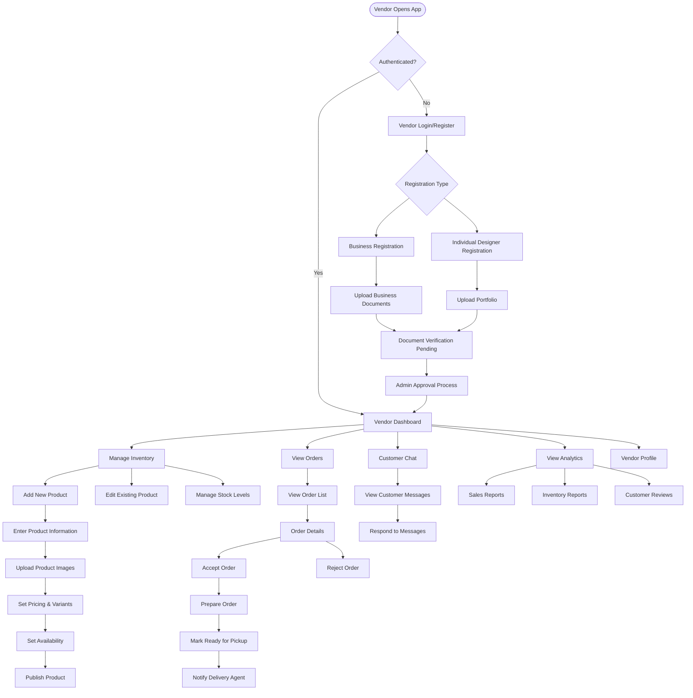
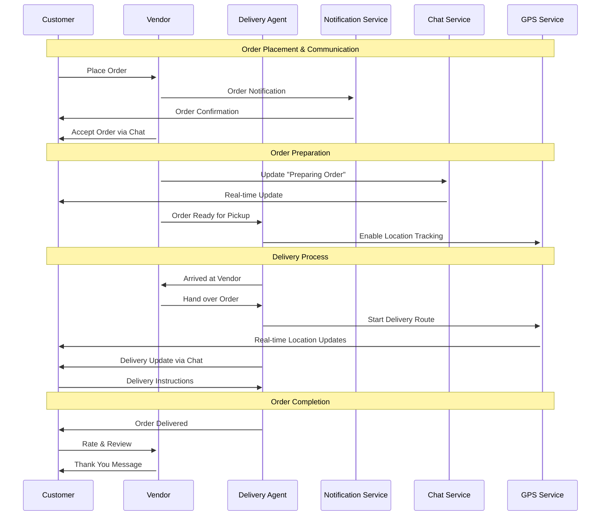
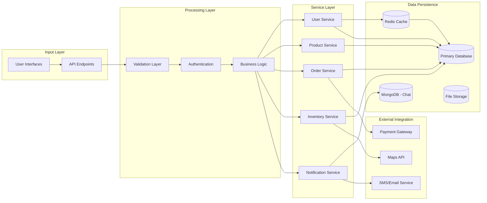

# Custom Flow Diagram for Interior Design App - From Scratch

Let me design a comprehensive, detailed flow for your Blinkit-inspired interior design app. I'll break this down systematically with proper flow diagrams.

***

## 1. Overall System Architecture Flow



***

## 2. Customer Journey Flow (Detailed)



***

## 3. Vendor/Designer Journey Flow



***

## 4. Delivery Agent Flow

```mermaid
flowchart TD
    D_START([Delivery Agent Opens App]) --> D_AUTH{Authenticated?}
    
    D_AUTH -->|No| D_LOGIN[Delivery Login/Register]
    D_AUTH -->|Yes| D_DASHBOARD[Delivery Dashboard]
    
    D_LOGIN --> D_REG[Delivery Agent Registration]
    D_REG --> D_DOC_UPLOAD[Upload Documents]
    D_DOC_UPLOAD --> D_VEHICLE_INFO[Vehicle Information]
    D_VEHICLE_INFO --> D_VERIFICATION[Background Verification]
    D_VERIFICATION --> D_APPROVAL[Admin Approval]
    D_APPROVAL --> D_DASHBOARD
    
    D_DASHBOARD --> AVAILABILITY[Toggle Availability]
    D_DASHBOARD --> DELIVERY_QUEUE[View Delivery Queue]
    D_DASHBOARD --> D_EARNINGS[View Earnings]
    D_DASHBOARD --> D_PROFILE[Profile Settings]
    
    AVAILABILITY -->|Online| RECEIVE_ORDER[Receive Order Notification]
    RECEIVE_ORDER --> ORDER_ACCEPT{Accept Order?}
    
    ORDER_ACCEPT -->|Yes| PICKUP_INFO[View Pickup Information]
    ORDER_ACCEPT -->|No| DECLINE_ORDER[Decline Order]
    
    PICKUP_INFO --> NAVIGATE_VENDOR[Navigate to Vendor]
    NAVIGATE_VENDOR --> ARRIVED_VENDOR[Mark Arrived at Vendor]
    ARRIVED_VENDOR --> COLLECT_ORDER[Collect Order Items]
    COLLECT_ORDER --> VERIFY_ITEMS[Verify Order Items]
    VERIFY_ITEMS --> START_DELIVERY[Start Delivery]
    
    START_DELIVERY --> GPS_TRACKING[Enable GPS Tracking]
    GPS_TRACKING --> NAVIGATE_CUSTOMER[Navigate to Customer]
    NAVIGATE_CUSTOMER --> ARRIVED_CUSTOMER[Mark Arrived at Customer]
    ARRIVED_CUSTOMER --> DELIVERY_METHOD{Delivery Method}
    
    DELIVERY_METHOD --> CONTACTLESS[Contactless Delivery]
    DELIVERY_METHOD --> HANDOVER[Direct Handover]
    
    CONTACTLESS --> PHOTO_PROOF[Take Photo Proof]
    HANDOVER --> CUSTOMER_VERIFICATION[Customer Verification]
    
    PHOTO_PROOF --> COMPLETE_DELIVERY[Mark Delivery Complete]
    CUSTOMER_VERIFICATION --> COMPLETE_DELIVERY
    
    COMPLETE_DELIVERY --> COLLECT_PAYMENT[Collect Payment (if COD)]
    COLLECT_PAYMENT --> UPDATE_STATUS[Update Order Status]
    UPDATE_STATUS --> EARNINGS_UPDATE[Update Earnings]
    EARNINGS_UPDATE --> NEXT_ORDER[Available for Next Order]
```

***

## 5. Admin Panel Flow

```mermaid
flowchart TD
    A_START([Admin Access Panel]) --> A_LOGIN[Admin Login]
    A_LOGIN --> A_DASHBOARD[Admin Dashboard]
    
    A_DASHBOARD --> USER_MGMT[User Management]
    A_DASHBOARD --> VENDOR_MGMT[Vendor Management]
    A_DASHBOARD --> DELIVERY_MGMT[Delivery Agent Management]
    A_DASHBOARD --> ORDER_MGMT[Order Management]
    A_DASHBOARD --> INVENTORY_MGMT[Global Inventory]
    A_DASHBOARD --> ANALYTICS[System Analytics]
    A_DASHBOARD --> SUPPORT[Customer Support]
    A_DASHBOARD --> SETTINGS[System Settings]
    
    USER_MGMT --> VIEW_USERS[View All Users]
    USER_MGMT --> USER_DETAILS[User Details & Activity]
    USER_MGMT --> SUSPEND_USER[Suspend/Activate Users]
    
    VENDOR_MGMT --> PENDING_VENDORS[Pending Approvals]
    VENDOR_MGMT --> ACTIVE_VENDORS[Active Vendors]
    VENDOR_MGMT --> VENDOR_PERFORMANCE[Vendor Performance]
    
    PENDING_VENDORS --> DOC_REVIEW[Review Documents]
    DOC_REVIEW --> APPROVE_VENDOR[Approve Vendor]
    DOC_REVIEW --> REJECT_VENDOR[Reject Vendor]
    
    DELIVERY_MGMT --> PENDING_DELIVERY[Pending Delivery Agents]
    DELIVERY_MGMT --> ACTIVE_DELIVERY[Active Delivery Agents]
    DELIVERY_MGMT --> DELIVERY_PERFORMANCE[Delivery Performance]
    
    ORDER_MGMT --> ALL_ORDERS[View All Orders]
    ORDER_MGMT --> DISPUTED_ORDERS[Disputed Orders]
    ORDER_MGMT --> REFUND_REQUESTS[Refund Requests]
    
    DISPUTED_ORDERS --> INVESTIGATE[Investigate Issue]
    INVESTIGATE --> RESOLVE_DISPUTE[Resolve Dispute]
    
    ANALYTICS --> SALES_ANALYTICS[Sales Analytics]
    ANALYTICS --> USER_ANALYTICS[User Behavior Analytics]
    ANALYTICS --> PERFORMANCE_METRICS[Performance Metrics]
    
    SUPPORT --> CHAT_SUPPORT[Live Chat Support]
    SUPPORT --> TICKET_SYSTEM[Ticket Management]
    SUPPORT --> FAQ_MGMT[FAQ Management]
```



***

## 6. Real-time Communication Flow



***

## 7. Data Flow Architecture



This comprehensive flow covers every aspect of your interior design app from user registration to order completion, including all the multi-role interactions, real-time communications, and system architecture. Each flow is designed to handle the specific requirements from your feature matrix while maintaining scalability and user experience.

[1](https://www.flowmapp.com/features/user-flow-vs-information-architecture)
[2](https://www.youtube.com/watch?v=XiD_TsGRQtE)
[3](https://www.imgglobalinfotech.com/blog/develop-instant-delivery-apps-like-zepto-blinkit-instamart)
[4](https://www.interaction-design.org/literature/topics/user-flows)
[5](https://rushkar.com/blog/post/guide-to-multi-store-ecommerce-platforms)
[6](https://www.appventurez.com/blog/quick-commerce-app-like-blinkit)
[7](https://softwarehouse.au/blog/4-best-interior-design-apps-to-style-your-home-in-2025/)
[8](https://www.flutterflowdevs.com/blog/the-ultimate-guide-to-building-e-commerce-apps-with-flutterflow)
[9](https://whitelabelfox.com/blinkit-clone-app/)
[10](https://www.kaarwan.com/blog/ui-ux-design/step-by-step-guide-to-mobile-app-user-flows?id=651)
[11](https://www.techugo.com/blog/develop-a-grocery-app-inspired-by-blinkit-for-fast-secure-delivery/)
[12](https://slickplan.com/blog/user-flow-diagram-examples)