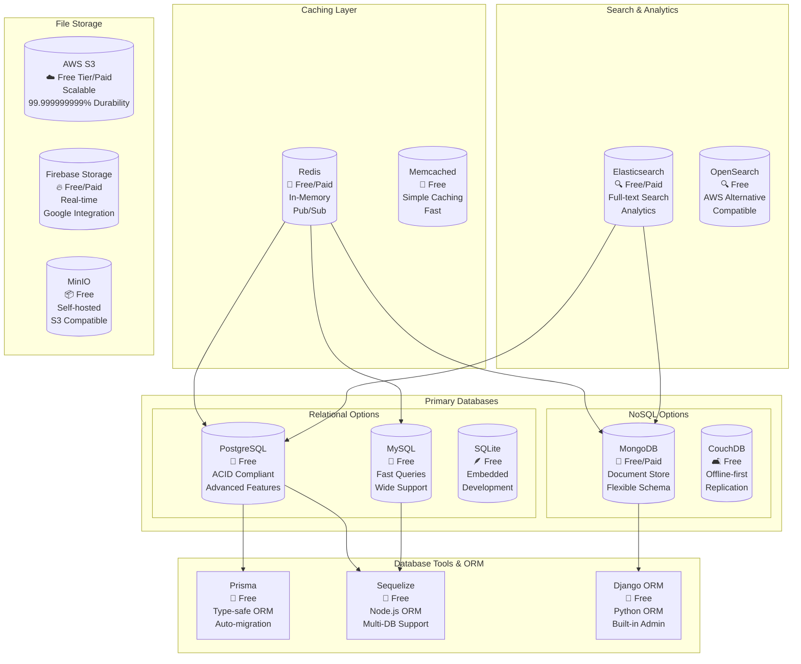
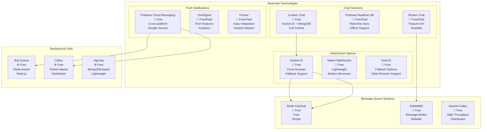

# Interior Design App - Complete Architecture with Tech Stack (Free & Paid Options)

Let me provide you with comprehensive architecture diagrams that include detailed tech stack options for your interior design app.

***

## 1. Complete System Architecture with Tech Stack Options

```mermaid
graph TB
    subgraph "Frontend Layer"
        MA[Mobile Apps<br/>📱 React Native (Free)<br/>📱 Flutter (Free)<br/>📱 Ionic (Paid)]
        WA[Web Admin Panel<br/>🌐 React.js (Free)<br/>🌐 Vue.js (Free)<br/>🌐 Angular (Free)]
    end
    
    subgraph "API Gateway & Security"
        AG[API Gateway<br/>🔀 Express Gateway (Free)<br/>🔀 Kong (Free/Paid)<br/>🔀 AWS API Gateway (Paid)]
        AUTH[Authentication<br/>🔐 Firebase Auth (Free/Paid)<br/>🔐 Auth0 (Free/Paid)<br/>🔐 Passport.js (Free)]
        RATE[Rate Limiting<br/>⚡ Express Rate Limit (Free)<br/>⚡ Redis (Free)<br/>⚡ Cloudflare (Free/Paid)]
    end
    
    subgraph "Backend Services"
        US[User Service<br/>👥 Node.js + Express (Free)<br/>👥 Django (Free)<br/>👥 Laravel (Free)]
        PS[Product Service<br/>📦 Node.js + Express (Free)<br/>📦 FastAPI (Free)<br/>📦 Spring Boot (Free)]
        OS[Order Service<br/>🛒 Node.js + Express (Free)<br/>🛒 Django REST (Free)<br/>🛒 NestJS (Free)]
        IS[Inventory Service<br/>📊 Node.js + Express (Free)<br/>📊 Django (Free)<br/>📊 Go + Gin (Free)]
        NS[Notification Service<br/>🔔 Node.js + FCM (Free)<br/>🔔 Pusher (Free/Paid)<br/>🔔 OneSignal (Free/Paid)]
        CS[Chat Service<br/>💬 Socket.io (Free)<br/>💬 Firebase (Free/Paid)<br/>💬 Stream Chat (Free/Paid)]
        GPS[Location Service<br/>📍 Google Maps API (Free/Paid)<br/>📍 Mapbox (Free/Paid)<br/>📍 OpenStreetMap (Free)]
        DS[Document Service<br/>📄 Multer + AWS S3 (Free/Paid)<br/>📄 Firebase Storage (Free/Paid)<br/>📄 Cloudinary (Free/Paid)]
    end
    
    subgraph "Database Layer"
        PDB[(Primary Database<br/>🗄️ PostgreSQL (Free)<br/>🗄️ MySQL (Free)<br/>🗄️ MongoDB (Free/Paid))]
        CACHE[(Cache Layer<br/>⚡ Redis (Free)<br/>⚡ Memcached (Free)<br/>⚡ ElastiCache (Paid))]
        CHAT_DB[(Chat Database<br/>💬 MongoDB (Free)<br/>💬 Firebase Firestore (Free/Paid)<br/>💬 CouchDB (Free))]
        FILE_STORAGE[(File Storage<br/>📁 AWS S3 (Free/Paid)<br/>📁 Firebase Storage (Free/Paid)<br/>📁 MinIO (Free))]
    end
    
    subgraph "External Integrations"
        PAYMENT[Payment Gateway<br/>💳 Stripe (Paid)<br/>💳 Razorpay (Paid)<br/>💳 PayPal (Paid)]
        EMAIL[Email Service<br/>📧 SendGrid (Free/Paid)<br/>📧 Mailgun (Free/Paid)<br/>📧 AWS SES (Paid)]
        SMS[SMS Service<br/>📱 Twilio (Paid)<br/>📱 Firebase (Free/Paid)<br/>📱 AWS SNS (Paid)]
    end
    
    subgraph "Infrastructure & DevOps"
        HOST[Hosting<br/>☁️ Vercel (Free/Paid)<br/>☁️ Netlify (Free/Paid)<br/>☁️ AWS/GCP/Azure (Paid)]
        CI_CD[CI/CD<br/>⚙️ GitHub Actions (Free)<br/>⚙️ GitLab CI (Free)<br/>⚙️ Jenkins (Free)]
        MONITOR[Monitoring<br/>📊 Sentry (Free/Paid)<br/>📊 New Relic (Paid)<br/>📊 DataDog (Paid)]
    end
    
    MA --> AG
    WA --> AG
    AG --> AUTH & RATE
    AG --> US & PS & OS & IS & NS & CS & GPS & DS
    
    US --> PDB & CACHE
    PS --> PDB & CACHE
    OS --> PDB & CACHE
    IS --> PDB & CACHE
    NS --> EMAIL & SMS
    CS --> CHAT_DB
    DS --> FILE_STORAGE
    
    OS --> PAYMENT
    NS --> EMAIL & SMS
    GPS --> PAYMENT
```

***

## 2. Frontend Architecture (Multi-Platform)

```mermaid
graph TB
    subgraph "Mobile Apps (iOS/Android)"
        subgraph "Customer App"
            C_UI[UI Layer<br/>📱 React Native (Free)<br/>📱 Flutter (Free)]
            C_STATE[State Management<br/>🔄 Redux (Free)<br/>🔄 MobX (Free)<br/>🔄 Zustand (Free)]
            C_NAV[Navigation<br/>🧭 React Navigation (Free)<br/>🧭 Flutter Navigator (Free)]
            C_API[API Layer<br/>🌐 Axios (Free)<br/>🌐 Fetch (Free)<br/>🌐 Apollo Client (Free)]
        end
        
        subgraph "Vendor App"
            V_UI[UI Layer<br/>📱 React Native (Free)<br/>📱 Flutter (Free)]
            V_STATE[State Management<br/>🔄 Redux (Free)<br/>🔄 MobX (Free)]
            V_API[API Layer<br/>🌐 Axios (Free)<br/>🌐 Fetch (Free)]
        end
        
        subgraph "Delivery App"
            D_UI[UI Layer<br/>📱 React Native (Free)<br/>📱 Flutter (Free)]
            D_STATE[State Management<br/>🔄 Redux (Free)<br/>🔄 Provider (Free)]
            D_GPS[GPS Integration<br/>📍 React Native Maps (Free)<br/>📍 Google Maps (Free/Paid)]
            D_API[API Layer<br/>🌐 Axios (Free)<br/>🌐 Dio (Free)]
        end
    end
    
    subgraph "Web Admin Panel"
        W_FRAMEWORK[Framework<br/>🌐 React.js (Free)<br/>🌐 Vue.js (Free)<br/>🌐 Angular (Free)]
        W_UI_LIB[UI Library<br/>🎨 Material-UI (Free)<br/>🎨 Ant Design (Free)<br/>🎨 Chakra UI (Free)]
        W_STATE[State Management<br/>🔄 Redux (Free)<br/>🔄 Vuex (Free)<br/>🔄 NgRx (Free)]
        W_CHARTS[Charts & Analytics<br/>📊 Chart.js (Free)<br/>📊 D3.js (Free)<br/>📊 Recharts (Free)]
    end
    
    subgraph "Shared Components"
        DESIGN_SYS[Design System<br/>🎨 Storybook (Free)<br/>🎨 Bit (Free/Paid)]
        ICONS[Icons<br/>🎯 React Icons (Free)<br/>🎯 Feather Icons (Free)]
        FORMS[Form Handling<br/>📝 Formik (Free)<br/>📝 React Hook Form (Free)]
    end
    
    C_UI --> C_STATE --> C_API
    V_UI --> V_STATE --> V_API
    D_UI --> D_STATE --> D_GPS --> D_API
    W_FRAMEWORK --> W_UI_LIB --> W_STATE --> W_CHARTS
    
    DESIGN_SYS --> C_UI & V_UI & D_UI & W_FRAMEWORK
```

***

## 3. Backend Microservices Architecture with Tech Stack

```mermaid
graph TB
    subgraph "API Gateway Layer"
        GATEWAY[API Gateway<br/>🔀 Express Gateway (Free)<br/>🔀 Traefik (Free)<br/>🔀 Kong (Free/Paid)<br/>🔀 AWS API Gateway (Paid)]
        LB[Load Balancer<br/>⚖️ Nginx (Free)<br/>⚖️ HAProxy (Free)<br/>⚖️ AWS ALB (Paid)]
        CORS[CORS Handler<br/>🔒 Express CORS (Free)<br/>🔒 Django CORS (Free)]
    end
    
    subgraph "Authentication & Authorization"
        AUTH_SVC[Auth Service<br/>🔐 Node.js + Passport (Free)<br/>🔐 Django + JWT (Free)<br/>🔐 Firebase Auth (Free/Paid)]
        RBAC[Role-Based Access<br/>👤 Casbin (Free)<br/>👤 CASL (Free)<br/>👤 Auth0 (Free/Paid)]
        JWT[JWT Management<br/>🎫 jsonwebtoken (Free)<br/>🎫 PyJWT (Free)]
    end
    
    subgraph "Core Business Services"
        USER_SVC[User Management<br/>👥 Node.js + Express (Free)<br/>👥 Django + DRF (Free)<br/>👥 FastAPI (Free)]
        PROD_SVC[Product Catalog<br/>📦 Node.js + Express (Free)<br/>📦 Django (Free)<br/>📦 Spring Boot (Free)]
        INV_SVC[Inventory Service<br/>📊 Node.js + Express (Free)<br/>📊 Go + Gin (Free)<br/>📊 Python + Flask (Free)]
        ORDER_SVC[Order Processing<br/>🛒 Node.js + Express (Free)<br/>🛒 Django + Celery (Free)<br/>🛒 NestJS (Free)]
    end
    
    subgraph "Communication Services"
        NOTIF_SVC[Notification Service<br/>🔔 Node.js + FCM (Free)<br/>🔔 Python + Celery (Free)<br/>🔔 Pusher (Free/Paid)]
        CHAT_SVC[Chat Service<br/>💬 Socket.io (Free)<br/>💬 WebSocket (Free)<br/>💬 Stream Chat (Free/Paid)]
        EMAIL_SVC[Email Service<br/>📧 Nodemailer (Free)<br/>📧 SendGrid (Free/Paid)<br/>📧 Mailgun (Free/Paid)]
    end
    
    subgraph "Location & Media Services"
        LOCATION_SVC[Location Service<br/>📍 Node.js + Google Maps (Free/Paid)<br/>📍 PostGIS (Free)<br/>📍 Mapbox (Free/Paid)]
        MEDIA_SVC[Media Service<br/>🖼️ Multer + Sharp (Free)<br/>🖼️ Cloudinary (Free/Paid)<br/>🖼️ AWS S3 + Lambda (Paid)]
        DOC_SVC[Document Verification<br/>📄 Custom OCR (Free)<br/>📄 Google Vision (Free/Paid)<br/>📄 AWS Textract (Paid)]
    end
    
    GATEWAY --> LB --> CORS
    GATEWAY --> AUTH_SVC --> RBAC --> JWT
    GATEWAY --> USER_SVC & PROD_SVC & INV_SVC & ORDER_SVC
    GATEWAY --> NOTIF_SVC & CHAT_SVC & EMAIL_SVC
    GATEWAY --> LOCATION_SVC & MEDIA_SVC & DOC_SVC
```

***

## 4. Database Architecture with Technology Options



***

## 5. Real-time Communication Stack



***

## 6. Infrastructure & DevOps Stack

```mermaid
graph TB
    subgraph "Development Environment"
        IDE[Development Tools<br/>💻 VS Code (Free)<br/>💻 WebStorm (Paid)<br/>💻 Android Studio (Free)]
        GIT[Version Control<br/>📝 Git (Free)<br/>📝 GitHub (Free/Paid)<br/>📝 GitLab (Free/Paid)]
        DOCKER[Containerization<br/>🐳 Docker (Free)<br/>🐳 Docker Compose (Free)<br/>🐳 Podman (Free)]
    end
    
    subgraph "CI/CD Pipeline"
        GITHUB_ACTIONS[GitHub Actions<br/>⚙️ Free/Paid<br/>2000 mins free<br/>Easy Integration]
        GITLAB_CI[GitLab CI<br/>⚙️ Free/Paid<br/>400 mins free<br/>Built-in Registry]
        JENKINS[Jenkins<br/>⚙️ Free<br/>Self-hosted<br/>Highly Customizable]
    end
    
    subgraph "Hosting Options"
        subgraph "Free Tier Hosting"
            VERCEL[Vercel<br/>🚀 Free/Paid<br/>Serverless<br/>Great for Frontend]
            NETLIFY[Netlify<br/>🚀 Free/Paid<br/>JAMstack Focus<br/>Easy Deployment]
            RENDER[Render<br/>🚀 Free/Paid<br/>Full-stack<br/>Auto-deploy]
            RAILWAY[Railway<br/>🚀 Free/Paid<br/>Simple Setup<br/>Database Included]
        end
        
        subgraph "Cloud Providers"
            AWS[AWS<br/>☁️ Free Tier/Paid<br/>Comprehensive<br/>Industry Standard]
            GCP[Google Cloud<br/>☁️ Free Tier/Paid<br/>AI/ML Tools<br/>Firebase Integration]
            AZURE[Microsoft Azure<br/>☁️ Free Tier/Paid<br/>Enterprise Focus<br/>Windows Integration]
        end
    end
    
    subgraph "Monitoring & Analytics"
        SENTRY[Sentry<br/>🐛 Free/Paid<br/>Error Tracking<br/>Performance Monitoring]
        GOOGLE_ANALYTICS[Google Analytics<br/>📊 Free<br/>Web Analytics<br/>User Behavior]
        MIXPANEL[Mixpanel<br/>📊 Free/Paid<br/>Event Tracking<br/>User Analytics]
    end
    
    IDE --> GIT --> DOCKER
    GIT --> GITHUB_ACTIONS & GITLAB_CI & JENKINS
    GITHUB_ACTIONS --> VERCEL & NETLIFY & AWS
    GITLAB_CI --> RENDER & GCP
    JENKINS --> RAILWAY & AZURE
    
    VERCEL & NETLIFY & RENDER --> SENTRY & GOOGLE_ANALYTICS
    AWS & GCP & AZURE --> SENTRY & MIXPANEL
```

***

## 7. Cost Breakdown by Technology Choice

| Component | Free Option | Cost | Paid Alternative | Cost |
|-----------|-------------|------|------------------|------|
| **Frontend** | React Native + Expo | $0 | Flutter + Premium UI Kit | $200-500 |
| **Backend** | Node.js + Express | $0 | NestJS + Enterprise | $0-1000/yr |
| **Database** | PostgreSQL (self-hosted) | $0-50/mo | AWS RDS | $50-200/mo |
| **Hosting** | Vercel/Netlify/Render | $0-100/mo | AWS/GCP/Azure | $100-500/mo |
| **Authentication** | Firebase Auth | $0-25/mo | Auth0 | $23-240/mo |
| **Notifications** | FCM | $0 | OneSignal | $9-99/mo |
| **Maps/GPS** | Google Maps (free quota) | $0-200/mo | Mapbox | $50-500/mo |
| **File Storage** | Firebase Storage | $0-25/mo | AWS S3 | $23-100/mo |
| **Chat** | Socket.IO + MongoDB | $0-50/mo | Stream Chat | $99-499/mo |
| **Monitoring** | Sentry (free tier) | $0-26/mo | New Relic | $99-349/mo |
| **CI/CD** | GitHub Actions | $0-21/mo | GitLab Premium | $19-99/mo |

**Total Monthly Cost Range:**
- **Minimal (Free/Low-cost):** $0 - $300/month
- **Professional (Mixed):** $300 - $1,000/month  
- **Enterprise (Premium):** $1,000 - $3,000+/month

This architecture provides you with a complete roadmap for building your interior design app with clear technology choices for every component, from free options for bootstrapping to premium solutions for scaling.

[1](https://www.shopify.com/in/enterprise/blog/ecommerce-tech-stack)
[2](https://bambooagile.eu/insights/mobile-application-architecture)
[3](https://www.bezkoder.com/react-node-express-postgresql/)
[4](https://6ammart.app/blog/best-technology-stack-for-ecommerce-website/)
[5](https://www.intellectsoft.net/blog/mobile-app-architecture/)
[6](https://www.youtube.com/watch?v=ldYcgPKEZC8)
[7](https://dev.to/mwacharo6/building-world-class-multi-platform-apps-the-ultimate-tech-stack-for-2025-3bc5)
[8](https://www.mendix.com/mobile-architecture/)
[9](https://dev.to/goodpic/understanding-react-native-architecture-22hh)
[10](https://www.myvirtualteams.com/what-is-the-best-tech-stack-for-e-commerce-app-development-in-2025/)
[11](https://www.imaginarycloud.com/blog/techstack-mobile-app)