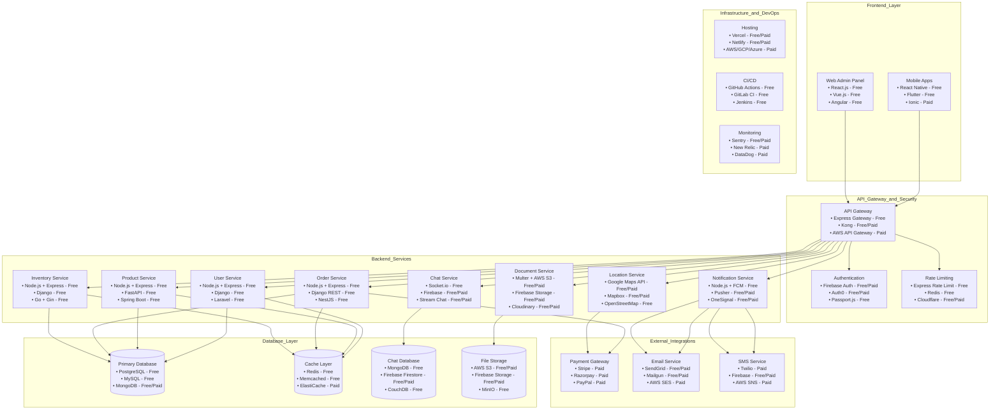
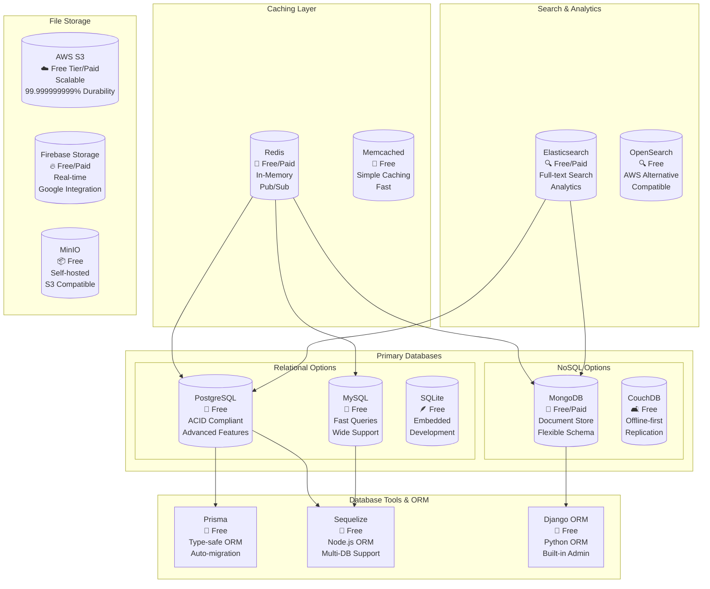
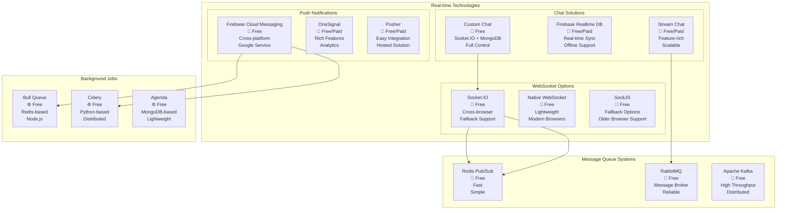

# Interior Design App - Complete Architecture with Tech Stack (Free & Paid Options)

Let me provide you with comprehensive architecture diagrams that include detailed tech stack options for your interior design app.

***

## 1. Complete System Architecture with Tech Stack Options



***

## 2. Frontend Architecture (Multi-Platform)

```mermaid
graph TB
    subgraph Mobile_Apps_iOS_Android
        subgraph Customer_App
            C_UI[UI Layer\n📱 React Native (Free)\n📱 Flutter (Free)]
            C_STATE[State Management\n🔄 Redux (Free)\n🔄 MobX (Free)\n🔄 Zustand (Free)]
            C_NAV[Navigation\n🧭 React Navigation (Free)\n🧭 Flutter Navigator (Free)]
            C_API[API Layer\n🌐 Axios (Free)\n🌐 Fetch (Free)\n🌐 Apollo Client (Free)]
        end
        
        subgraph Vendor_App
            V_UI[UI Layer\n📱 React Native (Free)\n📱 Flutter (Free)]
            V_STATE[State Management\n🔄 Redux (Free)\n🔄 MobX (Free)]
            V_API[API Layer\n🌐 Axios (Free)\n🌐 Fetch (Free)]
        end
        
        subgraph Delivery_App
            D_UI[UI Layer\n📱 React Native (Free)\n📱 Flutter (Free)]
            D_STATE[State Management\n🔄 Redux (Free)\n🔄 Provider (Free)]
            D_GPS[GPS Integration\n📍 React Native Maps (Free)\n📍 Google Maps (Free/Paid)]
            D_API[API Layer\n🌐 Axios (Free)\n🌐 Dio (Free)]
        end
    end
    
    subgraph Web_Admin_Panel
        W_FRAMEWORK[Framework\n🌐 React.js (Free)\n🌐 Vue.js (Free)\n🌐 Angular (Free)]
        W_UI_LIB[UI Library\n🎨 Material-UI (Free)\n🎨 Ant Design (Free)\n🎨 Chakra UI (Free)]
        W_STATE[State Management\n🔄 Redux (Free)\n🔄 Vuex (Free)\n🔄 NgRx (Free)]
        W_CHARTS[Charts & Analytics\n📊 Chart.js (Free)\n📊 D3.js (Free)\n📊 Recharts (Free)]
    end
    
    subgraph Shared_Components
        DESIGN_SYS[Design System\n🎨 Storybook (Free)\n🎨 Bit (Free/Paid)]
        ICONS[Icons\n🎯 React Icons (Free)\n🎯 Feather Icons (Free)]
        FORMS[Form Handling\n📝 Formik (Free)\n📝 React Hook Form (Free)]
    end
    
    C_UI --> C_STATE
    C_STATE --> C_API
    C_STATE --> C_NAV
    V_UI --> V_STATE
    V_STATE --> V_API
    D_UI --> D_STATE
    D_STATE --> D_GPS
    D_GPS --> D_API
    W_FRAMEWORK --> W_UI_LIB
    W_UI_LIB --> W_STATE
    W_STATE --> W_CHARTS
    
    DESIGN_SYS --> C_UI
    DESIGN_SYS --> V_UI
    DESIGN_SYS --> D_UI
    DESIGN_SYS --> W_FRAMEWORK
```

***

## 3. Backend Microservices Architecture with Tech Stack

```mermaid
graph TB
    subgraph API_Gateway_Layer
        GATEWAY[API Gateway\n🔀 Express Gateway (Free)\n🔀 Traefik (Free)\n🔀 Kong (Free/Paid)\n🔀 AWS API Gateway (Paid)]
        LB[Load Balancer\n⚖️ Nginx (Free)\n⚖️ HAProxy (Free)\n⚖️ AWS ALB (Paid)]
        CORS[CORS Handler\n🔒 Express CORS (Free)\n🔒 Django CORS (Free)]
    end
    
    subgraph Authentication_and_Authorization
        AUTH_SVC[Auth Service\n🔐 Node.js + Passport (Free)\n🔐 Django + JWT (Free)\n🔐 Firebase Auth (Free/Paid)]
        RBAC[Role-Based Access\n👤 Casbin (Free)\n👤 CASL (Free)\n👤 Auth0 (Free/Paid)]
        JWT[JWT Management\n🎫 jsonwebtoken (Free)\n🎫 PyJWT (Free)]
    end
    
    subgraph Core_Business_Services
        USER_SVC[User Management\n👥 Node.js + Express (Free)\n👥 Django + DRF (Free)\n👥 FastAPI (Free)]
        PROD_SVC[Product Catalog\n📦 Node.js + Express (Free)\n📦 Django (Free)\n📦 Spring Boot (Free)]
        INV_SVC[Inventory Service\n📊 Node.js + Express (Free)\n📊 Go + Gin (Free)\n📊 Python + Flask (Free)]
        ORDER_SVC[Order Processing\n🛒 Node.js + Express (Free)\n🛒 Django + Celery (Free)\n🛒 NestJS (Free)]
    end
    
    subgraph Communication_Services
        NOTIF_SVC[Notification Service\n🔔 Node.js + FCM (Free)\n🔔 Python + Celery (Free)\n🔔 Pusher (Free/Paid)]
        CHAT_SVC[Chat Service\n💬 Socket.io (Free)\n💬 WebSocket (Free)\n💬 Stream Chat (Free/Paid)]
        EMAIL_SVC[Email Service\n📧 Nodemailer (Free)\n📧 SendGrid (Free/Paid)\n📧 Mailgun (Free/Paid)]
    end
    
    subgraph Location_and_Media_Services
        LOCATION_SVC[Location Service\n📍 Node.js + Google Maps (Free/Paid)\n📍 PostGIS (Free)\n📍 Mapbox (Free/Paid)]
        MEDIA_SVC[Media Service\n🖼️ Multer + Sharp (Free)\n🖼️ Cloudinary (Free/Paid)\n🖼️ AWS S3 + Lambda (Paid)]
        DOC_SVC[Document Verification\n📄 Custom OCR (Free)\n📄 Google Vision (Free/Paid)\n📄 AWS Textract (Paid)]
    end
    
    GATEWAY --> LB
    LB --> CORS
    GATEWAY --> AUTH_SVC
    AUTH_SVC --> RBAC
    RBAC --> JWT
    GATEWAY --> USER_SVC
    GATEWAY --> PROD_SVC
    GATEWAY --> INV_SVC
    GATEWAY --> ORDER_SVC
    GATEWAY --> NOTIF_SVC
    GATEWAY --> CHAT_SVC
    GATEWAY --> EMAIL_SVC
    GATEWAY --> LOCATION_SVC
    GATEWAY --> MEDIA_SVC
    GATEWAY --> DOC_SVC
```

***

## 4. Database Architecture with Technology Options



***

## 5. Real-time Communication Stack



***

## 6. Infrastructure & DevOps Stack

```mermaid
graph TB
    subgraph Development_Environment
        IDE[Development Tools\n💻 VS Code (Free)\n💻 WebStorm (Paid)\n💻 Android Studio (Free)]
        GIT[Version Control\n📝 Git (Free)\n📝 GitHub (Free/Paid)\n📝 GitLab (Free/Paid)]
        DOCKER[Containerization\n🐳 Docker (Free)\n🐳 Docker Compose (Free)\n🐳 Podman (Free)]
    end
    
    subgraph CI_CD_Pipeline
        GITHUB_ACTIONS[GitHub Actions\n⚙️ Free/Paid\n2000 mins free\nEasy Integration]
        GITLAB_CI[GitLab CI\n⚙️ Free/Paid\n400 mins free\nBuilt-in Registry]
        JENKINS[Jenkins\n⚙️ Free\nSelf-hosted\nHighly Customizable]
    end
    
    subgraph Hosting_Options
        subgraph Free_Tier_Hosting
            VERCEL[Vercel\n🚀 Free/Paid\nServerless\nGreat for Frontend]
            NETLIFY[Netlify\n🚀 Free/Paid\nJAMstack Focus\nEasy Deployment]
            RENDER[Render\n🚀 Free/Paid\nFull-stack\nAuto-deploy]
            RAILWAY[Railway\n🚀 Free/Paid\nSimple Setup\nDatabase Included]
        end
        
        subgraph Cloud_Providers
            AWS[AWS\n☁️ Free Tier/Paid\nComprehensive\nIndustry Standard]
            GCP[Google Cloud\n☁️ Free Tier/Paid\nAI/ML Tools\nFirebase Integration]
            AZURE[Microsoft Azure\n☁️ Free Tier/Paid\nEnterprise Focus\nWindows Integration]
        end
    end
    
    subgraph Monitoring_and_Analytics
        SENTRY[Sentry\n🐛 Free/Paid\nError Tracking\nPerformance Monitoring]
        GOOGLE_ANALYTICS[Google Analytics\n📊 Free\nWeb Analytics\nUser Behavior]
        MIXPANEL[Mixpanel\n📊 Free/Paid\nEvent Tracking\nUser Analytics]
    end
    
    IDE --> GIT
    GIT --> DOCKER
    GIT --> GITHUB_ACTIONS
    GIT --> GITLAB_CI
    GIT --> JENKINS
    GITHUB_ACTIONS --> VERCEL
    GITHUB_ACTIONS --> NETLIFY
    GITHUB_ACTIONS --> AWS
    GITLAB_CI --> RENDER
    GITLAB_CI --> GCP
    JENKINS --> RAILWAY
    JENKINS --> AZURE
    VERCEL --> SENTRY
    VERCEL --> GOOGLE_ANALYTICS
    NETLIFY --> SENTRY
    NETLIFY --> GOOGLE_ANALYTICS
    RENDER --> SENTRY
    RENDER --> GOOGLE_ANALYTICS
    AWS --> SENTRY
    AWS --> MIXPANEL
    GCP --> SENTRY
    GCP --> MIXPANEL
    AZURE --> SENTRY
    AZURE --> MIXPANEL
```

***

## 7. Cost Breakdown by Technology Choice

| Component | Free Option | Cost | Paid Alternative | Cost |
|-----------|-------------|------|------------------|------|
| **Frontend** | React Native + Expo | $0 | Flutter + Premium UI Kit | $200-500 |
| **Backend** | Node.js + Express | $0 | NestJS + Enterprise | $0-1000/yr |
| **Database** | PostgreSQL (self-hosted) | $0-50/mo | AWS RDS | $50-200/mo |
| **Hosting** | Vercel/Netlify/Render | $0-100/mo | AWS/GCP/Azure | $100-500/mo |
| **Authentication** | Firebase Auth | $0-25/mo | Auth0 | $23-240/mo |
| **Notifications** | FCM | $0 | OneSignal | $9-99/mo |
| **Maps/GPS** | Google Maps (free quota) | $0-200/mo | Mapbox | $50-500/mo |
| **File Storage** | Firebase Storage | $0-25/mo | AWS S3 | $23-100/mo |
| **Chat** | Socket.IO + MongoDB | $0-50/mo | Stream Chat | $99-499/mo |
| **Monitoring** | Sentry (free tier) | $0-26/mo | New Relic | $99-349/mo |
| **CI/CD** | GitHub Actions | $0-21/mo | GitLab Premium | $19-99/mo |

**Total Monthly Cost Range:**
- **Minimal (Free/Low-cost):** $0 - $300/month
- **Professional (Mixed):** $300 - $1,000/month  
- **Enterprise (Premium):** $1,000 - $3,000+/month

This architecture provides you with a complete roadmap for building your interior design app with clear technology choices for every component, from free options for bootstrapping to premium solutions for scaling.

[1](https://www.shopify.com/in/enterprise/blog/ecommerce-tech-stack)
[2](https://bambooagile.eu/insights/mobile-application-architecture)
[3](https://www.bezkoder.com/react-node-express-postgresql/)
[4](https://6ammart.app/blog/best-technology-stack-for-ecommerce-website/)
[5](https://www.intellectsoft.net/blog/mobile-app-architecture/)
[6](https://www.youtube.com/watch?v=ldYcgPKEZC8)
[7](https://dev.to/mwacharo6/building-world-class-multi-platform-apps-the-ultimate-tech-stack-for-2025-3bc5)
[8](https://www.mendix.com/mobile-architecture/)
[9](https://dev.to/goodpic/understanding-react-native-architecture-22hh)
[10](https://www.myvirtualteams.com/what-is-the-best-tech-stack-for-e-commerce-app-development-in-2025/)
[11](https://www.imaginarycloud.com/blog/techstack-mobile-app)