# Limited Scope Interior Design App - Architecture & System Design

Based on your ₹30,000 budget constraint, here's the simplified architecture focusing only on the included features.

***

## 1. Overall System Architecture (Budget-Constrained)


***

## 2. Simplified User Flow Architecture


***

## 3. Database Schema (Simplified)

```mermaid
erDiagram
    USERS {
        int id PK
        string name
        string email UNIQUE
        string password_hash
        string phone
        string role
        string status
        date created_at
        date updated_at
    }
    VENDORS {
        int id PK
        int user_id FK
        string business_name
        string business_address
        string approval_status
        date created_at
    }
    CATEGORIES {
        int id PK
        string name
        string description
        string image_url
        boolean is_active
    }
    PRODUCTS {
        int id PK
        int vendor_id FK
        int category_id FK
        string name
        string description
        float price
        string image_url
        int stock_quantity
        boolean is_active
        date created_at
    }
    ORDERS {
        int id PK
        int customer_id FK
        int vendor_id FK
        float total_amount
        string status
        string delivery_address
        string notes
        date created_at
        date updated_at
    }
    ORDER_ITEMS {
        int id PK
        int order_id FK
        int product_id FK
        int quantity
        float price
        float subtotal
    }

    USERS ||--o{ VENDORS : "has"
    VENDORS ||--o{ PRODUCTS : "sells"
    CATEGORIES ||--o{ PRODUCTS : "contains"
    USERS ||--o{ ORDERS : "places"
    VENDORS ||--o{ ORDERS : "receives"
    ORDERS ||--o{ ORDER_ITEMS : "contains"
    PRODUCTS ||--o{ ORDER_ITEMS : "included_in"

```

***

## 4. API Architecture (RESTful - Simplified)

```mermaid
graph TB
    subgraph "API Endpoints Structure"
        subgraph "Authentication APIs"
            A1[POST /auth/register<br/>🔐 User Registration]
            A2[POST /auth/login<br/>🔐 User Login]
            A3[POST /auth/logout<br/>🔐 User Logout]
        end
        
        subgraph "User APIs"
            U1[GET /users/profile<br/>👤 Get User Profile]
            U2[PUT /users/profile<br/>👤 Update Profile]
            U3[GET /users/orders<br/>📋 User Order History]
        end
        
        subgraph "Product APIs"
            P1[GET /products<br/>📦 List Products with Pagination]
            P2[GET /products/:id<br/>📦 Get Product Details]
            P3[GET /categories<br/>📂 List Categories]
            P4[GET /products/search<br/>🔍 Search Products]
        end
        
        subgraph "Vendor APIs"
            V1[GET /vendor/products<br/>🏪 Vendor's Products]
            V2[POST /vendor/products<br/>🏪 Add Product]
            V3[PUT /vendor/products/:id<br/>🏪 Update Product]
            V4[DELETE /vendor/products/:id<br/>🏪 Remove Product]
            V5[GET /vendor/orders<br/>📋 Vendor Orders]
            V6[PUT /vendor/orders/:id<br/>📋 Update Order Status]
        end
        
        subgraph "Order APIs"
            O1[POST /orders<br/>🛒 Place Order]
            O2[GET /orders/:id<br/>🛒 Get Order Details]
            O3[PUT /orders/:id/status<br/>🛒 Update Order Status]
        end
        
        subgraph "Admin APIs"
            AD1[GET /admin/users<br/>👥 List All Users]
            AD2[GET /admin/vendors/pending<br/>🏪 Pending Vendor Approvals]
            AD3[PUT /admin/vendors/:id/approve<br/>✅ Approve Vendor]
            AD4[GET /admin/orders<br/>📊 All Orders Overview]
            AD5[GET /admin/analytics<br/>📊 Basic Analytics]
        end
    end
```



***

## 5. Technology Stack Breakdown (Budget-Optimized)

```mermaid
graph LR
    subgraph "Frontend Technologies"
        subgraph "Android App"
            RN[React Native<br/>📱 Cross-platform Framework<br/>💰 FREE<br/>🔧 JavaScript/TypeScript]
            RN_NAV[React Navigation<br/>🧭 App Navigation<br/>💰 FREE]
            AXIOS[Axios<br/>🌐 HTTP Client<br/>💰 FREE]
        end
        
        subgraph "Web Panels"
            REACT[React.js<br/>⚛️ Frontend Framework<br/>💰 FREE<br/>🔧 JavaScript]
            BOOTSTRAP[Bootstrap<br/>🎨 CSS Framework<br/>💰 FREE<br/>🔧 Responsive Design]
            MUI[Material-UI<br/>🎨 Component Library<br/>💰 FREE<br/>🔧 Admin Panel]
        end
    end
    
    subgraph "Backend Technologies"
        NODE[Node.js<br/>⚙️ Runtime Environment<br/>💰 FREE<br/>🔧 JavaScript]
        EXPRESS[Express.js<br/>🚂 Web Framework<br/>💰 FREE<br/>🔧 RESTful APIs]
        JWT[JSON Web Tokens<br/>🎫 Authentication<br/>💰 FREE<br/>🔧 Stateless Auth]
        BCRYPT[bcryptjs<br/>🔐 Password Hashing<br/>💰 FREE<br/>🔧 Security]
        MULTER[Multer<br/>📁 File Upload<br/>💰 FREE<br/>🔧 Image Handling]
    end
    
    subgraph "Database & Storage"
        POSTGRES[PostgreSQL<br/>🐘 Relational Database<br/>💰 FREE<br/>🔧 ACID Compliant]
        LOCAL_STORAGE[Local File System<br/>📁 Image Storage<br/>💰 FREE<br/>🔧 Simple Setup]
    end
    
    subgraph "Hosting & Deployment"
        VPS_HOST[DigitalOcean Droplet<br/>☁️ Virtual Server<br/>💰 $12/month<br/>🔧 Full Control]
        NGINX[Nginx<br/>🌐 Web Server<br/>💰 FREE<br/>🔧 Reverse Proxy]
        PM2[PM2<br/>⚙️ Process Manager<br/>💰 FREE<br/>🔧 Node.js Apps]
    end
    
    subgraph "Development Tools"
        GIT[Git + GitHub<br/>📝 Version Control<br/>💰 FREE<br/>🔧 Code Management]
        POSTMAN[Postman<br/>🧪 API Testing<br/>💰 FREE<br/>🔧 Development]
        FIGMA[Figma<br/>🎨 UI/UX Design<br/>💰 FREE<br/>🔧 Design Tool]
    end
```



***

## 6. Simplified Data Flow


***

## 7. Deployment Architecture (Single Server)

```mermaid
graph TB
    subgraph "Single VPS Server ($12/month)"
        subgraph "Web Server Layer"
            NGINX_MAIN[Nginx<br/>🌐 Port 80/443<br/>SSL Termination<br/>Static File Serving]
        end
        
        subgraph "Application Layer"
            NODE_API[Node.js API<br/>⚙️ Port 3000<br/>Express Server<br/>JWT Auth]
            ADMIN_WEB[Admin Panel<br/>🌐 Port 3001<br/>React Build<br/>Static Files]
            VENDOR_WEB[Vendor Panel<br/>🌐 Port 3002<br/>React Build<br/>Static Files]
        end
        
        subgraph "Database Layer"
            POSTGRES_DB[(PostgreSQL<br/>🗄️ Port 5432<br/>Single Instance<br/>Local Storage)]
        end
        
        subgraph "File Storage"
            LOCAL_FILES[Local File System<br/>📁 /uploads/<br/>Product Images<br/>Basic Optimization]
        end
        
        subgraph "Process Management"
            PM2_MANAGER[PM2<br/>⚙️ Process Manager<br/>Auto-restart<br/>Log Management]
        end
    end
    
    subgraph "External Services (Free)"
        GMAIL[Gmail SMTP<br/>📧 Email Service<br/>App Password<br/>FREE]
    end
    
    NGINX_MAIN --> NODE_API
    NGINX_MAIN --> ADMIN_WEB
    NGINX_MAIN --> VENDOR_WEB
    NGINX_MAIN --> LOCAL_FILES
    
    NODE_API --> POSTGRES_DB
    NODE_API --> LOCAL_FILES
    NODE_API --> GMAIL
    
    PM2_MANAGER --> NODE_API
    PM2_MANAGER --> ADMIN_WEB
    PM2_MANAGER --> VENDOR_WEB
```



***

## 8. Development Timeline Breakdown

| Week | Task | Technology Focus | Deliverable |
|------|------|------------------|-------------|
| **Week 1** | UI/UX Design | Figma, Component Planning | App Mockups, Client Approval |
| **Week 2** | Database Setup | PostgreSQL, Schema Design | Database Structure, API Planning |
| **Week 3** | Backend Development | Node.js, Express, Authentication | User & Product APIs |
| **Week 4** | Frontend Development | React Native, Basic UI | Customer App (80% complete) |
| **Week 5** | Web Panels | React.js, Admin/Vendor Interfaces | Web Panels (80% complete) |
| **Week 6** | Integration & Testing | API Integration, Bug Fixes | Fully Connected System |
| **Week 7** | Deployment & Documentation | Server Setup, Documentation | Live App, Handover |

This simplified architecture focuses purely on your budget constraints while maintaining a professional, scalable foundation that can be expanded later as the business grows.