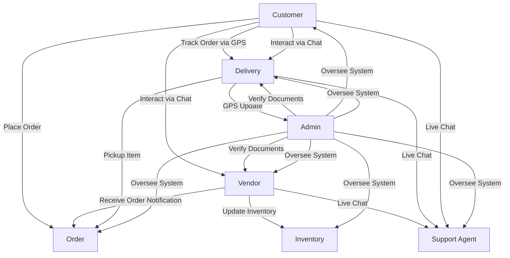
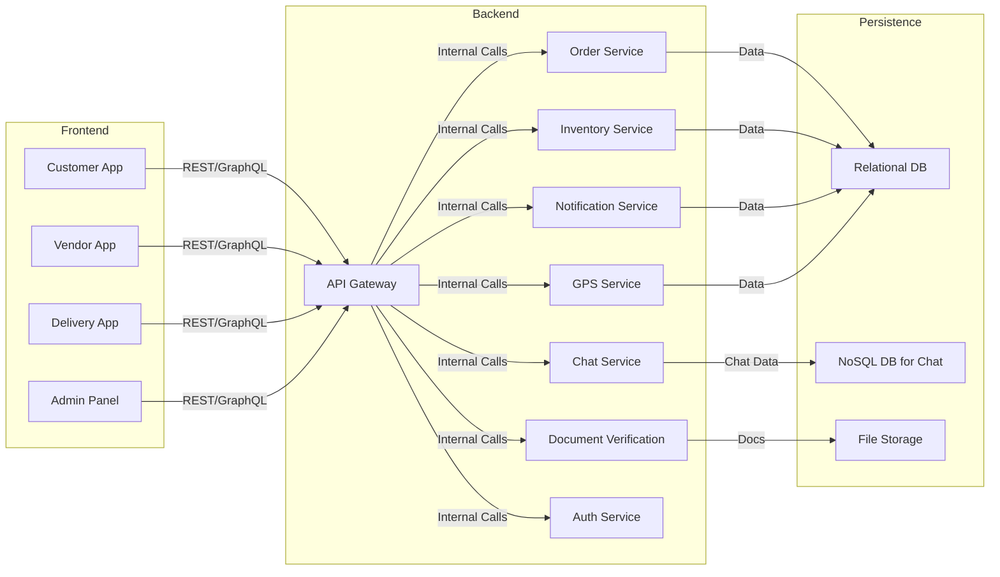

# Interior Designing Business App – Technical Requirements Document

As a seasoned architect with 40 years of systems experience, here's a comprehensive technical blueprint to craft a Blinkit-style ecosystem for interior design.

***

## 1. Executive Overview

Your client's vision combines e-commerce, logistics, and real-time experience for interior design. The app will mirror the feature-rich, user-friendly approach of Blinkit, targeting four user roles: Vendor, Delivery, Customer, and Admin. Each gets a tailored interface empowered by advanced, scalable, yet cost-sensitive technical choices.

***

## 2. Feature Matrix (from Client)

| Feature                  | Vendor App | Delivery App | Customer App | Admin Panel |
|--------------------------|:----------:|:------------:|:------------:|:-----------:|
| Realtime Notifications   | ✅         | ✅           | ✅           | ✅          |
| GPS Tracking             | ❌         | ✅           | ✅           | ✅          |
| Inventory Management     | ✅         | ❌           | ❌           | ✅          |
| Order Management         | ✅         | ✅           | ✅           | ✅          |
| Live Chat Support        | ✅         | ✅           | ✅           | ✅          |
| Document Verification    | ✅         | ✅           | ❌           | ✅          |

***

## 3. Functional Flow (Schematic Diagram – maria syntax)

***

## 4. App Architecture

### 4.1 High-Level Architecture Diagram

***

## 5. Technology Stack (Paid & Free Options)

| Layer           | Free/Freemium Options                                   | Paid/Scalable Alternatives           |
|-----------------|--------------------------------------------------------|--------------------------------------|
| Mobile Apps     | React Native, Flutter                                  | Ionic (Paid), NativeScript           |
| Web Panel       | React.js, Angular, Vue.js                              | PrimeReact (Paid)                    |
| Backend         | Node.js (Express), Django, Flask                       | AWS Lambda, Google Cloud Functions   |
| Database        | PostgreSQL, MongoDB, Firebase (Free Tier)              | AWS RDS, Google Cloud SQL, Mongo Atlas|
| Hosting         | Vercel, Netlify, Heroku (Free/Starter), Firebase       | AWS/Azure/GCP App Engine             |
| Notification    | Firebase Cloud Messaging, WebSockets                   | Twilio Notify, OneSignal             |
| Chat            | Firebase, Socket.io, Stream (Free Tier)                | Twilio, Sendbird, CometChat          |
| GPS/Maps        | Google Maps API (Free quota), Mapbox                   | ESRI ArcGIS                          |
| Document Verify | Simple SOFT auth, Google Vision (basic OCR)            | Onfido, Jumio, Auth0, Telesign       |
| File Storage    | Firebase, AWS S3 (Free Tier)                           | AWS S3, Google Cloud Storage         |
| Authenticator   | Firebase Auth, Auth0 (Free Tier), Passport.js          | Auth0 (Paid), AWS Cognito            |

***

## 6. Module Flow (Detailed Breakdown)

### Customer Journey

- **Signup/Login** ⇒ browse catalogue ⇒ place order
- **Track order (GPS)** ⇒ get notifications
- **Live chat with vendor/delivery**
- **Rate & Review services**

### Vendor Journey

- **Signup/Verify docs** ⇒ manage inventory, view orders
- **Realtime notification for new orders**
- **Chat with customers/delivery**
- **Export sales reports**

### Delivery Journey

- **Signup/Verify docs** ⇒ see delivery queue
- **GPS tracking & status updates**
- **Chat for coordination**

### Admin Panel

- **Central dashboard**
- **User, order, inventory, delivery management**
- **Document verification workflow**
- **Analytics & reporting**

***

## 7. Development Workflow & Resource Plan

1. **Wireframing/Design**
   - Tool: Figma (Free)/Adobe XD
2. **Frontend**
   - Mobile: React Native for cross-platform
   - Web: React.js/Next.js for admin
3. **Backend**
   - Node.js with Express.js, REST APIs
4. **Database**
   - Main: PostgreSQL
   - Chat/Notifications: Firebase/Socket.io
5. **Notifications**
   - Firebase Cloud Messaging (FCM)
6. **GPS/Maps**
   - Google Maps API (monitor quota for scaling)
7. **Authentication & Document Verification**
   - Firebase/Auth0 for onboarding, Onfido/Jumio as paid alt
8. **CI/CD**
   - GitHub Actions (Free)
9. **Analytics (optional)**
   - Google Analytics, Mixpanel

***

## 8. Scalability & Extensibility Considerations

- Begin with freemium resources to minimize cost and prove MVP
- Design for microservices as business expands
- Modularize: Each role’s app gets its own deployment & codebase, but shares central services
- Set up thorough API documentation (Swagger/OpenAPI)

***

## 9. Recommendations and Next Steps

- **Start with FREE stack:** Faster prototyping, minimal cost
- **Upgrade selectively:** Paid APIs for chat/notifications/document verification as user base grows
- **Architecture:** Microservices if you anticipate high volume; monolith for MVP
- **Design System/Theme:** Use Material-UI or Ant Design for rapid consistency

***

## 10. Sample Timeline (Agile Sprints)

| Sprint    | Major Deliverable                 |
|-----------|-----------------------------------|
| 1         | Setup, Wireframe, Auth Module     |
| 2         | Core Order & Inventory Service    |
| 3         | Delivery, GPS, Notification       |
| 4         | Chat, Document Verification, Admin|
| 5         | Final Integration & Testing       |

***

## Closing Words

With this backbone, you will deliver a robust, scalable, and visually striking platform for your client, leveraging free tech as far as possible and upgrading to best-in-class paid solutions only where growth justifies it. Each element stands on decades of experience in building dependable, path-breaking products.

Feel free to use, modify, or layer this blueprint for any feature depth your client demands.

[1](https://ppl-ai-file-upload.s3.amazonaws.com/web/direct-files/attachments/images/15170075/dd75dce6-beda-48c5-b370-7dc727ee713a/image.jpg)