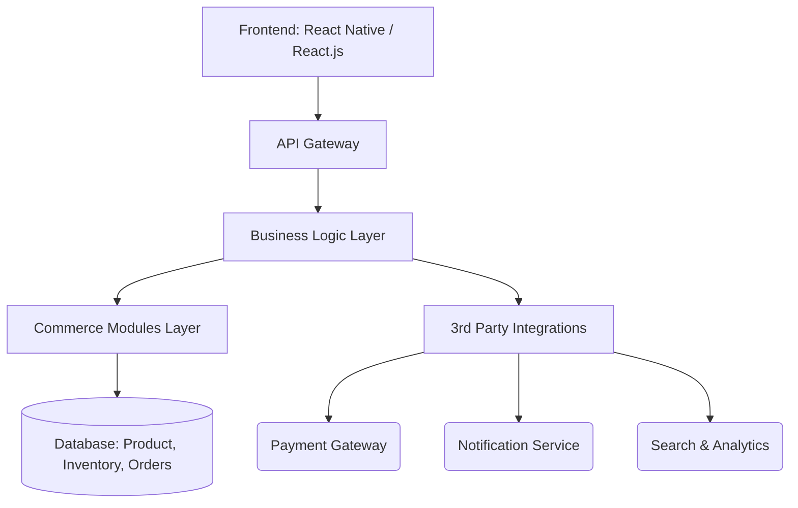
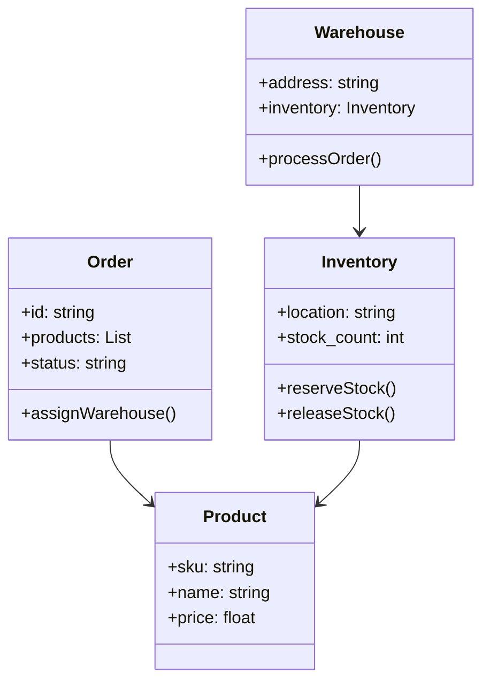

Let's begin by looking at the top popular e-commerce and quick commerce apps that relate to the idea of your interior design app inspired by Blinkit, understanding their system design, architecture, and tech stack.

***

## 1. Top Relevant Apps & Platforms

| App Name      | Domain/Focus                      | Notes                                   |
|---------------|---------------------------------|-----------------------------------------|
| Blinkit       | Quick commerce/grocery delivery | Ultra-fast delivery, micro-warehouses  |
| Zepto         | Quick commerce/grocery delivery | Fast delivery, AI-powered route/network |
| Shopify       | General e-commerce platform      | Highly modular, headless commerce option|
| Houzz         | Interior design & marketplace   | Combines design guides with product/catalog marketplace |
| RoomSketcher  | Home/interior design             | 3D floorplans, AR visualization         |
| Homestyler    | Interior design with AR features | Intuitive, social sharing features      |

***

## 2. Study of Architecture & System Design

### Blinkit / Zepto - Quick Commerce Apps

These apps prioritize speed and reliability in the last-mile delivery of groceries but have architectural similarities to what an interior design e-commerce/marketplace app might need:

- **Micro-warehouses (Dark Stores)** decentralize inventory to reduce delivery times
- Modular Inventory Management, Order Management, and Delivery tracking
- Multi-role system: Customer, Vendor, Delivery, Admin
- Real-time communication through Notifications and Live Chat
- AI-powered route optimization, inventory replenishment strategies

***

### Popular E-Commerce Architecture (Using a Headless Approach)

- **Frontend**: Decoupled web & mobile apps, interacting through APIs
- **API Gateway**: Routes requests securely to microservices
- **Business Logic**: Core domain services such as order, inventory, payment
- **Commerce Modules**: Modular and independently scalable components (catalog, pricing, marketing)
- **Integration Layer**: Payment gateways, notifications, search engines

***

### System Design Example: Blinkit Inventory Management (Simplified)

- Inventory is managed per warehouse (or dark store)
- Orders get assigned to nearest warehouse with available inventory
- Stock reservation prevents overselling

***

## 3. Tech Stack Insights from Popular Apps (2025 Trends)

| Layer                      | Popular Tech/Tools                         | Notes                          |
|----------------------------|-------------------------------------------|--------------------------------|
| Frontend                   | React Native, Flutter, React.js            | Cross-platform support          |
| Backend                    | Node.js (Express), Python (Django/Flask), Go | Microservices-friendly          |
| Database                   | PostgreSQL, MongoDB, Redis                  | Relational + caching + NoSQL    |
| API                        | REST or GraphQL                            | Flexible integration            |
| Realtime Features          | Firebase Cloud Messaging, Pusher, Socket.io | Notifications & chat            |
| Maps & Location            | Google Maps API, Mapbox                     | GPS tracking                   |
| Cloud/Hosting              | AWS (EC2, Lambda, RDS), GCP, Azure         | Scalable cloud infra            |
| Analytics & AI             | Google Analytics, Mixpanel, AI APIs         | Personalized recommendations   |
| DevOps                    | Docker, Kubernetes, GitHub Actions          | Modern CI/CD pipelines          |

***

## 4. Summary of System Design Principles for Your App

- **Headless and Modular Architecture:** Separate frontend and backend, with loosely coupled modules for inventory, orders, notifications, chat, and delivery.
- **Multi-role Access:** Distinct interfaces for customers, vendors, delivery agents, and admins.
- **Real-time Updates:** Leveraging websockets or push notifications for instant communication and order tracking.
- **Microservices or Well-Defined Modules:** Scale individual components like inventory or chat without affecting others.
- **Scalability & Extensibility:** Cloud infrastructure with containerization to scale user base and feature set.

***

If you want, I can proceed next by building a custom flow diagram for your interior design app based on these learnings or dive deeper into a specific app or technology. Let me know!

[1](https://orienteed.com/en/e-commerce-platforms-in-2025-the-top-10/)
[2](https://www.shopify.com/blog/best-ecommerce-platforms)
[3](https://zapier.com/blog/best-ecommerce-shopping-cart-software/)
[4](https://gowide.com/top-ecommerce-platforms-2025/)
[5](https://virtocommerce.com/blog/ecommerce-architecture)
[6](https://www.cmarix.com/blog/quick-commerce-app-development-guide/)
[7](https://www.linkedin.com/posts/r-kumar-2a9b932b3_day26-lld-lld-activity-7341102072819261442-mrZA)
[8](https://www.bitcot.com/best-home-interior-design-apps/)
[9](https://www.nopcommerce.com/en/blog/best-open-source-ecommerce-platforms)
[10](https://www.linkedin.com/pulse/choosing-right-tech-stack-quick-commerce-mobile-app-development-v7uwc)
[11](https://paraskaushik.hashnode.dev/lld-inventory-management-system-for-blinkitdunzozepto)