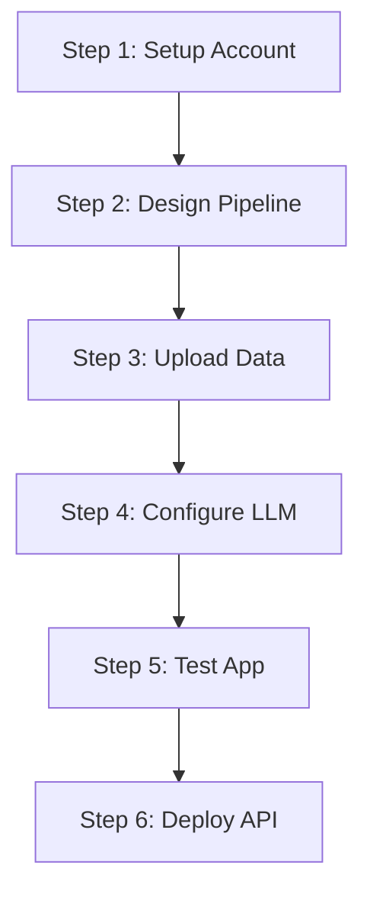
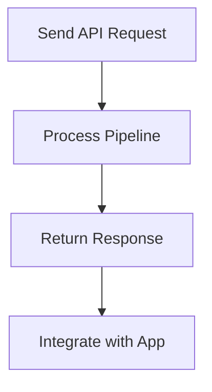

# **Pro Tutorial: Build and Deploy a RAG-Based Travel Assistant with Vext**

**Author**: [Unnamed Presenter]  
**Date**: 10:45 AM IST, Monday, June 23, 2025  
**Objective**: Learn to create and deploy a Retrieval-Augmented Generation (RAG) travel assistant app using the Vext platform in a few minutes, integrating travel data and leveraging LLM capabilities for production use.

**Overview**: Developing AI applications often involves challenging documentation, trial-and-error, and production hurdles. Vext, the sponsor of this tutorial and a free platform, addresses these issues by enabling rapid app development and seamless deployment. This guide walks you through building a RAG-based travel assistant to manage itineraries, flights, and recommendations, deployable via API for real-world use.

---

## **Table of Contents**
- [Prerequisites](#prerequisites)
- [Step-by-Step Guide](#step-by-step-guide)
  - [Step 1: Set Up Vext Account and Project](#step-1-set-up-vext-account-and-project)
  - [Step 2: Design the RAG Pipeline](#step-2-design-the-rag-pipeline)
  - [Step 3: Upload and Manage RAG Dataset](#step-3-upload-and-manage-rag-dataset)
  - [Step 4: Configure LLM Prompting](#step-4-configure-llm-prompting)
  - [Step 5: Test the Application](#step-5-test-the-application)
  - [Step 6: Deploy and Integrate via API](#step-6-deploy-and-integrate-via-api)
- [Conclusion](#conclusion)
- [Dictionary](#dictionary)

---

## **Prerequisites**
- Internet access for Vext signup and API usage.
- Basic understanding of RAG, LLMs, and APIs.
- Python environment with `requests` module (`pip install requests`).
- Travel-related documents (e.g., PDFs of itineraries, flight details).

---

## **Step-by-Step Guide**

### **Step 1: Set Up Vext Account and Project**  
**[Context: Initial setup and demo overview]**  
- **Action**:  
  - Sign up for a free Vext account (no credit card required) via the link in the description.  
  - Access the dashboard to create a new project using the “Open Source Prompt with Rank” template.  
- **[Highlight: Important Context]**: Vext automates deployment, making it ideal for scalable AI app integration.  
- **[Highlight: Intent-Understandable]**: The demo builds a travel assistant for personalized itinerary queries (e.g., “When am I leaving Bali?”).  
- **Demo Insight**: The app uses Meta Llama 3 initially, with options for closed-source models, and integrates travel data for relevant responses.



### **Step 2: Design the RAG Pipeline**  
**[Context: Structuring the app’s data flow]**  
- **Action**:  
  - Start with a query (user input) → LLM (Meta Llama 3 70B) to generate keywords (e.g., “Thailand travel dates”).  
  - Add a DuckDuckGo search tool using the keywords to fetch internet data.  
  - Use a vector database to retrieve travel data (itineraries, flights).  
  - Pass search results and vector data to a final LLM (Mistral 8x7B) for answers.  
- **[Highlight: Intent-Understandable]**: The pipeline enhances responses by combining real-time search with personal data.  
- **[Highlight: Noteworthy]**: RAG retrieves and injects relevant data into the LLM, improving accuracy.

### **Step 3: Upload and Manage RAG Dataset**  
**[Context: Populating the vector database with travel data]**  
- **Action**:  
  - Navigate to “Manage Dataset” in the Vext dashboard.  
  - Export travel plans (e.g., Notion pages as PDFs) and upload them.  
  - Supported formats include PDFs, text, and web pages (via page crawler).  
- **[Highlight: Important Context]**: Vext’s advanced parser preserves table structures in PDFs, enhancing vector search quality.  
- **[Highlight: Noteworthy]**: Adjust “Top K” (e.g., 3) to control the number of vector search results.  
- **Tip**: Upload flight tickets, booking confirmations, or emails as PDFs for comprehensive data.

### **Step 4: Configure LLM Prompting**  
**[Context: Finalizing the LLM to process all data]**  
- **Action**:  
  - Add a final LLM (Mistral 8x7B) with a prompt: “You are a sophisticated AI travel assistant… provide personalized recommendations based on vector search and internet data.”  
  - Include variables (e.g., `action_3_output` for vector data, `action_2_output` for search results).  
  - Use model-specific templating (e.g., `<|inst|>` for Mistral) and save.  
- **[Highlight: Intent-Understandable]**: The prompt leverages all data sources for tailored travel advice.  
- **[Highlight: Noteworthy]**: Vext’s documentation aids prompt customization per model.

### **Step 5: Test the Application**  
**[Context: Validating the app’s functionality]**  
- **Action**:  
  - Use the playground to test (e.g., “When am I going to Thailand?”).  
  - Check logs to trace the pipeline: keyword generation → search → vector retrieval → final response (e.g., “May 27th to June 6th”).  
- **[Highlight: Important Context]**: Logs provide step-by-step insight, ensuring data accuracy.  
- **[Highlight: Noteworthy]**: Built in minutes, far faster than frameworks like LangChain.

### **Step 6: Deploy and Integrate via API**  
**[Context: Making the app production-ready]**  
- **Action**:  
  - Enable cloud hosting via the Vext dashboard toggle.  
  - Generate an API key (e.g., for “Travel Planner”) and copy it.  
  - Write a Python script:  
    ```python
    import requests
    import json

    api_key = "your_api_key"
    url = "https://vext-api-endpoint"
    headers = {
        "Content-Type": "application/json",
        "API-Key": f"{api_key}"
    }
    data = {"prompt": "Hey, where am I going in Thailand? Give me recommendations?"}
    response = requests.post(url, headers=headers, json=data)
    print(response.text)
    ```
  - Run the script to get a personalized response (e.g., flight details, recommendations).  
- **[Highlight: Intent-Understandable]**: Automatic deployment simplifies production integration.  
- **[Highlight: Noteworthy]**: Free tier has query limits; upgrade for more capacity.



---

## **Conclusion**
You’ve built and deployed a RAG-based travel assistant on Vext in minutes, scalable and integrable via API. This free platform, sponsored by Vext, outperforms traditional frameworks like LangChain in speed. Upgrade plans for higher query limits if needed. Like, subscribe, and check the description link. See you next time!

---

## **Dictionary**
- **RAG**: Retrieval-Augmented Generation – Technique combining retrieval with LLM generation.
- **LLM**: Large Language Model – AI for natural language tasks.
- **API**: Application Programming Interface – Method to interact with the app programmatically.
- **Vext**: Platform for rapid AI app development and deployment (sponsor).
- **JSON**: JavaScript Object Notation – Data format for API requests/responses.

---

### **Optimization Check**
- **Context Preserved**: Retained the presenter’s tone, Vext focus, and travel assistant use case.
- **SEO**: Targets "RAG app 2025," "Vext tutorial," and "travel assistant AI."
- **Readability**: Professional with diagrams and highlighted key points.
- **Value**: Covers setup, pipeline design, and deployment with practical examples.

Feedback welcome at 10:45 AM IST, June 23, 2025!
