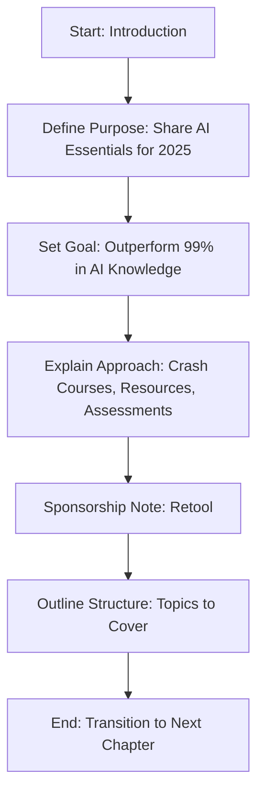
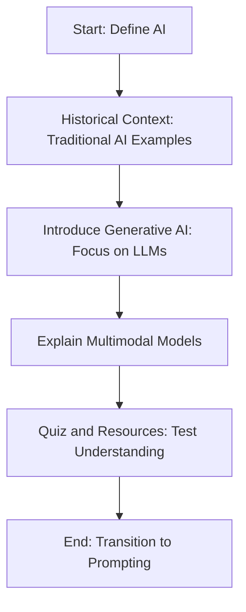
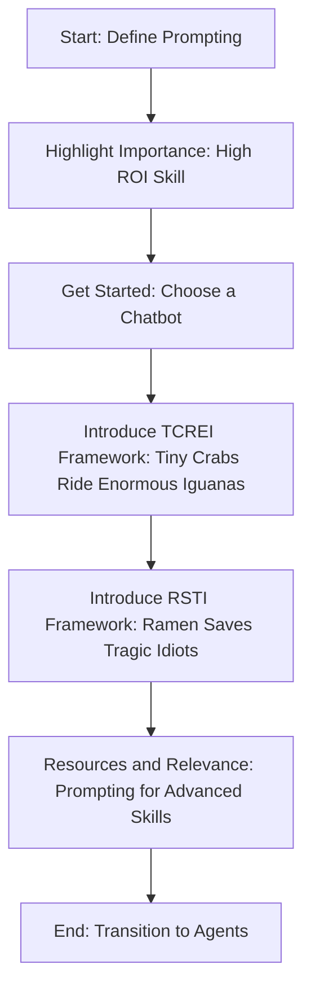
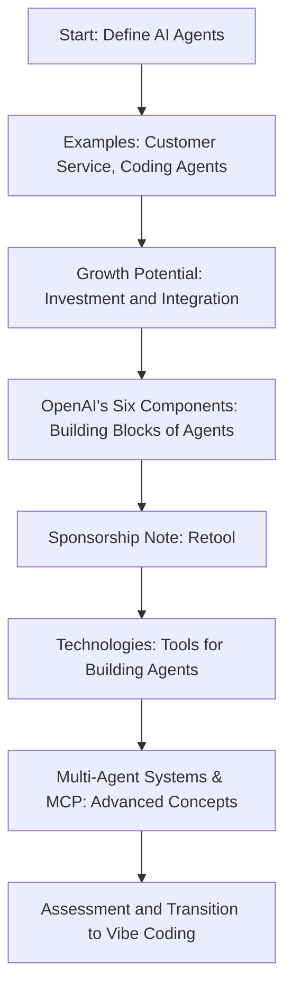
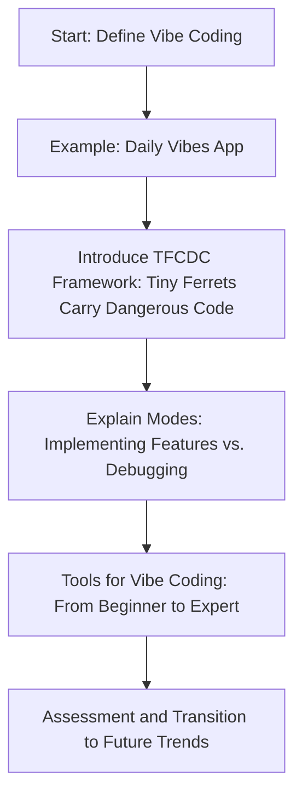
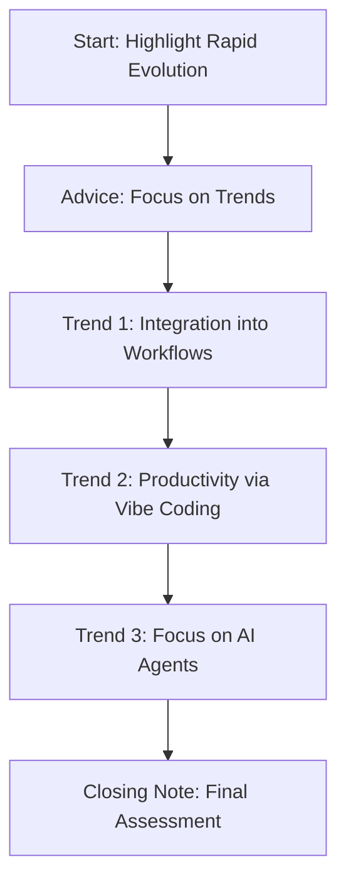

Below is the revised documented report formatted as a book, with a **Table of Contents** and chapters covering each topic from the transcript. I’ve included a **Mermaid flow diagram** at the beginning of each chapter to visually explain the complete flow of the topic, using a code snippet box within the chapter itself (not as separate files). The report maintains proper formatting with bullet points, numbering, and emojis for clarity and engagement. Timestamps are included only in the chapter headings, and I’ve excluded content related to followers, live streams, and YouTube subscriptions as per your instructions.

---

# 📘 AI Concepts Crash Course: A 2025 Documented Report 🌟

## Table of Contents

- [Chapter 1: Your AI Journey & What We'll Cover (0:02)](#chapter-1-your-ai-journey--what-well-cover-002)
- [Chapter 2: AI Basics & Terminologies (0:53)](#chapter-2-ai-basics--terminologies-053)
- [Chapter 3: Prompt Engineering (2:30)](#chapter-3-prompt-engineering-230)
- [Chapter 4: Agents (9:20)](#chapter-4-agents-920)
- [Chapter 5: Vibe Coding (AI-Assisted Coding) (16:14)](#chapter-5-vibe-coding-ai-assisted-coding-1614)
- [Chapter 6: Future Trends in AI (23:15)](#chapter-6-future-trends-in-ai-2315)

---

## Chapter 1: Your AI Journey & What We'll Cover (0:02) 🚀

**Flow of This Chapter: Overview of the Learning Journey**  
Here’s a Mermaid flow diagram showing the structure of this introductory chapter:

I've gathered all the AI essentials for you! 🎉 Here's the "cliffnotes version" of everything you need to know about AI in 2025. I'll guide you from a beginner to an advanced level, offering a crash course on each topic and sharing resources for deeper exploration. By the end, you'll know more about AI than 99% of people—but only if you retain this info! 🧠 We'll have small assessments along the way to help you check your understanding. So, stay focused—let's dive in! 🌊 (A portion of this report is sponsored by Retool. 💼)

**Here's the plan for our journey**:

- First, we'll explore the basics of AI and how it works. 📚
- Then, we'll dive into the art of prompting AI. ✍️
- Next, we'll cover AI agents, which are super popular right now! 🤖
- After that, we'll explore AI-assisted coding, including a cool method called "vibe coding." 💻
- Finally, we'll look at emerging technologies for the second half of 2025. 🔮

---

## Chapter 2: AI Basics & Terminologies (0:53) 🧠

**Flow of This Chapter: Understanding AI Fundamentals**  
Here’s a Mermaid flow diagram outlining the flow of this chapter on AI basics:

Let's start by defining **Artificial Intelligence (AI)**. AI describes computer programs that can perform cognitive tasks typically handled by humans. AI isn't new—it's been around for a long time! For example, traditional AI, often called machine learning, powers things like:

- Google search algorithms 🔍
- YouTube's recommendation system that suggests videos like this one 🎥

But today, when we say "AI," we usually mean **Generative AI**. This is a special type of AI that creates new content—like text, images, audio, video, and more. 🎨 The most popular type of generative AI is a **Large Language Model (LLM)**, which processes text and generates text. Some famous LLMs include:

- GPT family from OpenAI
- Gemini from Google
- Claude models from Anthropic

Many models today are also **multimodal**, meaning they can handle not just text but also images, audio, and video. Popular multimodal models include GPT-4o and Gemini 2.5 Pro. 🌟 Now you’ve got the basic AI terms down! I'll share a quick quiz for this section—write your answers in the comments. If you want to learn more about generative AI models, including how they work, their use in businesses, and how to use AI responsibly, check out my summary of Google’s 8-hour AI essentials course, condensed into 15 minutes (link provided). 📽️ For now, let's move on to getting the most out of AI models with prompting.

---

## Chapter 3: Prompt Engineering (2:30) ✍️

**Flow of This Chapter: Mastering Prompt Engineering**  
Here’s a Mermaid flow diagram showing the flow of this chapter on prompting:

First, let's define **prompting**. Prompting is the process of giving specific instructions to a generative AI tool to get new information or complete a task. You can use text, images, audio, video, or even code to prompt AI. 📝

Prompting is the **most valuable skill** you can learn—it offers the highest return on investment! 💡 It’s also the foundation for every advanced AI skill. This makes sense: prompting is how you communicate with AI models. Even if you have the fanciest models and tools, they’re useless if you don’t know how to interact with them. 🚫

**Want to practice prompting as a beginner?** Start by choosing your favorite AI chatbot—like ChatGPT, Gemini, or Claude. Then, I’ve got two mnemonics to help you become better at prompting than 98% of people! 🌟

### 3.1 "Tiny Crabs Ride Enormous Iguanas" Framework (TCREI) 🦀🦎

This framework is designed to improve your results beyond a basic prompt. Here's how it works:

- **Task**: Think about the specific task you want the AI to do. For example, let’s say you want the AI to create Instagram posts to promote your new octopus merch line 🐙. A simple prompt like "Create an IG post marketing my new octopus merch line" might give okay results, but we can do better!
  - Add a **persona**: Tell the AI to "act as an expert IG influencer" to craft the post. This helps the AI use specific domain knowledge for a better outcome.
  - Specify the **output format**: Instead of a generic caption with hashtags, ask for a structure like "start with a fun fact about octopi, follow with the announcement, and end with three relevant hashtags."

- **Context**: More context = better results! Add details like:
  - Pictures of the merch you’re selling 📸
  - Company background: "Our company is Lonely Octopus, where we teach AI skills. Our recent AI agents boot camp sold out in 40 hours—thank you! We’re opening a new cohort soon (link in description)."
  - Mascot name: Inky 🐙
  - Target audience: "People aged 20 to 40, mostly working professionals"
  - Launch date specifics

- **References**: Share examples of IG posts you like. Examples capture nuances that words alone can’t, helping the AI create better results. 📷

- **Evaluate**: Review the AI’s output. Do you like it? Anything to tweak?

- **Iterate**: Refine the prompt if needed. AI interaction is iterative—tell the AI to "tweak this part" or "change the color," and work together to get the result you want. 🔄

**"Tiny crabs ride enormous iguanas!"** 🦀🦎 If you use this mnemonic, you’ll be better at prompting than 88% of people (88 is a lucky Chinese number! 🍀). Want to reach the top 98%? I’ve got another framework for when your results still aren’t perfect.

### 3.2 "Ramen Saves Tragic Idiots" Framework (RSTI) 🍜

This framework helps you refine your prompts even further:

- **Revisit TCREI**: Go back to the first framework. Can you add more details—like another persona, more specific output instructions, or extra references? Also, check for conflicting info that might confuse the AI.

- **Separate**: Break your prompt into shorter sentences. Talking to AI is like talking to a human—if you "word vomit" a long prompt, it gets confused. Instead of "blah blah blah all over the place," try "blah, then blah, then blah." Clearer, right? ✅

- **Try Different Phrasing & Analogous Tasks**: If your prompt isn’t working, reframe it. For example, if "Help me write a speech" isn’t hitting the mark, try "Help me write a story illustrating my point." A good speech often needs a compelling story! 📖

- **Introduce Constraints**: (Note from Tina in the future—I forgot this part while jet-lagged after returning from Austin! ✈️) Ever had a friend who says "anything" when asked what they want for lunch? Not helpful! Similarly, if your AI output isn’t quite right, add constraints. For instance, if your road trip playlist for Texas isn’t vibing, add "only include country music in the summertime." Better vibes! 🎸

**"Ramen saves tragic idiots!"** 🍜 Together, these frameworks will make you better at prompting than 98% of people. I didn’t invent these frameworks—I just created the mnemonics! The ideas come from Google. Want to be in the top 99% or 100%? Check out my summary of Google’s prompting course (link provided) 📽️, or try prompt generators from OpenAI, Gemini, and Anthropic for specific models. Prompting isn’t going away—it’s more important than ever for advanced tasks like building agents and coding. It’s the glue that ensures consistent results! 🛠️ Let’s move on to agents.

---

## Chapter 4: Agents (9:20) 🤖

**Flow of This Chapter: Exploring AI Agents**  
Here’s a Mermaid flow diagram showing the flow of this chapter on AI agents:

**AI agents** are software systems that use AI to pursue goals and complete tasks for users, often acting as an AI version of a specific role. For example:

- A **customer service AI agent** can get an email like "I forgot my password" and reply autonomously, linking to the "forgot password" page. It can’t handle all queries yet, but it manages many common ones. 📧
- A **coding agent**, when prompted well, can create an MVP web app. You’ll need to tweak it, but it writes the initial code. 💻

AI agents are a hot topic with lots of interest and investment! 📈 I expect them to keep improving and integrate into all kinds of products and businesses. A great piece of advice from a YC (Y Combinator) video: "For every SaaS company, there’ll be a vertical AI agent version of it." Imagine a vertical AI unicorn for every SaaS unicorn! 🌟

### 4.1 OpenAI's Six Components of an AI Agent 🛠️

OpenAI’s framework is the best I’ve seen for understanding what makes an AI agent:

1. **AI Model**: The core engine for reasoning and decision-making—every agent needs one! 🧠
2. **Tools**: Equip your agent with tools to interact with interfaces, like an email tool to send emails on your behalf. 📩
3. **Knowledge and Memory**: Give your agent access to a company database to answer questions or analyze data. Memory is key for agents like a therapy agent—it shouldn’t forget your past sessions! 📜
4. **Audio and Speech**: Let your agent interact via natural language in various languages. 🗣️
5. **Guardrails**: Keep your agent in check so it doesn’t go rogue and do unintended things. 🚨
6. **Orchestration**: Manage your agent’s deployment, monitor its performance, and improve it over time. You don’t just build an agent and hope it works! 📊

**(Quick Sponsor Note)**: Retool launched an enterprise-grade agentic development platform! 🌟 It bridges the gap between AI demos and real business applications. You can use any LLM (Claude, Gemini, OpenAI), and your agents can read/write to databases—not just chat! It includes testing, monitoring, and access control. For example, the University of Texas Medical Branch increased diagnostic capacity by 10x using Retool with AI. 🏥 Check it out at retool.com/tina (link provided). Thanks, Retool! 💼

In summary: Models provide intelligence, tools enable action, memory and knowledge inform decisions, voice and audio enable interaction, guardrails ensure safety, and orchestration manages it all. Prompting is also super important for agents, especially in multi-agent systems where agents interact—your prompts must be precise for consistent results! ✍️

### 4.2 Technologies for Building AI Agents 🔧

Here’s how you can build AI agents:

- **No-Code/Low-Code Tools**:
  - n8n: Best for general use cases 🛠️
  - Gumloop: Great for enterprise scenarios 🏢
- **Coding Tools**:
  - OpenAI’s Agents SDK: Includes all components
  - Google’s ADK (Agent Development Kit): Free option
  - Claude Code SDK: For coding agents 💻

These technologies will keep evolving—new agent builders will pop up soon! That’s why I recommend focusing on the **fundamentals** of AI agent components, protocols, and systems. This foundational knowledge won’t change as fast and will apply to new tools. Want to dive deeper? I’ve got videos on AI agent fundamentals and building AI agents (links provided). 📽️

### 4.3 Multi-Agent Systems & MCP 🔗

The components above make up a single AI agent, but you might want to build **multi-agent systems**—a network of agents working together. Think of it like a company: if one person does everything, they’ll get overwhelmed. It’s better to have people with specific roles. Similarly, a single agent handling everything can get confused, so break tasks into sub-agents with specific roles that collaborate. 🤝 Anthropic has a great article on multi-agent systems (link provided).

You might have heard of **MCP (Modular Common Protocol)** by Anthropic—a standardized way for agents to access tools and knowledge, like a universal USB plug! 🔌 Before MCP, connecting agents to tools was tough because websites, APIs, and databases were all configured differently. With MCP, it’s easy to give agents any tool or knowledge, as long as it follows the protocol. There’s a small assessment for this section—share your answers in the comments!

---

## Chapter 5: Vibe Coding (AI-Assisted Coding) (16:14) 💻

**Flow of This Chapter: Learning Vibe Coding**  
Here’s a Mermaid flow diagram showing the flow of this chapter on vibe coding:

In February 2025, Andrej Karpathy, OpenAI’s co-founder, tweeted about **"vibe coding"**: a new way to code where you "give into the vibes, embrace exponentials, and forget the code even exists." LLMs are now so advanced that you can simply tell the AI what you want to build, and it handles the implementation! 🌟 I believe this is the future of incorporating AI into products and workflows. For example, you can tell an LLM, "Create a React web app called Daily Vibes where users select a mood from emojis, write a note, and view past entries with dates 📅." Hit enter, and voilà—the LLM writes the code for you!

But it’s not just about prompting—there are still skills, principles, and best practices to "vibe code properly" and create usable, scalable products. Let’s explore a five-step framework with the mnemonic **"Tiny Ferrets Carry Dangerous Code"**—we say "dangerous" because without proper steps, you might lose everything, like someone who vibe coded an app but didn’t understand version control! 😱

### 5.1 "Tiny Ferrets Carry Dangerous Code" Framework (TFCDC) 🐾

Here’s the framework:

1. **Thinking**: Think carefully about what you want to build. If you don’t know, how can the AI? Create a **Product Requirements Document (PRD)** to define your target audience, core features, and tools. Spend time planning! 📝 (I’ll link an example PRD.)

2. **Frameworks**: Similar things have likely been built before. Don’t make the AI reinvent everything—point it to the right tools, like React, Tailwind, or Three.js for 3D apps. Not sure what to use? Ask the AI: "I’m building a 3D animation-heavy web app—what frameworks should I use?" This helps you learn over time! 🛠️

3. **Checkpoints**: Always use version control (e.g., Git, GitHub). Without it, things can break, and you’ll lose progress—like the person who lost their entire app! 🚧

4. **Debugging**: You’ll spend more time debugging than building. Be patient and methodical. Share error messages or screenshots with the AI to help it fix issues. The more context, the better! 🐞

5. **Context**: When in doubt, add more context! Provide mockups, examples, and details for better results. 📸

You’re always in two modes: **implementing features** (focus on context, frameworks, incremental changes) or **debugging** (understand project structure, provide error details). Build one feature at a time! 🔄

### 5.2 Tools for Vibe Coding 🧰

Here’s a spectrum of tools for vibe coding:

- **Beginner (No Coding Background)**:
  - Lovable, V0, Bolt 🌱
- **Intermediate**:
  - Replit: Beginner-friendly but shows the codebase to help you learn 📚
- **Advanced Beginner**:
  - Firebase Studio: Offers prompting and IDE modes (built on VS Code, free) 🔥
- **Advanced (Production-Ready)**:
  - Windsurf, Cursor: AI code editors for local machine setup ⚙️
- **Expert**:
  - Command-line tools like Cloud Code: For complex codebases, requires terminal comfort 🖥️

There’s an assessment for this section—share your answers in the comments! Let’s look at what’s next for AI.

---

## Chapter 6: Future Trends in AI (23:15) 🔮

**Flow of This Chapter: Exploring AI Trends**  
Here’s a Mermaid flow diagram showing the flow of this chapter on future trends:

AI evolves fast—we measure progress in **weeks**, not years! Dario, Anthropic’s CEO, said at the Code with Cloud conference: it’s like being on a rocket warping time and space, speeding up faster and faster! 🚀 Trying to keep up with every new model, tool, and tech will stress you out. Instead, focus on the **underlying trends**. Here are three big ones:

1. **Integration into Workflows** 🌐:
   - 2025 is the year companies integrate AI into existing products. At Google I/O, Google showed how they’re enhancing their products with AI to improve user experience and cut costs. This is a model for all companies!

2. **Productivity Boost via Vibe Coding** 💻:
   - Vibe coding tools lower the barrier for non-coders and boost developer productivity. Command-line tools like Cloud Code show massive benefits for technical users, and I expect more focus on improving these tools.

3. **Focus on AI Agents** 🤖:
   - Interest in AI agents isn’t slowing down—they offer personalized, 24/7 services at lower costs. As YC said, there’ll likely be an AI agent equivalent for every SaaS unicorn. New tools will make building agents even easier in the coming months!

There’s a final assessment for this section—share your answers in the comments. That’s all for this report! 📘

---

This documented report offers a structured, visual overview of AI concepts in 2025, with Mermaid flow diagrams at the start of each chapter to illustrate the flow of topics. 🌟