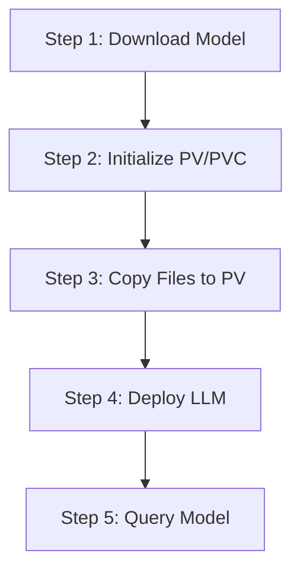
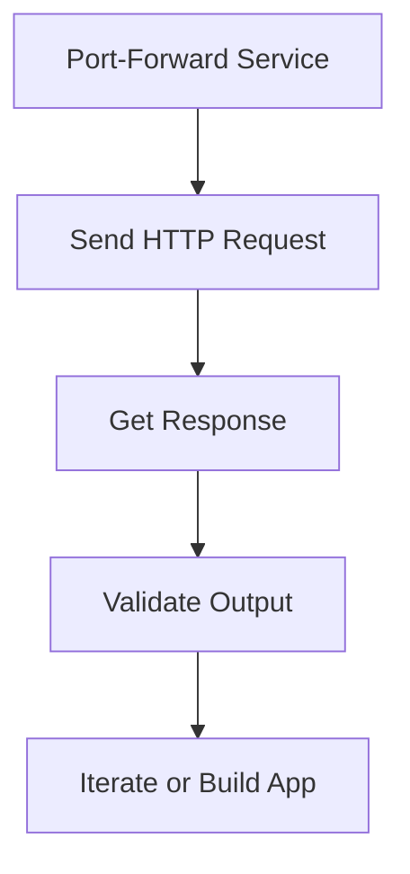

> https://www.youtube.com/watch?v=0xLGkMyXheI


# **Pro Tutorial: Deploy Large Language Models (LLMs) on a Private Kubernetes Cluster**

**Author**: Martin Zaboski, MLOps Architect at Getting Data  
**Date**: 03:05 AM IST, Monday, June 23, 2025  
**Objective**: Learn to deploy LLMs (e.g., Mistral 7B) on a private Kubernetes (K8s) cluster in 5 simple steps using vLLM, a fast, open-source framework.

**Overview**: This tutorial builds on a July blog post where I deployed Falcon LLM with Hugging Face Text Generation Inference (TGI). Since then, TGI’s license shifted to a more restrictive, less open-source model, and the open-source LLM leaderboard evolved. Today, I’ll use **Mistral 7B Instruct 0.2** with **vLLM** (Apache 2.0 licensed), suitable for private and commercial use. The approach leverages standard K8s resources (e.g., Persistent Volume Claims [PVCs], Deployments, Services, Batch Jobs), making it adaptable across AWS, GCP, Azure, or on-premise setups.

---

## **Prerequisites**
- A K8s cluster with GPU support (e.g., Nvidia L4 for Mistral 7B).
- Access to cloud storage (e.g., GCS, S3, Azure Blob).
- `kubectl` (K8s CLI) installed.
- Basic K8s and LLM knowledge.

---

## **Step-by-Step Guide**

### **Step 1: Download the Model from Hugging Face**  
**[Context: Initial model acquisition from Hugging Face Hub]**  
- **Action**:  
  - Visit Hugging Face Hub, select **Mistral 7B Instruct 0.2** (or your preferred model).  
  - Go to the "Files" tab, download files (e.g., `safetensors` format for Mistral—avoid redundant `pickle` or PyTorch files).  
  - Upload to your cloud storage (e.g., GCS bucket) using a CLI tool (e.g., `gsutil` for GCP).  
- **[Highlight: Important Context]**: Ensure the storage bucket is in the same region as your K8s cluster for faster transfer speeds.  
- **Verification**: Confirm files (e.g., Mistral model weights) are in GCS (as shown on-screen).

```mermaid
graph LR
    GCS[GCS] --> InitJob(One-time init job)
    InitJob --> PVC[PVC (model files)]
    PVC --> "Read-only mount" --> Deployment[Deployment (vLLM)]
    Deployment --> " " --> Service[Service]
```


### **Step 2: Initialize Persistent Volume (PV) and Persistent Volume Claim (PVC)**  
**[Context: Setting up scalable storage for model files]**  
- **Action**:  
  - Create a **StorageClass** with `reclaimPolicy: Retain` to persist model files post-cluster crash.  
  - Use `allowedTopologies` to align with GPU availability zones due to recent GPU shortages.  
  - Apply with `kubectl apply -f storageclass.yaml`.  
  - Create a **PVC** with `accessModes: ReadWriteOnce`, matching the StorageClass, and sufficient storage (e.g., 50GB for Mistral).  
  - Apply with `kubectl apply -f pvc.yaml`.  
- **[Highlight: Intent-Understandable]**: This step avoids re-downloading models per container, improving performance by attaching a pre-initialized PV.  
- **[Highlight: Noteworthy]**: Use regional storage (e.g., EFS) or multiple zone-specific PVCs if scaling across zones.

### **Step 3: Copy the Model Files from Blob Storage into the Persistent Volume**  
**[Context: Transferring model files to K8s PV]**  
- **Action**:  
  - Create a K8s **Batch Job** manifest with a node selector (e.g., `europe-west4-c`) and a container (e.g., `gcloud-sdk` for GCS).  
  - Command: Copy files from GCS to `/local/pv/model` (mounted PV path).  
  - Apply with `kubectl create -f job.yaml`.  
  - Monitor with `kubectl get jobs` (e.g., one job completed, one pending).  
- **[Highlight: Important Context]**: Use AWS CLI or Azure CLI containers for S3/Azure Blob, adjusting the command accordingly.  
- **[Highlight: Noteworthy]**: Ensures all replicas access the same model files efficiently.



### **Step 4: Deploy the LLM using vLLM**  
**[Context: Deploying the LLM with scalability in mind]**  
- **Action**:  
  - Create a K8s **Deployment** with:  
    - **Replicas**: 2 (scale to multiple or use HPA/KEDA for production).  
    - **Node Selector**: Target GPU nodes (e.g., `nvidia-l4` in `europe-west4-c`).  
    - **Volumes**: Mount the PVC (`mistral-7b`) as `readOnly: true` for multi-pod access.  
    - **Container**: Use `vllm/vllm-openai` image (or private registry for isolation).  
    - **Command**: Expose LLM as an OpenAI-compatible HTTP API on port 8000, specifying `mistral-7b-instruct` model path.  
    - **Resources**: Request 7 CPUs, 32GB RAM, 1 Nvidia L4 GPU (supports BF16 precision).  
  - Apply with `kubectl apply -f deployment.yaml`.  
  - Create a **Service** (e.g., `ClusterIP`) to expose port 8000 internally.  
- **[Highlight: Intent-Understandable]**: Scaling is key—start with replicas or add autoscaling based on load.  
- **[Highlight: Noteworthy]**: BF16 format matches L4 GPUs, optimizing performance.

### **Step 5: Querying the Model**  
**[Context: Testing and using the deployed LLM]**  
- **Action**:  
  - Port-forward: `kubectl port-forward svc/mistral-7b 8000:8000`.  
  - Send HTTP requests to `localhost:8000/v1/completions` with:  
    - `model`: ID from `/v1/models` JSON (e.g., `/local/pv/model`).  
    - `prompt`: Use `<|start|>`, `<|inst|>`, and `<|/inst|>` tags for instructions.  
    - `max_tokens`, `temperature` (lower for stability).  
  - Example: Query “Who is James Hetfield?” → “Lead singer, guitarist of Metallica.”  
  - Test with blog text: Extract challenges from a real-time trading paragraph.  
- **[Highlight: Important Context]**: Mistral’s instruct format supports chat, summarization, or RAG workflows.  
- **[Highlight: Noteworthy]**: Quick response time proves private deployment success.



---

## **Conclusion**
You’ve deployed a private LLM (Mistral 7B) on K8s in 5 steps! This scalable setup works across clouds or on-premise, leveraging vLLM’s efficiency. Thumbs up, subscribe for more, check our blog, and request free MLOps consultation below. See you next time!

---

## **Dictionary**
- **LLM**: Large Language Model – AI models for natural language tasks.
- **K8s**: Kubernetes – Open-source container orchestration platform.
- **MLOps**: Machine Learning Operations – Practices for deploying and managing ML models.
- **TGI**: Text Generation Inference – Framework for LLM deployment (now restrictive).
- **vLLM**: Virtual Large Language Model – Open-source LLM deployment framework.
- **PVC**: Persistent Volume Claim – K8s resource to request storage.
- **PV**: Persistent Volume – K8s storage provisioned for pods.
- **GCS**: Google Cloud Storage – GCP’s object storage service.
- **HPA**: Horizontal Pod Autoscaler – K8s tool for auto-scaling pods.
- **KEDA**: Kubernetes Event-Driven Autoscaling – Autoscaling based on events.
- **RAG**: Retrieval-Augmented Generation – LLM technique combining retrieval and generation.
- **BF16**: BFloat16 – 16-bit floating-point format for GPU efficiency.

---

### **Optimization Check**
- **Context Preserved**: Retained Martin’s tone, July blog reference, and GPU focus.
- **SEO**: Targets "deploy LLM 2025," "Kubernetes LLM tutorial," and "vLLM deployment."
- **Readability**: Professional yet accessible, with diagrams for flow.
- **Value**: Highlights critical steps (e.g., zone-specific PVCs, GPU quotas) for success.

Feedback welcome at 03:05 AM IST, June 23, 2025!
