# 📘 The Ultimate Django Course: A 2025 Documented Report 🌟

## Table of Contents

- [Chapter 1: Introduction (0:02)](#chapter-1-introduction-002)
- [Chapter 2: Prerequisites (1:02)](#chapter-2-prerequisites-102)
- [Chapter 3: How to Take This Course (1:38)](#chapter-3-how-to-take-this-course-138)
- [Chapter 4: Getting Started with Django (2:43)](#chapter-4-getting-started-with-django-243)
- [Chapter 5: What is Django? (3:22)](#chapter-5-what-is-django-322)
- [Chapter 6: How the Web Works (6:08)](#chapter-6-how-the-web-works-608)
- [Chapter 7: Setting Up the Development Environment (10:32)](#chapter-7-setting-up-the-development-environment-1032)
- [Chapter 8: Creating Your First Django Project (12:38)](#chapter-8-creating-your-first-django-project-1238)
- [Chapter 9: Using the Integrated Terminal in VSCode (18:50)](#chapter-9-using-the-integrated-terminal-in-vscode-1850)
- [Chapter 10: Creating Your First App (22:06)](#chapter-10-creating-your-first-app-2206)
- [Chapter 11: Writing Views (25:36)](#chapter-11-writing-views-2536)
- [Chapter 12: Mapping URLs to Views (27:27)](#chapter-12-mapping-urls-to-views-2727)
- [Chapter 13: Using Templates (32:15)](#chapter-13-using-templates-3215)
- [Chapter 14: Debugging Django Applications in VSCode (36:24)](#chapter-14-debugging-django-applications-in-vscode-3624)
- [Chapter 15: Using Django Debug Toolbar (44:12)](#chapter-15-using-django-debug-toolbar-4412)
- [Chapter 16: Building a Data Model (48:41)](#chapter-16-building-a-data-model-4841)
- [Chapter 17: Introduction to Data Modeling (49:24)](#chapter-17-introduction-to-data-modeling-4924)
- [Chapter 18: Building an E-Commerce Data Model (52:02)](#chapter-18-building-an-e-commerce-data-model-5202)
- [Chapter 19: Organizing Models in Apps (56:35)](#chapter-19-organizing-models-in-apps-5635)

---

## Chapter 1: Introduction (0:02) 🚀

**Flow of This Chapter: Course Overview**  
Here’s a Mermaid flow diagram showing the structure of this introductory chapter:

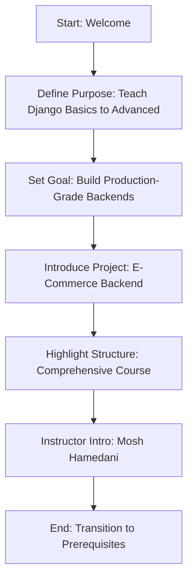

Welcome to the **Ultimate Django Course**! 🎉 I’m going to teach you everything you need to know about Django, from the very basics to advanced concepts. By the end, you’ll be able to use Django to build production-grade backends for your web and mobile apps. If you’ve always wanted to learn web development with Python, you’re in the right place! 🐍 We’ll use Python and Django to build and deploy the backend for an e-commerce application. 📦

This course is comprehensive, organized, and practical, designed to take you from zero to hero and prepare you for a job. Everything you need to know about Django is here in the right order—no need to jump between random tutorials! I’m Mosh Hamedani, and I’ve taught millions how to advance their software engineering skills through my YouTube channel and online school, codewithmosh.com. Let’s jump in! 🌟

---

## Chapter 2: Prerequisites (1:02) 📚

**Flow of This Chapter: Required Knowledge**  
Here’s a Mermaid flow diagram outlining the prerequisites for this course:

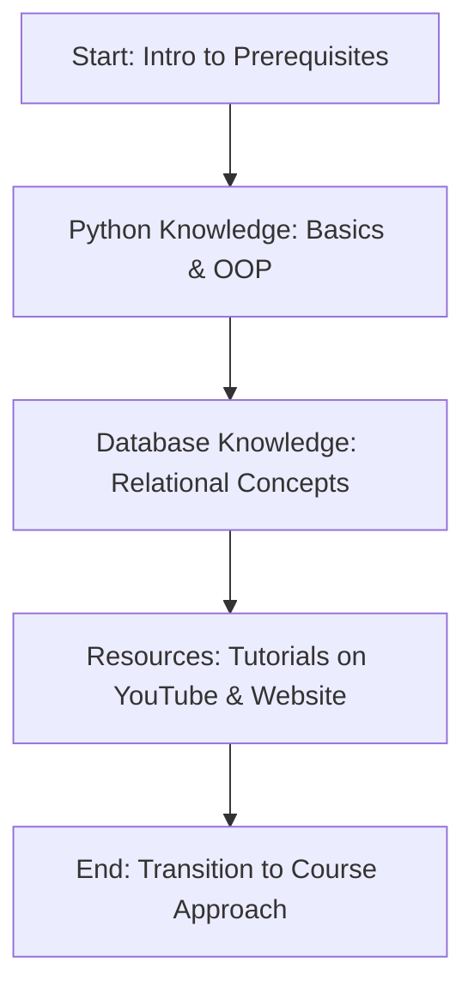

Let’s talk about what you need to know to take this course. For starters, you need to know **Python**—the basics as well as object-oriented programming (OOP) concepts like:

- Classes
- Inheritance
- Polymorphism

You should also know the basics of **relational databases**, including concepts like:

- Tables
- Columns
- Primary and foreign keys
- Relationships

If you need a refresher, I have beginner-level tutorials on my YouTube channel and comprehensive courses on my website, codewithmosh.com (links provided). 📽️ Let’s assume you’re the right student for this course and move on! ✅

---

## Chapter 3: How to Take This Course (1:38) 📝

**Flow of This Chapter: Learning Approach**  
Here’s a Mermaid flow diagram showing how to approach this course:

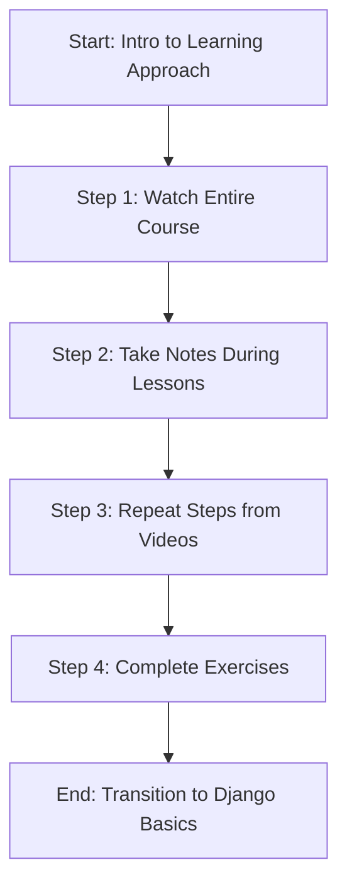

Here’s how you should take this course to get the most out of it:

- **Watch the Entire Course**: Go from beginning to end, even if you’re familiar with Django. I’ll share tips and tricks along the way—you don’t want to miss them! 🎯
- **Take Notes**: Write down keywords on paper while watching each lesson. Writing helps you remember new concepts. ✍️
- **Repeat Steps**: After each lesson, go through your notes and repeat the steps I showed in the video. This is how I learn new things! 🔄
- **Complete Exercises**: I’ve designed tons of exercises to help you understand and retain the material. The more you practice, the better you’ll be at Django and coding in general! 💻

I won’t waste your time with repetitive or useless content, so make sure to follow these steps. Let’s get started with Django! 🚀

---

## Chapter 4: Getting Started with Django (2:43) 🌟

**Flow of This Chapter: Django Introduction Overview**  
Here’s a Mermaid flow diagram outlining the introduction to Django basics:

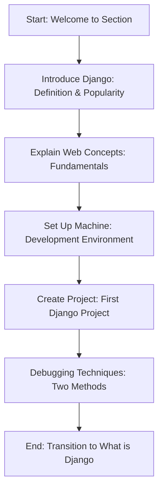

Welcome back to the **Ultimate Django Course**! In this section, we’ll cover the basics of Django. Here’s what we’ll do:

- First, I’ll give you a quick introduction to what Django is and why it’s so popular. 🌐
- Then, we’ll talk about fundamental web development concepts every web developer must know. 📚
- Next, we’ll set up our machine for development and create our first Django project. 💻
- Once the project is running, I’ll show you two essential techniques for debugging Django applications. 🐞

This will be a short and sweet introduction to Django, so let’s jump in! 🚀

---

## Chapter 5: What is Django? (3:22) 🐍

**Flow of This Chapter: Understanding Django**  
Here’s a Mermaid flow diagram showing the flow of this chapter on Django’s definition and benefits:

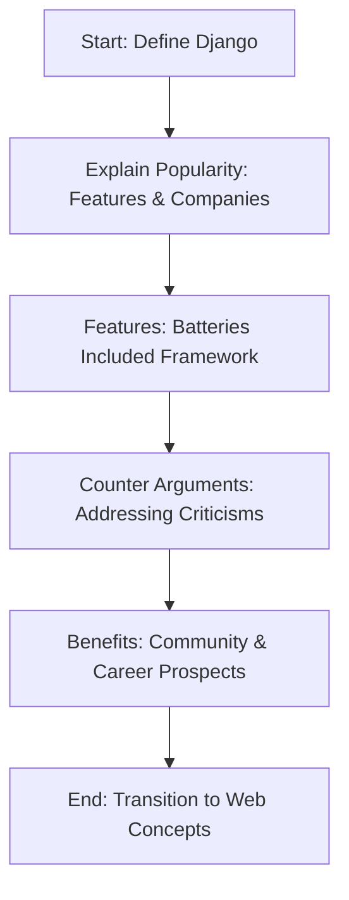

**What is Django** and why is it so popular? Django is a free and open-source framework for building web applications with Python. 🐍 It’s not the only Python web framework, but it’s the most popular because it helps us build websites faster with fewer lines of code. Companies like YouTube, Instagram, Spotify, and Dropbox use Django in their tech stacks! 🌟

Django is a **batteries-included framework**, meaning it comes with many features out of the box, so we don’t have to code them from scratch. For example:

- An admin interface for managing data 📊
- An object-relational mapper (ORM) to query/persist data without much SQL code 🗃️
- An authentication package for identifying users 🔐
- A package for caching data ⚡

Since Django offers these features, we can focus on our application’s requirements without reinventing the wheel. However, some developers, like superstar John Smith, might criticize Django as “old and bloated.” I disagree—comparing frameworks based only on speed is like saying a Ferrari is better than a truck because it’s faster. 🚗 A wise engineer considers factors like:

- Maturity and stability of the framework
- Learning curve
- Size of the community

Django has been around for a long time and has a huge community, offering tons of reusable packages and support. Plus, Django’s features are optional—you use only what you need! In the US, the average salary for a Django developer is over $117,000/year, making it a great investment for your future if you like Python and web development. 💼

---

## Chapter 6: How the Web Works (6:08) 🌐

**Flow of This Chapter: Web Development Concepts**  
Here’s a Mermaid flow diagram showing the flow of this chapter on web fundamentals:

```mermaid
graph TD
    A[Start: Intro to Web Concepts] --> B[Example: Online Store at moshby.com]
    B --> C[Frontend vs Backend: Roles]
    C --> D[HTTP Protocol: Request-Response Cycle]
    D --> E[Server Options: HTML vs API]
    E --> F[Django’s Role: Building APIs]
    F --> G[End: Transition to Setup]
```

Let’s explore fundamental concepts for building web applications. Imagine we’re building an online store at moshby.com. 🛒 This website has two parts:

- **Frontend**: Loaded in the user’s browser, it’s what the user sees and interacts with. 🖥️
- **Backend**: Runs on a web server, handling data processing and business rules. 🖧

When Alice visits moshby.com, her browser sends an **HTTP request** to the server (HTTP = HyperText Transfer Protocol). The server processes this and sends an **HTTP response** back. As Alice navigates, this request-response cycle repeats. 🔄

For the backend, we decide how to respond to clients. Options include:

- **Generate HTML on the server**: Use HTML (HyperText Markup Language) to send a complete page to the client.
- **Return only data (API approach)**: The client generates the page, freeing up the server to handle more requests, making the app more scalable. 📈

The API approach is now the industry best practice, using tools like React, Angular, or Vue for the frontend. Django, a server-side framework, is used to build the backend—don’t compare it to frontend tools like React! We’ll use Django to build an **API** for our online store, providing endpoints (e.g., for products or orders) that clients can use to get/save data. Let’s set up our environment next! 🛠️

---

## Chapter 7: Setting Up the Development Environment (10:32) 🛠️

**Flow of This Chapter: Environment Setup**  
Here’s a Mermaid flow diagram outlining the setup process:

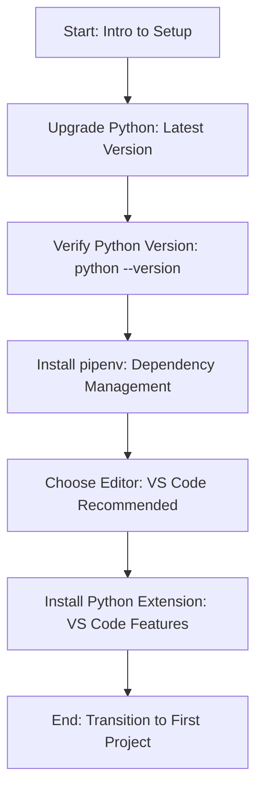

Let’s set up your machine for coding! First, upgrade to the latest Python version from python.org/downloads. 🐍 Then, verify the upgrade in your terminal:

- On Mac: `python3 --version` (Mac has Python 2 and 3; we want 3.9.5 or later).
- On Windows/Linux: `python --version`.

Next, install **pipenv** using `pip` (or `pip3` on Mac). Pipenv manages dependencies in virtual environments to avoid clashes. ⚙️ I’ll use **Visual Studio Code (VS Code)** as my editor—it’s my preference, but you can use others like PyCharm. I recommend VS Code because I’ll share shortcuts and tips specific to it. Download it from code.visualstudio.com if needed. 📥

In VS Code, go to the Extensions panel, search for “Python,” and install the extension for features like IntelliSense, debugging, and code navigation. 🌟 Now we’re ready to create our first Django project! 🚀

---

## Chapter 8: Creating Your First Django Project (12:38) 📂

**Flow of This Chapter: First Django Project**  
Here’s a Mermaid flow diagram showing the process of creating a Django project:

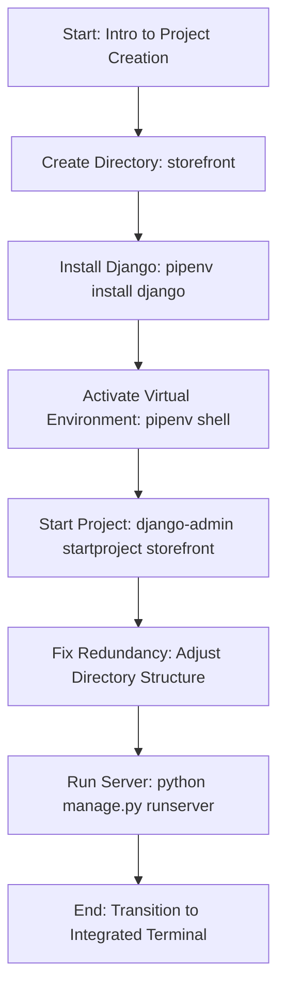

Let’s create our first Django project! In your terminal, navigate to your desired location (e.g., Desktop) and create a directory called **storefront**. 📁 Then, go inside and install Django using `pipenv install django`. This sets up a virtual environment. Activate it with `pipenv shell`.

Pipenv creates a `Pipfile` (like package.json for JavaScript) listing dependencies, such as Django. Use `django-admin startproject storefront .` to create a project in the current directory (the dot avoids extra folders). This generates:

- A `storefront` directory with core files (settings.py, urls.py, etc.)
- A `manage.py` file, a wrapper around `django-admin` that uses project settings

Run the server with `python manage.py runserver` (optionally specify a port, e.g., 8000). Ignore the “unapplied migrations” warning for now. Open the server address (e.g., `http://127.0.0.1:8000`) in your browser to see your project running! 🌐 Let’s make things easier with VS Code’s integrated terminal next. 🖥️

---

## Chapter 9: Using the Integrated Terminal in VSCode (18:50) 🖥️

**Flow of This Chapter: Integrated Terminal Setup**  
Here’s a Mermaid flow diagram showing how to use the integrated terminal:

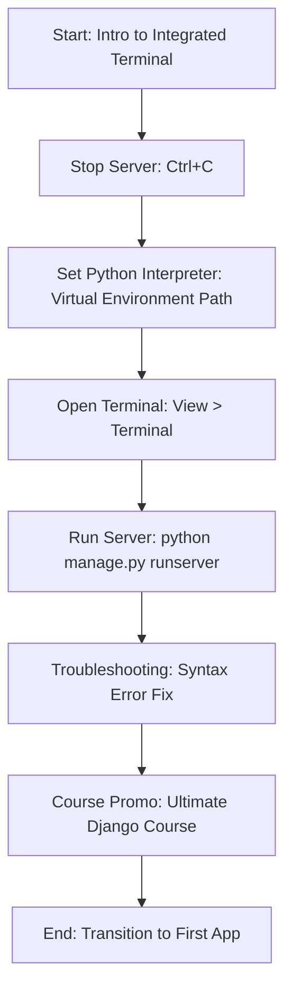

So far, we’ve used a separate terminal, but VS Code’s **integrated terminal** is easier. First, stop the web server with `Ctrl+C`. To use the integrated terminal, configure it to use the Python interpreter in our virtual environment. Find the path with `pipenv --venv`, copy it, and in VS Code:

- Open the Command Palette (`Shift+Command+P` on Mac).
- Search for “Python: Select Interpreter,” paste the path, and append `/bin/python` (use `\` on Windows).

Now, open the integrated terminal (`Ctrl+`` on Mac). VS Code auto-activates the virtual environment. Run `python manage.py runserver`—it works seamlessly! 🌟 If you get a “syntax error,” open a new terminal to re-activate the environment. Let’s create our first app next! 🚀

**Quick Note**: This tutorial is the first hour of my 10-hour **Ultimate Django Course**, which includes exercises, a full e-commerce project, a 30-day money-back guarantee, and a certificate. Check it out at codewithmosh.com (link provided)! 📜

---

## Chapter 10: Creating Your First App (22:06) 📱

**Flow of This Chapter: Creating a Django App**  
Here’s a Mermaid flow diagram showing the process of creating an app:

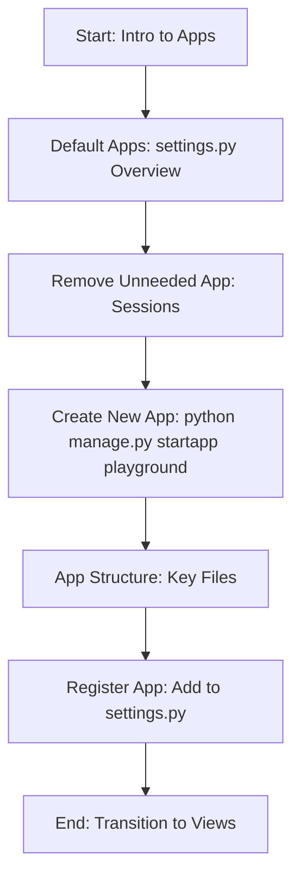

A Django project is a collection of **apps**, each providing specific functionality, like apps on your phone. 📱 In `settings.py`, default apps include:

- `admin`: For an admin interface 📊
- `auth`: For user authentication 🔐
- `sessions`: For server-side memory (legacy, not used in APIs—let’s remove it)

Create a new app with `python manage.py startapp playground`. This generates a folder with:

- `migrations/`: For database tables 🗃️
- `admin.py`: For admin interface setup
- `models.py`: For data models
- `tests.py`: For unit tests
- `views.py`: For request handlers (not UI views)

Register the app in `settings.py` under `INSTALLED_APPS` by adding `playground`. Let’s write our first view! ✍️

---

## Chapter 11: Writing Views (25:36) 📬

**Flow of This Chapter: Writing a View**  
Here’s a Mermaid flow diagram showing how to write a view:

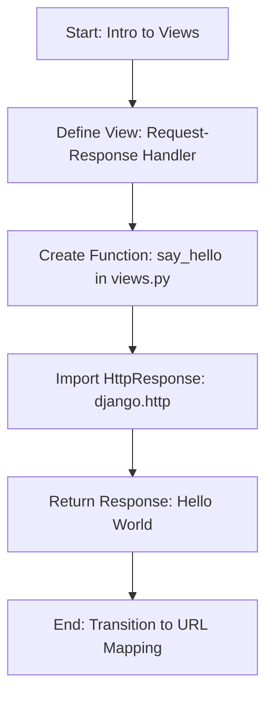

**Views** in Django handle HTTP requests and return responses—they’re request handlers, not UI views (those are templates). In `playground/views.py`, create a function:

```python
from django.http import HttpResponse

def say_hello(request):
    return HttpResponse("Hello World")
```

This function takes a `request` object and returns an `HttpResponse` with “Hello World.” Next, we’ll map this view to a URL! 🔗

---

## Chapter 12: Mapping URLs to Views (27:27) 🔗

**Flow of This Chapter: URL Mapping**  
Here’s a Mermaid flow diagram showing how to map URLs to views:

```mermaid
graph TD
    A[Start: Intro to URL Mapping] --> B[Create urls.py: In playground App]
    B --> C[Define URL Patterns: path('hello/', views.say_hello)]
    C --> D[Link to Main URLs: storefront/urls.py]
    D --> E[Update Route: Remove Redundant Prefix]
    E --> F[Test: Visit playground/hello]
    F --> G[End: Transition to Templates]
```

Let’s map our `say_hello` view to the URL `playground/hello/`. Create `playground/urls.py`:

```python
from django.urls import path
from . import views

urlpatterns = [
    path('hello/', views.say_hello),
]
```

Link this to the main `storefront/urls.py`:

```python
from django.urls import path, include

urlpatterns = [
    path('playground/', include('playground.urls')),
]
```

Update `playground/urls.py` to `path('hello/', views.say_hello)` (remove “playground” since it’s in the main URLs). Restart the server, visit `playground/hello/`, and see “Hello World”! 🌟 Let’s explore templates next. 📜

---

## Chapter 13: Using Templates (32:15) 📄

**Flow of This Chapter: Using Templates**  
Here’s a Mermaid flow diagram showing how to use templates:

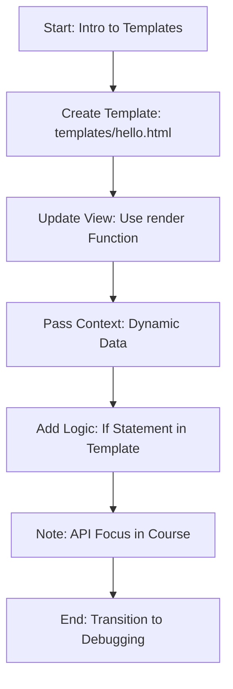

Django views are request handlers; templates are the UI views. Create `playground/templates/hello.html`:

```html
<html>
<body>
    
        <h1>Hello {{ name }}</h1>
    
        <h1>Hello World</h1>
    
</body>
</html>
```

Update `say_hello` to use the `render` function:

```python
from django.shortcuts import render

def say_hello(request):
    return render(request, 'hello.html', {'name': 'Mosh'})
```

This renders the template with dynamic data. Refresh the browser to see “Hello Mosh”! Django templates are modular, but we’ll focus on APIs (returning data, not HTML) in this course. Let’s learn debugging next! 🐞

---

## Chapter 14: Debugging Django Applications in VSCode (36:24) 🐞

**Flow of This Chapter: Debugging in VSCode**  
Here’s a Mermaid flow diagram showing the debugging process:

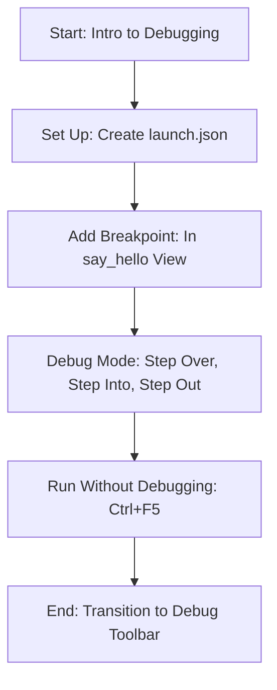

Debugging in VS Code helps us find issues by running code line by line. In the “Run and Debug” panel, create a `launch.json` file (select “Django”) and set the port to 9000. Add a dummy function in `say_hello`:

```python
def calculate():
    x = 1
    y = 2
    return x

def say_hello(request):
    x = calculate()
    return render(request, 'hello.html', {'name': 'Mosh'})
```

Set a breakpoint on `x = calculate()`, start debugging, and visit `playground/hello/`. Use:

- **Step Over (F10)**: Execute the current line.
- **Step Into (F11)**: Go inside `calculate()`.
- **Step Out (Shift+F11)**: Exit the function.

Remove breakpoints when done (`Shift+F5` to stop). You can also run without debugging using `Ctrl+F5`. Let’s explore another debugging tool! 🔍

---

## Chapter 15: Using Django Debug Toolbar (44:12) 🔍

**Flow of This Chapter: Django Debug Toolbar**  
Here’s a Mermaid flow diagram showing how to use the Django Debug Toolbar:

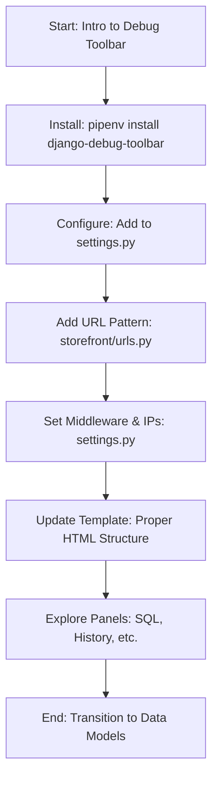

The **Django Debug Toolbar** is a powerful debugging tool. Install it with `pipenv install django-debug-toolbar`. Configure it in `settings.py`:

- Add `debug_toolbar` to `INSTALLED_APPS`.
- Add `MIDDLEWARE`: `'debug_toolbar.middleware.DebugToolbarMiddleware'`.
- Set `INTERNAL_IPS = ['127.0.0.1']`.

In `storefront/urls.py`, add:

```python
import debug_toolbar
urlpatterns = [
    path('playground/', include('playground.urls')),
    path('__debug__/', include(debug_toolbar.urls)),
]
```

Update `hello.html` to include proper HTML structure (`<html><body>...</body></html>`). Refresh the browser to see the toolbar, which offers panels like SQL queries, history, and settings. We’ll revisit the SQL panel later! 🗃️ Let’s move to data modeling. 📊

---

## Chapter 16: Building a Data Model (48:41) 📊

**Flow of This Chapter: Data Model Overview**  
Here’s a Mermaid flow diagram outlining the data modeling section:

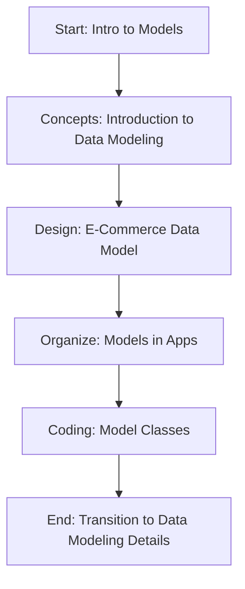

In this section, we’ll explore **models** for storing and retrieving data. We’ll cover:

- A quick introduction to data modeling concepts. 📚
- Designing a data model for an e-commerce app. 🛒
- Organizing models in apps for better reusability. 📂
- Coding model classes to use throughout the course. 💻

Let’s get started! 🚀

---

## Chapter 17: Introduction to Data Modeling (49:24) 🗃️

**Flow of This Chapter: Data Modeling Basics**  
Here’s a Mermaid flow diagram showing the introduction to data modeling:

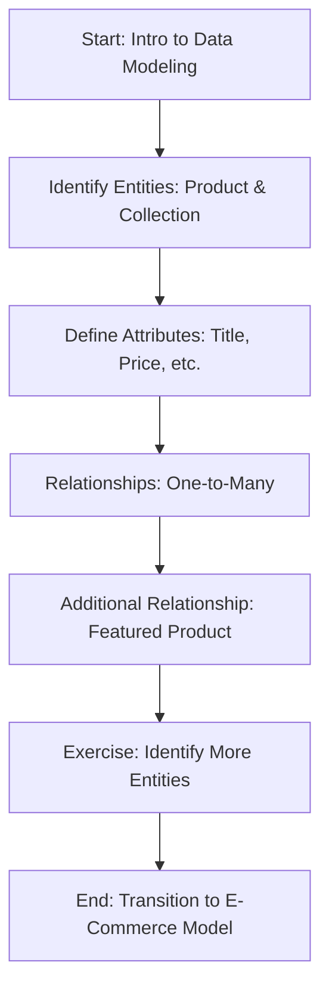

The first step in a Django project is identifying data to store. For an e-commerce app, we need:

- **Product**: Attributes like title, description, price, inventory.
- **Collection**: Attribute like title, with a one-to-many relationship to Product (a collection has many products).

A collection can also have a **featured product** (0 or 1 product). Django auto-adds an `id` attribute to entities. Try this exercise: Identify 5 essential entities for an e-commerce app, including attributes and relationships! 📝 Let’s see the solution next. 🛠️

---

## Chapter 18: Building an E-Commerce Data Model (52:02) 🛒

**Flow of This Chapter: E-Commerce Data Model Design**  
Here’s a Mermaid flow diagram showing the e-commerce data model creation:

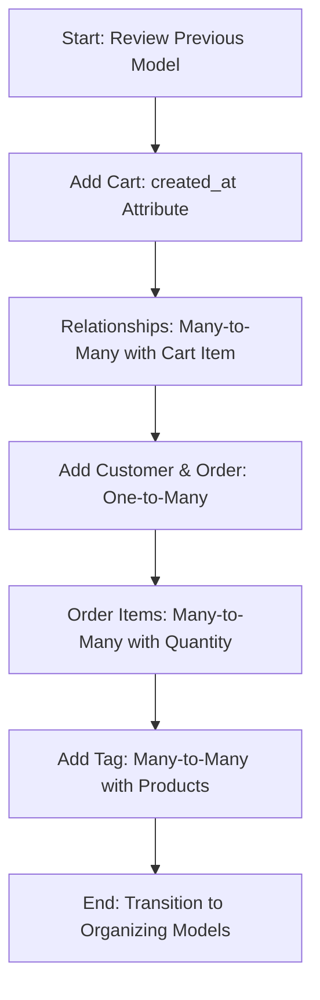

From the last lesson, we have a one-to-many relationship between **Collection** and **Product**. Now, add:

- **Cart**: With `created_at` to track creation time.
- **Cart Item**: A many-to-many relationship between Cart and Product, with a `quantity` attribute (e.g., Cart ↔ Cart Item ↔ Product).
- **Customer**: Attributes like name, email; one-to-many with **Order**.
- **Order Item**: A many-to-many relationship between Order and Product, with `quantity`.
- **Tag**: A many-to-many relationship with Product for tagging.

Carts are anonymous—no direct link to Customer. This model keeps things simple but functional! Let’s organize these into apps. 📂

---

## Chapter 19: Organizing Models in Apps (56:35) 📂

**Flow of This Chapter: Organizing Models**  
Here’s a Mermaid flow diagram showing how to organize models into apps:

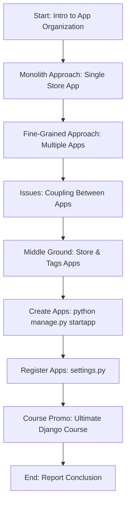

A Django project contains apps, each providing specific functionality. We could put all entities (Product, Cart, etc.) in a single **Store** app, but this creates a monolith—hard to maintain and reuse. Alternatively, splitting into apps like Products, Customers, Shopping Cart, and Orders increases **coupling** (dependencies), making updates tricky.

A better approach is a middle ground:

- **Store App**: Includes Product, Collection, Cart, Customer, Order (core e-commerce functionality).
- **Tags App**: Includes Tag and Tagged Item (optional, reusable for other apps like blogs).

Create these apps with `python manage.py startapp store` and `python manage.py startapp tags`, then register them in `settings.py` under `INSTALLED_APPS`. This design minimizes coupling and maximizes cohesion! 🌟

**Quick Note**: This tutorial is the first hour of my 10-hour **Ultimate Django Course**, which includes exercises, a full e-commerce project, a 30-day money-back guarantee, and a certificate. Check it out at codewithmosh.com (link provided)! 📜 That’s all for this report! 📘

--- 

This documented report provides a structured overview of the **Ultimate Django Course**, with Mermaid flow diagrams for each chapter to illustrate the flow of topics. 🌟
