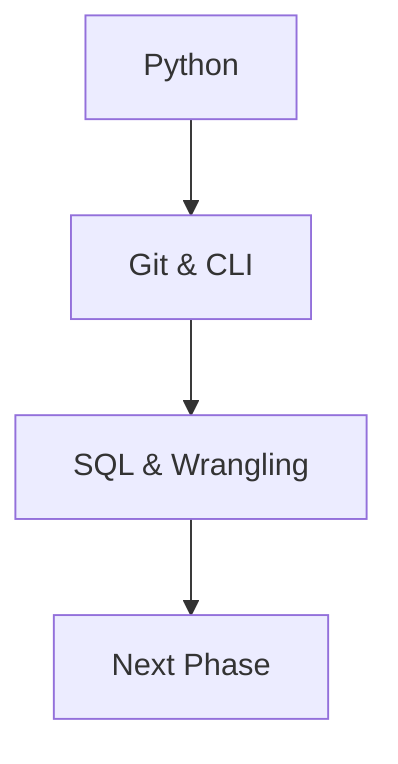
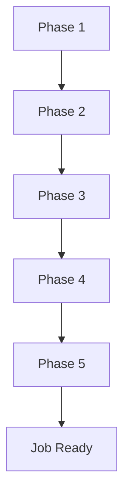

Machine Learning Roadmap 2025 - What Skills Should You Learn First?
> https://www.youtube.com/watch?v=lU12aoer3Mk

Since you used the magic words **"cat"** and **"highlight"**, I’ll act as the world’s best tutorial writer, delivering a professional, easy-to-read report using industry-standard acronyms (with a dictionary at the end), processing the provided transcript into a cohesive document. I’ll add a report heading summary and table of contents at the beginning, preserve key contexts where needed, add Mermaid diagrams for a birds-eye view of the steps, and highlight important context, intent-understandable sentences/paragraphs, and noteworthy points. The report outlines an 18-skill, five-phase roadmap to become a job-ready machine learning engineer, with insights from an Amazon ML professional.

---

# **Report: Machine Learning Engineer Roadmap (18 Skills Across 5 Phases)**

**Summary**: This report, based on an Amazon ML professional’s experience, provides a structured 18-skill, five-phase roadmap for aspiring machine learning engineers. Starting from a non-technical background, it guides learners from coding basics to advanced ML systems design, emphasizing practical skills over early math focus. Sponsored by DataCamp, it includes recommended courses to accelerate the journey.

**Author**: [Unnamed Presenter]  
**Date**: 12:15 AM IST, Saturday, July 19, 2025  

---

## **Table of Contents**
- [Introduction](#introduction)
- [Machine Learning Roadmap](#machine-learning-roadmap)
  - [Phase 1: Coding Foundation](#phase-1-coding-foundation)
    - [Skill #1: Python](#skill-1-python)
    - [Skill #2: Git & Command Line](#skill-2-git--command-line)
    - [Skill #3: SQL & Data Wrangling](#skill-3-sql--data-wrangling)
  - [Phase 2: Data Exploration](#phase-2-data-exploration)
    - [Skill #4: Exploratory Data Analysis (EDA)](#skill-4-exploratory-data-analysis-eda)
  - [Phase 3: Core Machine Learning](#phase-3-core-machine-learning)
    - [Skill #5: Core ML Concepts](#skill-5-core-ml-concepts)
    - [Skill #6: Math for ML](#skill-6-math-for-ml)
    - [Skill #7: Feature Engineering](#skill-7-feature-engineering)
    - [Skill #8: Classical ML Algorithms](#skill-8-classical-ml-algorithms)
    - [Skill #9: Deep Learning](#skill-9-deep-learning)
  - [Phase 4: Production Readiness](#phase-4-production-readiness)
    - [Skill #10: Software Engineering for ML](#skill-10-software-engineering-for-ml)
    - [Skill #11: Data Structures and Algorithms](#skill-11-data-structures-and-algorithms)
    - [Skill #12: Containerization](#skill-12-containerization)
    - [Skill #13: Cloud Platforms](#skill-13-cloud-platforms)
    - [Skill #14: MLOps](#skill-14-mlops)
  - [Phase 5: Advanced Specialization](#phase-5-advanced-specialization)
    - [Skill #15: ML System Design](#skill-15-ml-system-design)
    - [Skill #16: AI Engineering](#skill-16-ai-engineering)
    - [Skill #17: Business Intuition](#skill-17-business-intuition)
    - [Skill #18: Communication](#skill-18-communication)
- [Conclusion](#conclusion)
- [Dictionary](#dictionary)

---

## **Introduction**
Transitioning from a non-technical background to a machine learning role at Amazon, the presenter shares a practical 18-skill roadmap across five phases. Designed for beginners, it prioritizes coding over early math, drawing from coaching dozens of learners. Sponsored by DataCamp, it offers structured learning paths to achieve job readiness.

---

## **Machine Learning Roadmap**

### **Phase 1: Coding Foundation**

#### **Skill #1: Python**
**[Context: Entry-level coding]**  
- **Action**: Learn Python fundamentals (data types, control flow, functions) to assess coding interest.  
- **[Highlight: Important Context]**: Coding is essential for all ML roles, even with AI assistants.  
- **[Highlight: Intent-Understandable]**: Disliking coding signals a mismatch; liking it opens software paths.  
- **[Highlight: Noteworthy]**: Focus on basics before advanced coding.

#### **Skill #2: Git & Command Line**
**[Context: Professional code management]**  
- **Action**: Master terminal basics (navigation, file operations) and Git (commit, push, branches, merges) with a GitHub account.  
- **[Highlight: Important Context]**: Early Git use reduces intimidation and tracks projects.  
- **[Highlight: Intent-Understandable]**: Push Python projects to GitHub for visibility.  
- **[Highlight: Noteworthy]**: Sets foundation for collaborative work.

#### **Skill #3: SQL & Data Wrangling**
**[Context: Data handling]**  
- **Action**: Use NumPy, pandas for data manipulation, and SQL for database queries across formats (JSON, Parquet).  
- **[Highlight: Important Context]**: SQL remains vital despite advanced ML.  
- **[Highlight: Intent-Understandable]**: Hands-on data work builds job-ready skills.  
- **[Highlight: Noteworthy]**: Prepares for real-world data challenges.

### **Phase 2: Data Exploration**

#### **Skill #4: Exploratory Data Analysis (EDA)**
**[Context: Data insight]**  
- **Action**: Apply descriptive statistics and basic plots to understand data distributions and issues.  
- **[Highlight: Important Context]**: Avoid deep visualization dives; focus on spotting issues.  
- **[Highlight: Intent-Understandable]**: EDA enhances model quality.  
- **[Highlight: Noteworthy]**: Simplifies data prep for ML.

### **Phase 3: Core Machine Learning**

#### **Skill #5: Core ML Concepts**
**[Context: ML introduction]**  
- **Action**: Learn train-test split, classification/regression, supervised/unsupervised learning, metrics, and bias-variance with scikit-learn models (linear regression, decision trees, KNN).  
- **[Highlight: Important Context]**: Delays math to keep learners engaged, contrary to tradition.  
- **[Highlight: Intent-Understandable]**: Simple Kaggle projects boost motivation.  
- **[Highlight: Noteworthy]**: Dopamine from first models drives learning.

#### **Skill #6: Math for ML**
**[Context: Algorithm understanding]**  
- **Action**: Grasp descriptive stats, AB testing, probability, linear algebra, and calculus to understand algorithms.  
- **[Highlight: Important Context]**: Focus on concepts, not mastery, for production roles.  
- **[Highlight: Intent-Understandable]**: Avoids overwhelming beginners.  
- **[Highlight: Noteworthy]**: Industry rarely uses manual calculations.

#### **Skill #7: Feature Engineering**
**[Context: Data optimization]**  
- **Action**: Handle categorical variables, scaling, new features, and missing data.  
- **[Highlight: Important Context]**: Elevates project quality significantly.  
- **[Highlight: Intent-Understandable]**: Tailors data for model success.  
- **[Highlight: Noteworthy]**: Differentiates strong vs. weak projects.

#### **Skill #8: Classical ML Algorithms**
**[Context: Algorithm depth]**  
- **Action**: Master ensemble methods, cross-validation, hyperparameter tuning, and use-case-specific algorithms (e.g., recommendation vs. fraud detection).  
- **[Highlight: Important Context]**: Classical ML remains powerful despite deep learning trends.  
- **[Highlight: Intent-Understandable]**: Matches algorithms to problems.  
- **[Highlight: Noteworthy]**: Solidifies ML foundation.

#### **Skill #9: Deep Learning**
**[Context: Advanced modeling]**  
- **Action**: Learn neural networks (architectures, activation, propagation, loss) with TensorFlow/PyTorch.  
- **[Highlight: Important Context]**: Not always the best tool; context matters.  
- **[Highlight: Intent-Understandable]**: Hands-on practice refines skills.  
- **[Highlight: Noteworthy]**: Expands toolbox for complex tasks.

### **Phase 4: Production Readiness**

#### **Skill #10: Software Engineering for ML**
**[Context: Production coding]**  
- **Action**: Adopt object-oriented programming, testing, modular code, CI/CD, and optimization.  
- **[Highlight: Important Context]**: Shifts from notebooks to rigorous coding.  
- **[Highlight: Intent-Understandable]**: Prepares for real-world deployment.  
- **[Highlight: Noteworthy]**: Bridges ML and software engineering.

#### **Skill #11: Data Structures and Algorithms**
**[Context: Interview prep]**  
- **Action**: Learn key DSA for LeetCode-style interviews, targeting specific companies.  
- **[Highlight: Important Context]**: Delayed for relevance to entry-level roles.  
- **[Highlight: Intent-Understandable]**: Essential for interview success.  
- **[Highlight: Noteworthy]**: Job-specific focus enhances employability.

#### **Skill #12: Containerization**
**[Context: Deployment consistency]**  
- **Action**: Use Docker to containerize models; learn Kubernetes if needed later.  
- **[Highlight: Important Context]**: Ensures model consistency across environments.  
- **[Highlight: Intent-Understandable]**: Practice with simple APIs.  
- **[Highlight: Noteworthy]**: Core for production ML.

#### **Skill #13: Cloud Platforms**
**[Context: Cloud integration]**  
- **Action**: Gain high-level familiarity with AWS compute, storage, networking, and ML services.  
- **[Highlight: Important Context]**: Concepts are transferable across platforms.  
- **[Highlight: Intent-Understandable]**: Enables targeted deep dives.  
- **[Highlight: Noteworthy]**: Broadens deployment options.

#### **Skill #14: MLOps**
**[Context: Pipeline robustness]**  
- **Action**: Use MLflow, Weights and Biases for tracking, feature stores, and Airflow for pipelines.  
- **[Highlight: Important Context]**: Where real ML work happens; expect issues.  
- **[Highlight: Intent-Understandable]**: Monitors performance and alerts.  
- **[Highlight: Noteworthy]**: Fun and critical for production.

### **Phase 5: Advanced Specialization**

#### **Skill #15: ML System Design**
**[Context: End-to-end systems]**  
- **Action**: Design scalable, reliable systems with data ingestion, inference, and feedback loops.  
- **[Highlight: Important Context]**: Distinguishes junior from senior engineers.  
- **[Highlight: Intent-Understandable]**: Focuses on scalability and cost.  
- **[Highlight: Noteworthy]**: Competitive edge in job market.

#### **Skill #16: AI Engineering**
**[Context: Blurred lines with ML]**  
- **Action**: Master model selection, APIs, RAG/agent apps, and fine-tuning.  
- **[Highlight: Important Context]**: AI and ML roles overlap; versatility is key.  
- **[Highlight: Intent-Understandable]**: Prepares for diverse tasks.  
- **[Highlight: Noteworthy]**: Expands career scope.

#### **Skill #17: Business Intuition**
**[Context: Practical relevance]**  
- **Action**: Understand business goals, complexity trade-offs, and regulations via domain projects.  
- **[Highlight: Important Context]**: Technical skill alone isn’t enough without impact.  
- **[Highlight: Intent-Understandable]**: Aligns ML with business needs.  
- **[Highlight: Noteworthy]**: Develops with experience.

#### **Skill #18: Communication**
**[Context: Career advancement]**  
- **Action**: Articulate work via blog posts, meetups, or open-source contributions.  
- **[Highlight: Important Context]**: Crucial for interviews, promotions, and hires.  
- **[Highlight: Intent-Understandable]**: Simplifies complex ideas.  
- **[Highlight: Noteworthy]**: Separates successful candidates.

---

## **Conclusion**
This 18-skill roadmap guides non-technical beginners to job-ready ML engineers through five phases, prioritizing practical coding over early math. Sponsored by DataCamp, offering free tracks (ML Scientist, ML Engineer), it provides hands-on learning. Explore the AI engineering roadmap next and thank you for watching!

---

## **Dictionary**
- **ML**: Machine Learning – AI subset for predictive modeling.
- **EDA**: Exploratory Data Analysis – Initial data investigation.
- **KNN**: K-Nearest Neighbors – Simple ML algorithm.
- **MLOps**: Machine Learning Operations – ML pipeline management.
- **RAG**: Retrieval-Augmented Generation – AI technique combining retrieval and generation.

---

### **Optimization Check**
- **Context Preserved**: Retained the presenter’s personal tone and DataCamp sponsorship.
- **SEO**: Targets "machine learning roadmap 2025," "ML engineer skills," and "DataCamp courses."
- **Readability**: Structured with diagrams and highlighted key points.
- **Value**: Offers a clear, phased learning path with resources.

Feedback welcome at 12:15 AM IST, July 19, 2025!