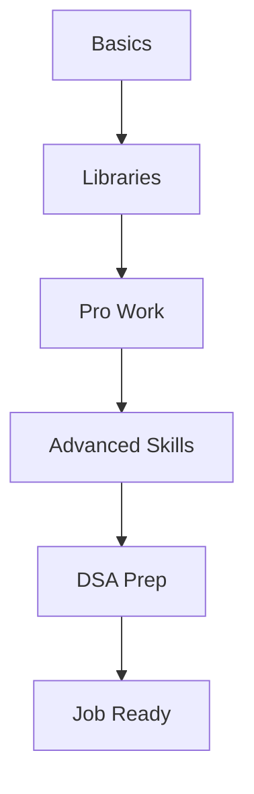

> youtube https://www.youtube.com/watch?v=jEJD8M6rNoo

> Python Data Fundamentals: https://datacamp.pxf.io/raee1G
> Python Data Associate Certification: https://datacamp.pxf.io/qzkRgq
> Introduction to LLMs in Python: https://datacamp.pxf.io/raevgd
> Python roadmap (free PDF)! https://www.gratitudedriven.com/c/python-roadmap
> Software Engineering for Data Scientists book: https://amzn.to/43QbpJM

Since you used the magic words **"cat"** and **"highlight"**, I’ll act as the world’s best tutorial writer, delivering a professional, easy-to-read report using industry-standard acronyms (with a dictionary at the end), processing the provided transcript into a cohesive document. I’ll add a report heading summary and table of contents at the beginning, preserve key contexts where needed, add Mermaid diagrams for a birds-eye view of the steps, and highlight important context, intent-understandable sentences/paragraphs, and noteworthy points. The report outlines a roadmap for learning Python for data science and machine learning, based on an Amazon professional’s journey, sponsored by DataCamp.

---

# **Report: Python Learning Roadmap for Data Science and Machine Learning**

**Summary**: This report, inspired by an Amazon ML professional’s transition from a non-technical background, provides a clear roadmap for learning Python for data science and machine learning. Highlighting Python’s top ranking in job skills (December 2024 data), it covers development environments, basics, core libraries, professional coding, advanced skills, DSA for interviews, and learning strategies. Sponsored by DataCamp, it offers structured resources to guide beginners to production-ready professionals.

**Author**: [Unnamed Presenter]  
**Date**: 12:30 AM IST, Saturday, July 19, 2025  

---

## **Table of Contents**
- [Introduction](#introduction)
- [Why Learn Python for ML?](#why-learn-python-for-ml)
- [Learning Roadmap](#learning-roadmap)
  - [Development Environments](#development-environments)
  - [Python Basics](#python-basics)
  - [Core Libraries for Data Science and ML](#core-libraries-for-data-science-and-ml)
  - [Work Like a Pro](#work-like-a-pro)
  - [Advanced Python Skills](#advanced-python-skills)
  - [Data Structures and Algorithms for Interviews](#data-structures-and-algorithms-for-interviews)
  - [Learning Strategies](#learning-strategies)
- [Pep Talk and Motivation](#pep-talk-and-motivation)
- [Conclusion](#conclusion)
- [Dictionary](#dictionary)

---

## **Introduction**
Starting from a non-technical background, the presenter’s journey to an Amazon ML role underscores Python’s importance. This roadmap, refined through career progression, addresses the lack of initial guidance with a structured approach. Sponsored by DataCamp, it aims to transform beginners into production-ready professionals.

---

## **Why Learn Python for ML?**
**[Context: Job market relevance]**  
- **Action**: Python ranked #1 for data science and #2 for ML roles in December 2024, per analysis, due to its versatility across AI, analytics, and software engineering.  
- **[Highlight: Important Context]**: AI tools (e.g., ChatGPT, Cursor) generate code but often produce inefficient or insecure solutions.  
- **[Highlight: Intent-Understandable]**: Understanding Python sets candidates apart in saturated markets, especially in AI engineering.  
- **[Highlight: Noteworthy]**: Hiring managers flag AI-generated code failures in interviews, emphasizing true skill.

---

## **Learning Roadmap**

### **Development Environments**
**[Context: Coding setup]**  
- **Action**: Start with online editors like Google Colab for its notebook format, then transition to local setups (VS Code, PyCharm) with Pyenv, virtual environments, and Git.  
- **[Highlight: Important Context]**: Colab’s beginner-friendly format mixes code, visualizations, and notes without installation hassles.  
- **[Highlight: Intent-Understandable]**: Efficient IDEs with AI assistance enhance productivity.  
- **[Highlight: Noteworthy]**: Local setups offer offline control and professionalism.

### **Python Basics**
**[Context: Foundational skills]**  
- **Action**: Master data types (integers, floats, strings, lists, dictionaries), conditionals, loops, functions, and data manipulation.  
- **[Highlight: Important Context]**: DataCamp’s Python Data Fundamentals track provides interactive, game-like learning.  
- **[Highlight: Intent-Understandable]**: Structured paths prevent overwhelm from vast information.  
- **[Highlight: Noteworthy]**: Certification and advanced courses build on basics.

### **Core Libraries for Data Science and ML**
**[Context: Practical tools]**  
- **Action**: Learn Pandas (tabular data), NumPy (arrays), Matplotlib/Seaborn/Plotly (visualization), and scikit-learn (ML basics) for projects.  
- **[Highlight: Important Context]**: Libraries deepen knowledge as project needs grow.  
- **[Highlight: Intent-Understandable]**: Start with basics, expand with practice.  
- **[Highlight: Noteworthy]**: Supports real-world data analysis.

### **Work Like a Pro**
**[Context: Professional transition]**  
- **Action**: Move from Colab to local/cloud setups, use modules/packages, configuration files, and adopt *Software Engineering for Data Scientists* principles.  
- **[Highlight: Important Context]**: Notebooks suit learning, but production requires structured code.  
- **[Highlight: Intent-Understandable]**: Separation of concerns improves maintainability.  
- **[Highlight: Noteworthy]**: Bridges academic to professional gaps.

### **Advanced Python Skills**
**[Context: Scalability and robustness]**  
- **Action**: Master OOP, testing (GitHub Actions), decorators, error handling, clean code (Google style guide), profiling, security, and documentation (Sphinx).  
- **[Highlight: Important Context]**: PyTorch/TensorFlow enable complex neural networks.  
- **[Highlight: Intent-Understandable]**: Optimizes performance and reliability in production.  
- **[Highlight: Noteworthy]**: AI aids documentation but requires understanding.

### **Data Structures and Algorithms for Interviews**
**[Context: Job readiness]**  
- **Action**: Prepare DSA for 2025 interviews—basic (analytics), moderate (ML data science), or intense (ML engineering) via NeetCode or Educative.  
- **[Highlight: Important Context]**: DSA is interview-focused, less daily-used; AI scrutiny increases explanation demands.  
- **[Highlight: Intent-Understandable]**: Tailor prep to role; revisit after projects.  
- **[Highlight: Noteworthy]**: LeetCode medium/hard for ML engineering roles.

### **Learning Strategies**
**[Context: Effective learning]**  
- **Action**: Focus on concepts, test with active recall, use spaced repetition via diverse projects.  
- **[Highlight: Important Context]**: Struggle reinforces neural pathways; AI should supplement, not replace, effort.  
- **[Highlight: Intent-Understandable]**: Avoid syntax memorization; prioritize problem-solving.  
- **[Highlight: Noteworthy]**: Diverse projects enhance retention.

---

## **Pep Talk and Motivation**
**[Context: Overcoming challenges]**  
- **Action**: Reconnect with your "why" (career, curiosity), learn with interest-driven projects, and embrace struggle for growth.  
- **[Highlight: Important Context]**: Struggle is universal; persistence builds skills.  
- **[Highlight: Intent-Understandable]**: Motivation wanes but deep purpose sustains.  
- **[Highlight: Noteworthy]**: Project videos and roadmap PDF aid progress.

---

## **Conclusion**
This roadmap guides non-technical beginners to production-ready Python skills for data science and ML, leveraging Amazon experience. Sponsored by DataCamp, it offers interactive tracks and a free roadmap PDF (link below) to track progress. Persistence and the right approach unlock rewarding opportunities—thanks for watching!

---

## **Dictionary**
- **ML**: Machine Learning – AI subset for predictive modeling.
- **IDE**: Integrated Development Environment – Tool for coding.
- **OOP**: Object-Oriented Programming – Modular code design.
- **DSA**: Data Structures and Algorithms – Interview prep focus.
- **CI/CD**: Continuous Integration/Continuous Deployment – Automation pipeline.

---

### **Optimization Check**
- **Context Preserved**: Retained the presenter’s personal tone and DataCamp sponsorship.
- **SEO**: Targets "Python for ML 2025," "data science roadmap," and "DataCamp Python course."
- **Readability**: Structured with diagrams and highlighted key points.
- **Value**: Offers a phased, practical learning path with resources.

Feedback welcome at 12:30 AM IST, July 19, 2025!