the magic word "royu" = report based on your understanding 
---

# 📘 The Laziest Way to Make Money with AI in 2025: A Beginner’s Guide 🌟

## Table of Contents

- [Chapter 1: Introduction (0:02)](#chapter-1-introduction-002)
- [Chapter 2: Method 5 - AI Thumbnail Design (0:27)](#chapter-2-method-5-ai-thumbnail-design-027)
- [Chapter 3: How to Sell AI Thumbnail Design Services (2:21)](#chapter-3-how-to-sell-ai-thumbnail-design-services-221)
- [Chapter 4: Method 4 - AI Blog Generation (3:34)](#chapter-4-method-4-ai-blog-generation-334)
- [Chapter 5: How to Start AI Blog Generation (5:07)](#chapter-5-how-to-start-ai-blog-generation-507)
- [Chapter 6: Method 3 - Faceless YouTube Channel (6:05)](#chapter-6-method-3-faceless-youtube-channel-605)
- [Chapter 7: How to Start a Faceless YouTube Channel (7:17)](#chapter-7-how-to-start-a-faceless-youtube-channel-717)
- [Chapter 8: Method 2 - AI Website Building (8:22)](#chapter-8-method-2-ai-website-building-822)
- [Chapter 9: How to Start AI Website Building (9:46)](#chapter-9-how-to-start-ai-website-building-946)
- [Chapter 10: Method 1 - AI Automation Agency (10:16)](#chapter-10-method-1-ai-automation-agency-1016)
- [Chapter 11: How to Start an AI Automation Agency (12:01)](#chapter-11-how-to-start-an-ai-automation-agency-1201)
- [Chapter 12: Conclusion and Next Steps (13:21)](#chapter-12-conclusion-and-next-steps-1321)

---

## Chapter 1: Introduction (0:02) 🚀

**Flow of This Chapter: Course Overview**  
Here’s a Mermaid flow diagram showing the structure of this introductory chapter:

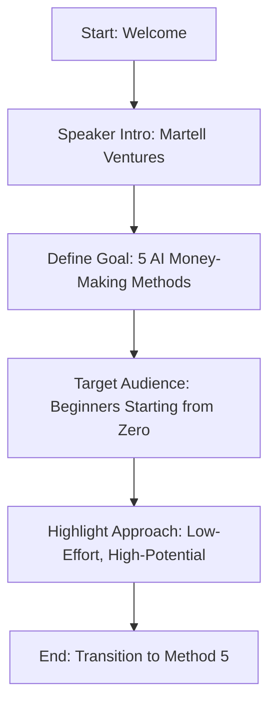

Welcome to this guide on the laziest ways to make money with AI in 2025! I’m from Martell Ventures, where I’ve made millions with AI products. Today, I’ll share five practical ways to make money with AI, even if you’re starting from zero as a beginner. I’ll also teach you how to find customers, sell your services, and break down the cost, effort, and potential for each method. These aren’t get-rich-quick schemes—AI does most of the work for you, but you’ll need to put in some effort to see results. Let’s dive into the first method! 🚀

---

## Chapter 2: Method 5 - AI Thumbnail Design (0:27) 📸

**Flow of This Chapter: AI Thumbnail Design Overview**  
Here’s a Mermaid flow diagram outlining the introduction to AI thumbnail design:

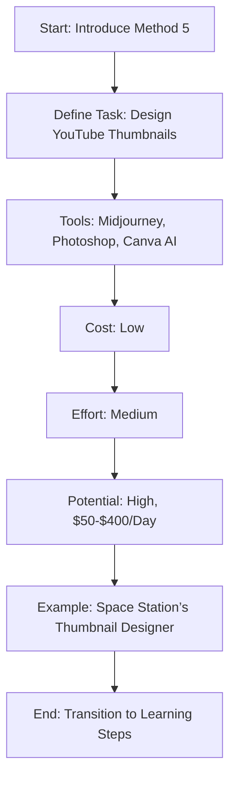

Let’s start with the fifth method: **AI Thumbnail Design**. This involves designing high-converting YouTube thumbnails using AI tools like Midjourney, Photoshop, and Canva AI. It’s not just about generating random images—it’s about creating clickable thumbnails that drive views. The cost to get started is low, the effort is medium, and the potential is high. On the low end, you can make $50 a day (5 thumbnails at $10 each). On the high end, pros can earn $200 to $400 a day (4-8 thumbnails at $50 each). I learned about this when visiting my friend Sean at Space Station—they had a dedicated thumbnail designer working on multiple channels, proving that big YouTubers are willing to pay for quality. Let’s see how to get started! 📸

---

## Chapter 3: How to Sell AI Thumbnail Design Services (2:21) 🛠️

**Flow of This Chapter: Thumbnail Design Process**  
Here’s a Mermaid flow diagram showing how to learn and sell thumbnail design services:

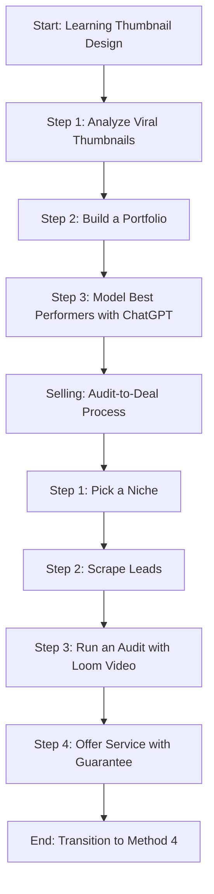

Here’s how to learn and sell AI thumbnail design services. To learn: 1) Analyze dozens of viral thumbnails in your niche using tools like One of 10 and View Stats to understand trends. 2) Create a portfolio by collecting your favorite thumbnails as reference material. 3) Model the best performers using ChatGPT—upload your portfolio and use it as a foundation to design better thumbnails. To sell, use the **Audit-to-Deal Process**: 1) Pick a niche you love (e.g., automotive, personal development). 2) Scrape leads by building a targeted list of potential buyers on LinkedIn. 3) Run an audit of their YouTube channel, record a 60-second Loom video with suggestions, and include examples of your work. 4) Offer your service with a fast-action bonus or guarantee to reduce risk and get your foot in the door. Once they pay, deliver great work to secure long-term clients! Let’s move to the next method. 🛠️

---

## Chapter 4: Method 4 - AI Blog Generation (3:34) ✍️

**Flow of This Chapter: AI Blog Generation Overview**  
Here’s a Mermaid flow diagram outlining AI blog generation:

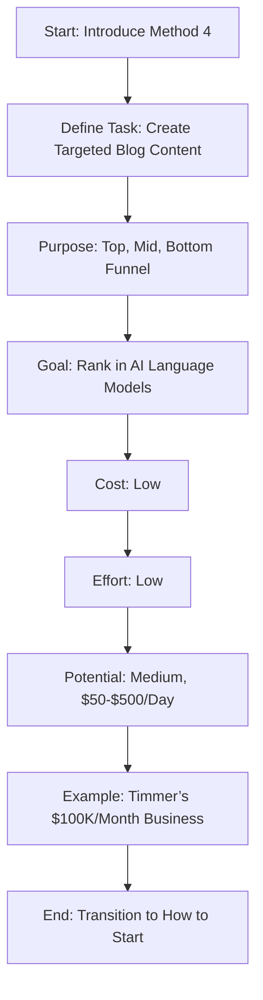

The fourth method is **AI Blog Generation**. This involves creating highly specific blog content for customers to build awareness across the marketing funnel—top, mid, and bottom. The goal is to help businesses rank in AI language models (e.g., ChatGPT) so their business is recommended in search results. The cost to start is low (using free tools), the effort is low (AI guides you), but the potential is medium because AI is reducing the long-term value of blogs. You can make $50 a day (5 blogs at $10 each) or up to $200-$500 a day on the high end by helping clients rank in AI models or earning affiliate revenue. My client Timmer makes over $100,000 a month creating SEO blog posts from podcast episodes using AI—proof that AI supports, but doesn’t replace, human storytelling. Let’s see how to get started! ✍️

---

## Chapter 5: How to Start AI Blog Generation (5:07) 📝

**Flow of This Chapter: AI Blog Generation Process**  
Here’s a Mermaid flow diagram showing how to start AI blog generation:

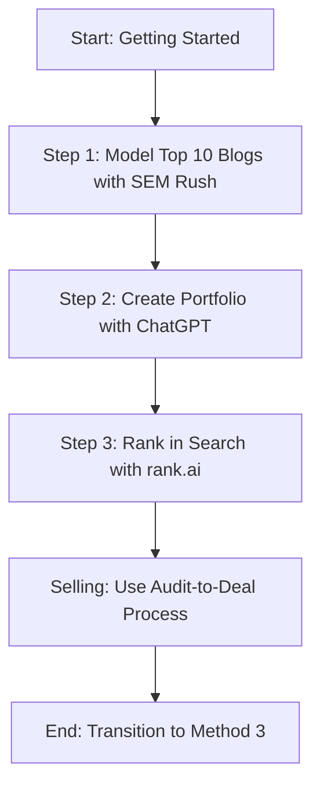

Here’s how to start AI blog generation: 1) Model the top 10 blogs in your niche using tools like SEM Rush or Uber Suggest to find patterns. 2) Use ChatGPT to create a portfolio of writing samples inspired by the best blogs (don’t copy, but train the AI to match the style). 3) Use tools like rank.ai to help your blog posts rank in both Google and AI language models like ChatGPT. To find customers, run the Audit-to-Deal Process: audit their content, show your expertise, and make it easy for them to buy. This simple process can help you land clients quickly! Let’s move to the third method. 📝

---

## Chapter 6: Method 3 - Faceless YouTube Channel (6:05) 🎥

**Flow of This Chapter: Faceless YouTube Channel Overview**  
Here’s a Mermaid flow diagram outlining the faceless YouTube channel method:

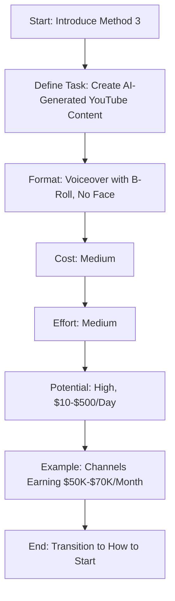

The third method is creating a **Faceless YouTube Channel**. These are channels where AI generates content—like voiceovers with B-roll—without showing a person on screen. They can get hundreds of thousands of views, earning $50,000 to $70,000 a month through YouTube ads. The cost to start is medium (you need editing software), the effort is medium (you need storytelling skills), and the potential is high because income stacks over time. On the low end, small channels make $10-$50 a day, but on the high end, you can earn $500 a day or more through ads and affiliate links. I’ve been consuming AI-generated YouTube content for years without realizing it—it’s a proven model! Let’s see how to get started. 🎥

---

## Chapter 7: How to Start a Faceless YouTube Channel (7:17) 📹

**Flow of This Chapter: Faceless YouTube Channel Process**  
Here’s a Mermaid flow diagram showing how to start a faceless YouTube channel:

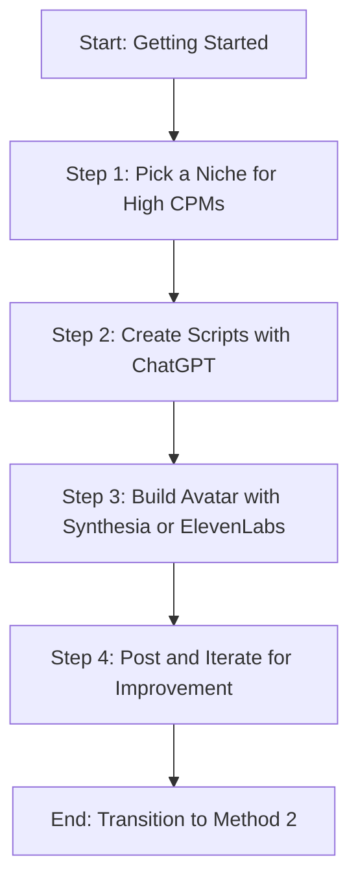

Here’s how to start a faceless YouTube channel: 1) Pick a niche with high CPMs (cost per thousand views) or affiliate potential—research what pays well. 2) Use ChatGPT to create scripts and develop a unique narrative style (e.g., cadence, hooks). 3) Build your avatar—either keep it faceless or use tools like Synthesia or ElevenLabs to generate a virtual AI avatar that reads your scripts. 4) Post videos and iterate—aim to make each video 1% better, focusing on 10,000 iterations rather than hours. This method lets you build a scalable income stream over time! Let’s move to the second method. 📹

---

## Chapter 8: Method 2 - AI Website Building (8:22) 🌐

**Flow of This Chapter: AI Website Building Overview**  
Here’s a Mermaid flow diagram outlining AI website building:

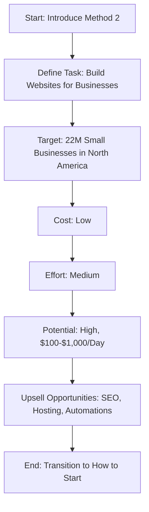

The second method is **AI Website Building**. With 22 million small businesses in North America, there’s huge demand for websites. Traditionally, businesses pay $5,000-$25,000 for a website, but you can use AI to build them faster and cheaper while still charging a premium. Use no-code tools to generate imagery, copy, and code structure. The cost is low, the effort is medium (some technical skills needed, like hosting), and the potential is high. On the low end, you can make $100 a day (one website), but on the high end, you can earn $500-$1,000 a day by serving multiple clients and upselling services like AI SEO, hosting, and automations. This method is taking over traditional design agencies! Let’s see how to get started. 🌐

---

## Chapter 9: How to Start AI Website Building (9:46) 🖥️

**Flow of This Chapter: AI Website Building Process**  
Here’s a Mermaid flow diagram showing how to start AI website building:

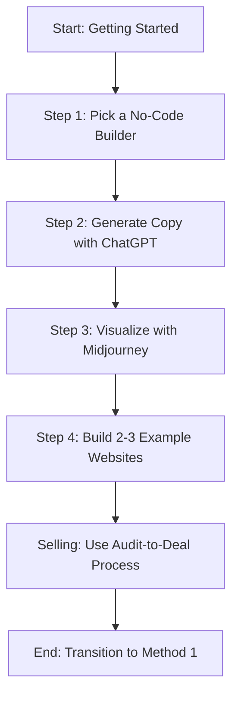

Here’s how to start AI website building: 1) Pick a no-code builder and master it—options like Framer AI, Bolt, or Reloom are great for beginners. 2) Generate custom copy using ChatGPT. 3) Visualize the copy with Midjourney to create stunning designs. 4) Build 2-3 example websites to showcase your skills (e.g., for your parents or a personal project). To sell, use the Audit-to-Deal Process: audit a business’s current website, show how you can improve it, and offer your services. This method lets you tap into a massive market with minimal overhead! Let’s move to the top method. 🖥️

---

## Chapter 10: Method 1 - AI Automation Agency (10:16) ⚙️

**Flow of This Chapter: AI Automation Agency Overview**  
Here’s a Mermaid flow diagram outlining the AI automation agency method:

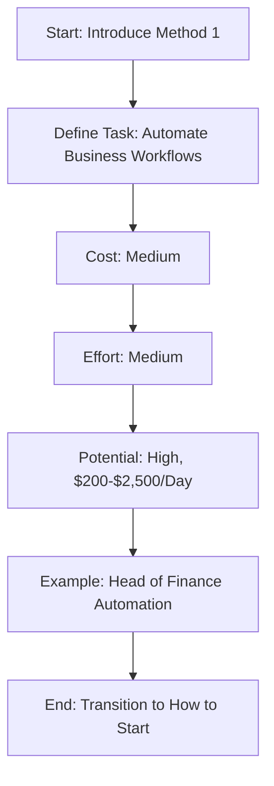

The top method is starting an **AI Automation Agency**. This involves helping businesses automate workflows to reduce complexity and increase efficiency. The cost is medium (some software may require pro versions), the effort is medium (there’s a learning curve, but anyone can learn), and the potential is high. On the low end, you can make $200 a day with one or two small clients. On the high end, you can earn $1,000-$2,500 a day by integrating tools, improving lead generation, and optimizing back-end workflows for larger clients. My head of finance, who loves spreadsheets, spent 3 weeks building an end-to-end process to automate bookkeeping—proof that AI automation frees people to focus on creativity and results, not repetitive tasks. Let’s see how to get started! ⚙️

---

## Chapter 11: How to Start an AI Automation Agency (12:01) 🔧

**Flow of This Chapter: AI Automation Agency Process**  
Here’s a Mermaid flow diagram showing how to start an AI automation agency:

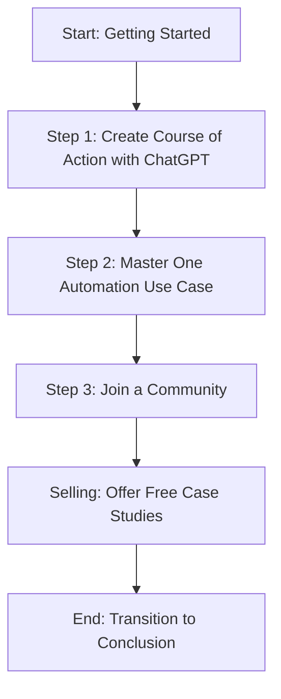

Here’s how to start an AI automation agency: 1) Create a course of action by asking ChatGPT for the top 10 steps to start an automation agency. 2) Master one automation use case (e.g., cold outreach, team training, or onboarding automation)—specialists get paid more. 3) Join a community like Dave Eelar’s (for technical AI systems) or Stephen Pope’s (for content and automation) to learn faster. To sell, reach out to businesses and offer to solve a problem for free in exchange for a case study. If you overdeliver, they’ll keep you around and refer you to others. After 5-10 case studies, you’ll have a solid client base! Let’s wrap up. 🔧

---

## Chapter 12: Conclusion and Next Steps (13:21) 🎉

**Flow of This Chapter: Conclusion and Next Steps**  
Here’s a Mermaid flow diagram showing the conclusion:

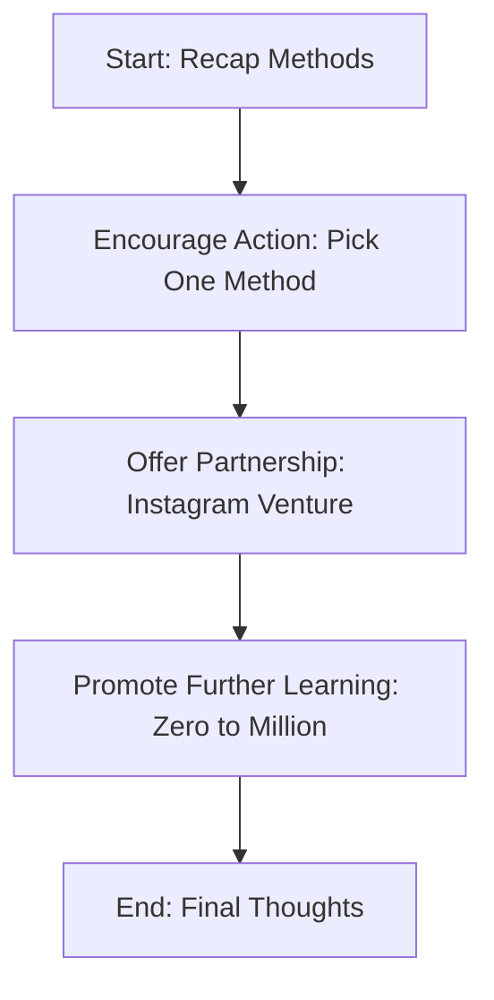

We’ve covered five lazy ways to make money with AI in 2025: AI Thumbnail Design, AI Blog Generation, Faceless YouTube Channels, AI Website Building, and AI Automation Agencies. Each method leverages AI to minimize effort while maximizing potential. Pick one that resonates with you and start small—use the Audit-to-Deal Process to land clients easily. If you’re building real AI technology and want to partner, find me on Instagram and send the word “venture.” To learn how I went from zero to a million this year, click the link provided. Start your AI journey today—you’ve got this! 🎉

---

This documented report provides a structured overview of the laziest ways to make money with AI in 2025, tailored for beginners, with Mermaid flow diagrams for each chapter to illustrate the flow of topics. 🌟